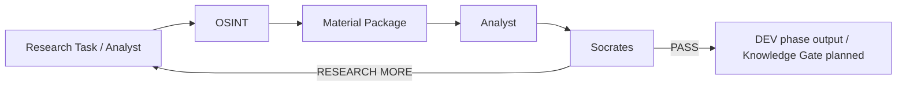
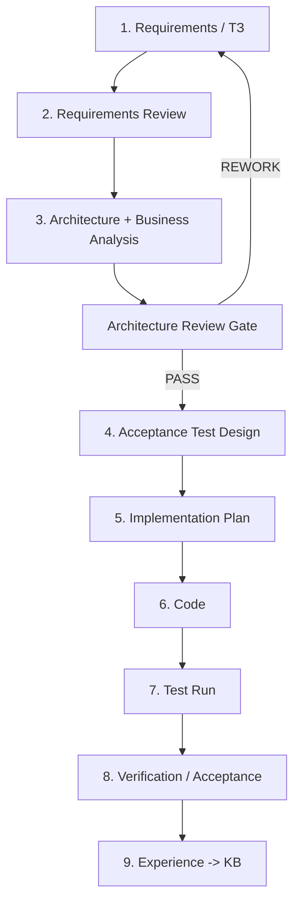

# OSINT_deepseek / FATHER Knowledge Factory

> **Status:** PROJECT / DEV / **STAGE 06 — VERIFICATION AND REPOSITORY RATIONALIZATION**
>
> **Engineering rule:** **NO CODE BEFORE CONTRACT.** Requirements are checked first, then business/process architecture is reviewed, then acceptance tests are designed, then implementation may continue.

This repository is being evolved from the original `OSINT_deepseek` prototype into the first practical worker of the FATHER ecosystem: an OSINT supplier for the Knowledge Factory.

## Mission

The OSINT worker does **not** decide what is true and does **not** publish knowledge by itself. It receives a research task, finds and preserves materials, records provenance and returns a material package to Analyst.

The surrounding DEV chain is:



## FATHER engineering lifecycle



**Current project gate:** **Stage 06 is ACTIVE. Feature growth remains paused while the current repository boundary, dependencies, legacy assets and complete DEV execution path are verified.**

The project already completed the first full requirement→architecture→test→minimal-fix cycle for storage/provenance semantics. Current work is proving the repository as a coherent product and removing obsolete paths only after dependency evidence.

## Development journal

The living project history, WHY decisions, completed work, unresolved risks and forward roadmap are tracked in:

**[Development Journal](docs/DEVELOPMENT_JOURNAL.md)**

The journal must be updated whenever a gate is passed, a material architecture/contract decision changes, a major defect is resolved, a component is removed, or the roadmap changes.

## Documentation packs

| Pack | Purpose |
|---|---|
| [Development Journal](docs/DEVELOPMENT_JOURNAL.md) | **Living history + current status + WHY decisions + roadmap** |
| [Project Governance](docs/PROJECT_GOVERNANCE.md) | Mandatory engineering chain, gates, statuses and change rules |
| [OSINT Agent ТЗ v1](docs/OSINT_AGENT_TZ_V1.md) | What the OSINT worker must and must not do |
| [Stage 03 — Architecture Review Pack](docs/03_architecture/README.md) | business analysis, diagrams, architecture views, review gate, WHY decisions |
| [Business Analysis](docs/03_architecture/01_BUSINESS_ANALYSIS.md) | Actors, SIPOC, value stream, boundaries, business rules and risks |
| [Architecture Views](docs/03_architecture/02_ARCHITECTURE_VIEWS.md) | Context, components, sequence, data flow, failures and DEV/PROD boundaries |
| [Formal Architecture Review](docs/03_architecture/03_ARCHITECTURE_REVIEW.md) | Review checklist, defects, risks and PASS/REWORK gate |
| [Decision Register](docs/03_architecture/04_DECISION_REGISTER.md) | Architecture decisions with WHY, evidence and revisit conditions |
| [Stage 04 — Testing](docs/04_testing/README.md) | acceptance test design and execution rules |
| [Stage 05 — Implementation](docs/05_implementation/01_STORAGE_SEMANTICS_PLAN.md) | reviewed minimal implementation plan for the first corrected defect |
| [Stage 06 — Verification](docs/06_verification/README.md) | **Current stage:** static audit, component traceability, dependency/legacy rationalization and full-run planning |
| [Component Traceability Map](docs/06_verification/09_COMPONENT_TRACEABILITY_MAP.md) | current `father_osint/` component → contract → test → status map |
| [Test Plan v1](docs/TEST_PLAN_V1.md) | project-level verification strategy |
| [Traceability Matrix](docs/TRACEABILITY_MATRIX.md) | Requirement -> architecture -> test -> code mapping |
| [Repository Audit](docs/REPOSITORY_AUDIT_2026-08-09.md) | earlier inventory snapshot; current Stage 06 docs govern disposition |
| [Donor KB: Telegram](docs/DONOR_KB_TELEGRAM_INTELLIGENCE_V0_1.md) | Research notes for future transport selection |

## Directory map

| Directory | Role | README |
|---|---|---|
| `docs/` | Requirements, architecture, test, implementation, verification and journal | [docs/README.md](docs/README.md) |
| `father_osint/` | Current FATHER OSINT DEV implementation | [father_osint/README.md](father_osint/README.md) |
| `father_osint/collectors/` | Source acquisition boundary | [collectors/README.md](father_osint/collectors/README.md) |
| `father_osint/transports/` | Experimental transport adapters, not approved for PROD | [transports/README.md](father_osint/transports/README.md) |
| `tests/` | Current contract/architecture/DEV verification assets | [tests/README.md](tests/README.md) |
| `data/` | DEV fixtures and runtime data references | [data/README.md](data/README.md) |
| `config/` | Draft mission/profile/policy inputs | [config/README.md](config/README.md) |
| `core/` | Legacy prototype core; audited, not current architecture | [core/README.md](core/README.md) |
| `scripts/` | Canonical DEV runners plus audited legacy scripts | [scripts/README.md](scripts/README.md) |
| `services/` | Experimental services/subprojects | [services/README.md](services/README.md) |
| `telegram_bridge/` | Experimental/deferred Telegram transport bridge | [telegram_bridge/README.md](telegram_bridge/README.md) |

## Current disposition at a glance

```text
father_osint/                 CURRENT DEV PRODUCT
scripts/run_dev_osint.py      KEEP
scripts/run_dev_pipeline.py   KEEP / CANONICAL DEV RUNNER
tests/                        CURRENT VERIFICATION
config/                       DRAFT PROFILE/POLICY INPUTS
data/dev/                     TEST FIXTURES ONLY
core/                         LEGACY
old runtime scripts           LEGACY
services/llm-gateway/         FROZEN EXPERIMENTAL SUBPROJECT
Teleproto/live Telegram       EXPERIMENTAL / DEFERRED
```

## DEV vs PROD

The current project works in **DEV / SIMPLIFIED** mode. Fixtures and public/simple sources are preferred until the contract is proven. Real MTProto sessions, Tor gateways, proxy rotation, schedulers, secrets infrastructure and battle monitoring are explicitly deferred to the PROD design gate.

## Change policy

Before adding a new file, service, database, agent or dependency, answer:

1. Which approved requirement requires it?
2. Which architecture element owns it?
3. Which business/process flow does it participate in?
4. What enters it and what must leave it?
5. Why is the component needed instead of a simpler existing mechanism?
6. Which acceptance test will prove it works?

If these questions have no clear answers, the change is not implementation-ready.
