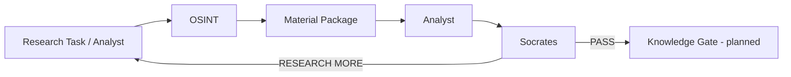
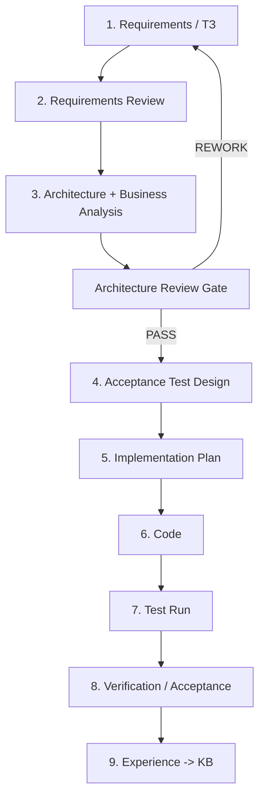

# OSINT_deepseek / FATHER Knowledge Factory

> **Status:** PROJECT / DEV / STAGE 03 — ARCHITECTURE REVIEW
>
> **Engineering rule:** **NO CODE BEFORE CONTRACT.** Requirements are checked first, then business/process architecture is reviewed, then acceptance tests are designed, then implementation may continue.

This repository is being evolved from the original `OSINT_deepseek` prototype into the first practical worker of the FATHER ecosystem: an OSINT supplier for the Knowledge Factory.

## Mission

The OSINT worker does **not** decide what is true and does **not** publish knowledge by itself. It receives a research task, finds and preserves materials, records provenance, removes obvious duplicates and returns a material package to Analyst.

The surrounding DEV chain is:

## FATHER engineering lifecycle

**Current project gate:** **Stage 03 is OPEN. Further feature coding is paused until architecture review passes.**

Stage 03 explicitly checks not only classes/modules but the whole business and information chain: who requests work, what enters each stage, what leaves it, why each component exists, how gaps and failures are exposed, which decisions are approved, and which technologies remain deferred hypotheses.

## Documentation packs

| Pack | Purpose |
|---|---|
| [Project Governance](docs/PROJECT_GOVERNANCE.md) | Mandatory engineering chain, gates, statuses and change rules |
| [OSINT Agent ТЗ v1](docs/OSINT_AGENT_TZ_V1.md) | What the OSINT worker must and must not do |
| [Stage 03 — Architecture Review Pack](docs/03_architecture/README.md) | **Current stage:** business analysis, diagrams, architecture views, review gate, WHY decisions |
| [Business Analysis](docs/03_architecture/01_BUSINESS_ANALYSIS.md) | Actors, SIPOC, value stream, boundaries, business rules and risks |
| [Architecture Views](docs/03_architecture/02_ARCHITECTURE_VIEWS.md) | Context, components, sequence, data flow, failures and DEV/PROD boundaries |
| [Formal Architecture Review](docs/03_architecture/03_ARCHITECTURE_REVIEW.md) | Review checklist, defects, risks and PASS/REWORK gate |
| [Decision Register](docs/03_architecture/04_DECISION_REGISTER.md) | Architecture decisions with WHY, evidence and revisit conditions |
| [DEV Architecture v1](docs/ARCHITECTURE_DEV_V1.md) | Earlier minimal architecture; input into Stage 03 review, not automatic approval |
| [Test Plan v1](docs/TEST_PLAN_V1.md) | Acceptance strategy; executed after Stage 03 PASS |
| [Traceability Matrix](docs/TRACEABILITY_MATRIX.md) | Requirement -> architecture -> test -> code mapping |
| [Repository Audit](docs/REPOSITORY_AUDIT_2026-08-09.md) | Inventory and status of existing code and legacy assets |
| [Donor KB: Telegram](docs/DONOR_KB_TELEGRAM_INTELLIGENCE_V0_1.md) | Research notes for future transport selection |

## Directory map

| Directory | Role | README |
|---|---|---|
| `docs/` | Requirements, architecture, ADR/research/test packs | [docs/README.md](docs/README.md) |
| `father_osint/` | New FATHER OSINT DEV implementation; frozen for new features during Stage 03 | [father_osint/README.md](father_osint/README.md) |
| `father_osint/collectors/` | Source acquisition boundary | [collectors/README.md](father_osint/collectors/README.md) |
| `father_osint/transports/` | Experimental transport adapters, not approved for PROD | [transports/README.md](father_osint/transports/README.md) |
| `tests/` | Existing tests awaiting reconciliation with Stage 03 and formal Stage 04 test design | [tests/README.md](tests/README.md) |
| `data/` | DEV fixtures and runtime data | [data/README.md](data/README.md) |
| `config/` | Legacy/current configuration assets | [config/README.md](config/README.md) |
| `core/` | Legacy prototype core | [core/README.md](core/README.md) |
| `scripts/` | Legacy and DEV launch/diagnostic scripts | [scripts/README.md](scripts/README.md) |
| `services/` | Experimental services | [services/README.md](services/README.md) |
| `telegram_bridge/` | Experimental Telegram transport bridge | [telegram_bridge/README.md](telegram_bridge/README.md) |

## DEV vs PROD

The current project works in **DEV / SIMPLIFIED** mode. Fixtures and public/simple sources are preferred until the contract is proven. Real MTProto sessions, Tor gateways, proxy rotation, schedulers, secrets infrastructure and battle monitoring are explicitly deferred to the PROD design gate.

## Change policy

Before adding a new file, service, database, agent or dependency, answer:

1. Which approved requirement requires it?
2. Which architecture element owns it?
3. Which business/process flow does it participate in?
4. What enters it and what must leave it?
5. Why is the component needed instead of a simpler existing mechanism?
6. Which acceptance test will prove it works?

If these questions have no clear answers, the change is not implementation-ready.
