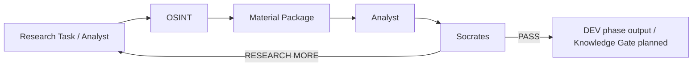
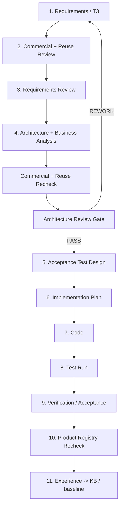

# OSINT_deepseek / FATHER Knowledge Factory

> **Status:** PROJECT / DEV / **DEV v1 BASELINE FROZEN**
>
> **Stage 06:** ✅ COMPLETE — Verification and Repository Rationalization
>
> **Current development:** **Stage 07 / M5 — Telegram Radar**
>
> **Engineering rule:** **NO CODE BEFORE CONTRACT.** Requirements are reviewed first, including commercial/reuse potential, then architecture, acceptance tests, implementation plan, code, verification and experience capture.

This repository is evolving from the original `OSINT_deepseek` prototype into the first practical worker of the FATHER ecosystem: an OSINT supplier for the Knowledge Factory.

## Mission

The OSINT worker does **not** decide what is true and does **not** publish knowledge by itself. It receives a research task, finds and preserves materials, records provenance and returns evidence to Analyst.



## Engineering lifecycle



## Commercial product direction

Commercialization is a **separate product-development track**, not a substitute for the core engineering roadmap. Every reusable block should be reviewed before development, during architecture review and after verification for additional lawful uses and product opportunities.

The living registry is here:

**[Commercial Product Opportunity Registry](docs/PRODUCT_OPPORTUNITY_REGISTRY.md)**

It tracks potential products built from shared FATHER blocks, including competitive/channel intelligence, content-origin and propagation analysis, brand/reputation monitoring, technology/market radar, research tooling, security/risk use cases and future marketing/advertising/analytics scenarios where appropriate and lawful.

Principle:

```text
ONE VERIFIED CORE
      ↓
Telegram Radar / Artifact / Provenance / Analyst / Socrates / KB
      ↓
MANY PRODUCT ASSEMBLIES
```

Commercial ideas may influence reusable interfaces and metadata, but they must not contaminate the core with one customer's domain logic or bypass requirements, legal constraints, tests, donor review, benchmarks or architecture gates.

## Frozen DEV v1 baseline

Current clean-checkout CI proves:

```text
checkout
  ↓
Python 3.12
  ↓
DEV dependency install
  ↓
import father_osint
  ↓
21 tests PASS
  ↓
run_dev_osint.py PASS
  ↓
run_dev_pipeline.py PASS
```

The frozen semantic baseline proves:
- equal payload does not collapse independent source observations;
- raw text payloads may be reused by SHA-256 without dropping provenance;
- file-only Material is hashed from original file bytes;
- missing local files fail explicitly;
- follow-up research accumulates evidence across cycles;
- research loops remain hard bounded;
- collector failures remain isolated and visible;
- Telegram collection stays independent of a concrete transport library.

Historical Ollama/GPU/workstation code, old `core/`, `vip/`, the unapproved Teleproto/Node bridge and the unrelated experimental policy/"llm-gateway" prototype were removed only after their useful engineering lessons were documented and clean CI proved the current product did not depend on them.

## Development control

Living history, WHY decisions, completed work, risks and roadmap:

**[Development Journal](docs/DEVELOPMENT_JOURNAL.md)**

Formal freeze record:

**[DEV v1 Baseline Freeze](docs/06_verification/16_DEV_V1_BASELINE_FREEZE.md)**

## Key documentation

| Pack | Purpose |
|---|---|
| [Development Journal](docs/DEVELOPMENT_JOURNAL.md) | Living history, status, WHY decisions and roadmap |
| [Commercial Product Registry](docs/PRODUCT_OPPORTUNITY_REGISTRY.md) | Separate living product track: reusable blocks → commercial opportunities, priorities and review gates |
| [Project Governance](docs/PROJECT_GOVERNANCE.md) | Mandatory engineering chain and gates |
| [OSINT Agent ТЗ v1](docs/OSINT_AGENT_TZ_V1.md) | Current requirements and acceptance criteria |
| [Stage 03 — Architecture Review](docs/03_architecture/README.md) | Business analysis, diagrams and architecture decisions |
| [Stage 04 — Testing](docs/04_testing/README.md) | Acceptance test design and execution rules |
| [Stage 06 — Verification](docs/06_verification/README.md) | Completed verification/rationalization evidence |
| [Stage 07 — Next Requirement](docs/07_next_requirement/) | M5 Telegram Radar requirements, donor research and PoC planning |
| [Full Project Audit](docs/06_verification/14_FULL_PROJECT_AUDIT_2026-08-09.md) | Full-project findings and remediation priorities |
| [Semantic Remediation Plan](docs/06_verification/15_SEMANTIC_REMEDIATION_PLAN.md) | Contract for cumulative evidence, reuse metric and file hashing |
| [DEV v1 Freeze](docs/06_verification/16_DEV_V1_BASELINE_FREEZE.md) | Formal frozen baseline and change-control gate |
| [Traceability Matrix](docs/TRACEABILITY_MATRIX.md) | requirement → architecture → test → code → evidence |
| [Donor KB: Telegram](docs/DONOR_KB_TELEGRAM_INTELLIGENCE_V0_1.md) | Research notes for future transport selection; not approval |

## Directory map

| Directory | Role |
|---|---|
| `father_osint/` | Frozen FATHER OSINT DEV v1 implementation |
| `scripts/` | Canonical DEV execution adapters |
| `tests/` | Verified executable contract evidence |
| `data/` | DEV fixtures/runtime data references |
| `config/` | Draft mission/profile/policy inputs |
| `docs/` | Requirements, architecture, tests, decisions, verification, product registry and journal |

## Current disposition

```text
father_osint/                 DEV v1 BASELINE
scripts/run_dev_osint.py      KEEP
scripts/run_dev_pipeline.py   KEEP / CANONICAL DEV RUNNER
tests/                        VERIFIED CONTRACT EVIDENCE
config/                       DRAFT PROFILE/POLICY INPUTS
data/dev/                     TEST FIXTURES ONLY
father_osint/transports/      M5 EXTENSION BOUNDARY / NO APPROVED IMPLEMENTATION
```

## Dependencies

- `requirements.txt` — current runtime dependency declaration; the DEV core is stdlib-only.
- `requirements-dev.txt` — verification/test dependencies (`pytest`).

Historical prototype dependencies are retained in Git history and audit documents, not in the active dependency surface.

## DEV vs PROD

The frozen baseline is **DEV / SIMPLIFIED**, not production readiness. Real MTProto sessions, Tor gateways, proxy rotation, schedulers, secrets infrastructure, production LLM routing, battle monitoring, generic Artifact ingestion, local transcription, Knowledge Gate and autonomous KB publication remain separate future requirements.

## Next milestone

**M5 — Telegram Radar.**

Current M5 sequence:
- requirements and commercial/reuse review;
- donor verification;
- bounded TDLib and GramJS PoCs;
- common benchmark and security/operations review;
- ADR transport selection;
- acceptance tests before product-path implementation.

Later planned core milestones remain:
- M6 — generic Artifact/Ingestion layer;
- M7 — local-first transcription/extraction;
- M8 — Knowledge Gate foundation.

We choose by business value and reusable capability, not by which technology is most interesting.

## Change policy

Before modifying the frozen baseline or adding a file, service, database, agent or dependency, answer:

1. Which approved requirement requires it?
2. Which commercial or non-commercial reuse scenarios could benefit from this block?
3. Is this a defect fix or a new capability?
4. Which architecture element owns it?
5. What enters it and what must leave it?
6. Why is it needed instead of a simpler existing mechanism?
7. Which acceptance test will prove it works?
8. Does it break a frozen invariant or add an external dependency?
9. What is the rollback path?
10. Does the implementation remain reusable rather than embedding one product's domain logic into the core?

If these questions have no clear answers, the change is not implementation-ready.
