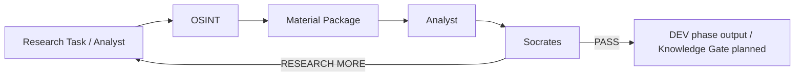
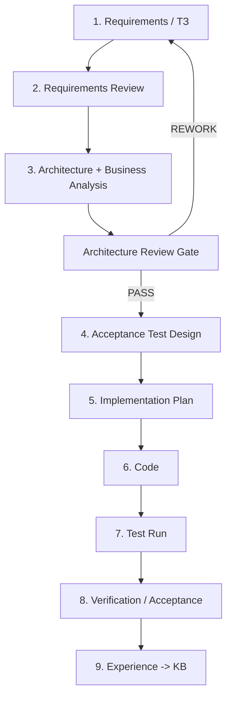

# OSINT_deepseek / FATHER Knowledge Factory

> **Status:** PROJECT / DEV / **STAGE 06 — VERIFICATION AND REPOSITORY RATIONALIZATION**
>
> **Engineering rule:** **NO CODE BEFORE CONTRACT.** Requirements are reviewed first, then business/process architecture, acceptance tests, implementation plan, code, verification and experience capture.

This repository is being evolved from the original `OSINT_deepseek` prototype into the first practical worker of the FATHER ecosystem: an OSINT supplier for the Knowledge Factory.

## Mission

The OSINT worker does **not** decide what is true and does **not** publish knowledge by itself. It receives a research task, finds and preserves materials, records provenance and returns a material package to Analyst.



## FATHER engineering lifecycle



**Current gate:** Stage 06 is active. Feature growth remains paused while the current DEV baseline, dependencies and repository boundaries are verified and cleaned with evidence.

## Verified DEV baseline

The current clean-checkout CI path proves:

```text
checkout
  ↓
Python 3.12
  ↓
DEV dependency install
  ↓
import father_osint
  ↓
pytest collect
  ↓
17 tests PASS
  ↓
run_dev_osint.py PASS
  ↓
run_dev_pipeline.py PASS
```

Historical Ollama/GPU/workstation code, the old `core/` package, the unapproved Teleproto/Node Telegram transport PoC and the unrelated experimental policy/"llm-gateway" prototype were removed only after their useful engineering lessons were documented and clean CI proved that the current FATHER OSINT path did not depend on them.

## Development journal

The living project history, WHY decisions, completed work, unresolved risks and forward roadmap are tracked in:

**[Development Journal](docs/DEVELOPMENT_JOURNAL.md)**

Material gate changes and cleanup decisions also receive dedicated Stage 06 reports under `docs/06_verification/` and journal entries under `docs/journal/`.

## Documentation packs

| Pack | Purpose |
|---|---|
| [Development Journal](docs/DEVELOPMENT_JOURNAL.md) | Living history, status, WHY decisions and roadmap |
| [Project Governance](docs/PROJECT_GOVERNANCE.md) | Mandatory engineering chain and gates |
| [OSINT Agent ТЗ v1](docs/OSINT_AGENT_TZ_V1.md) | What the OSINT worker must and must not do |
| [Stage 03 — Architecture Review](docs/03_architecture/README.md) | Business analysis, diagrams, architecture and decisions |
| [Stage 04 — Testing](docs/04_testing/README.md) | Acceptance test design and execution rules |
| [Stage 05 — Implementation](docs/05_implementation/01_STORAGE_SEMANTICS_PLAN.md) | Reviewed minimal implementation plan |
| [Stage 06 — Verification](docs/06_verification/README.md) | Current verification and rationalization stage |
| [Component Traceability Map](docs/06_verification/09_COMPONENT_TRACEABILITY_MAP.md) | component → contract → test → status |
| [Dependency Split](docs/06_verification/10_DEPENDENCY_SPLIT.md) | Current vs DEV vs legacy dependency decision |
| [Legacy Cleanup Report](docs/06_verification/11_LEGACY_CLEANUP_REPORT.md) | evidence-based removal of old runtime/core code |
| [Telegram Experiment Audit](docs/06_verification/12_TELEGRAM_EXPERIMENT_AUDIT.md) | why the unapproved concrete transport PoC was removed |
| [LLM Gateway Disposition](docs/06_verification/13_LLM_GATEWAY_DISPOSITION.md) | why the unrelated policy-control experiment was removed from the active tree |
| [Traceability Matrix](docs/TRACEABILITY_MATRIX.md) | requirement → architecture → test → code |
| [Donor KB: Telegram](docs/DONOR_KB_TELEGRAM_INTELLIGENCE_V0_1.md) | Research notes for future transport selection |

## Directory map

| Directory | Role |
|---|---|
| `father_osint/` | Current FATHER OSINT DEV implementation |
| `scripts/` | Canonical DEV execution adapters |
| `tests/` | Current contract/architecture/DEV verification assets |
| `data/` | DEV fixtures and runtime data references |
| `config/` | Draft mission/profile/policy inputs |
| `docs/` | Requirements, architecture, tests, decisions, verification and journal |

## Current disposition

```text
father_osint/                 CURRENT DEV PRODUCT
scripts/run_dev_osint.py      KEEP
scripts/run_dev_pipeline.py   KEEP / CANONICAL DEV RUNNER
tests/                        CURRENT VERIFICATION
config/                       DRAFT PROFILE/POLICY INPUTS
data/dev/                     TEST FIXTURES ONLY
father_osint/transports/      FUTURE BOUNDARY / NO APPROVED IMPLEMENTATION
```

## Dependencies

- `requirements.txt` — current runtime dependencies; current core is stdlib-only.
- `requirements-dev.txt` — verification/test dependencies.
- `requirements-legacy.txt` — historical dependency record only; not required for the current DEV product.

## DEV vs PROD

The current project works in **DEV / SIMPLIFIED** mode. Fixtures and public/simple sources are preferred until the contract is proven. Real MTProto sessions, Tor gateways, proxy rotation, schedulers, secrets infrastructure, LLM provider routing and battle monitoring are deferred to separate requirements and PROD gates.

## Change policy

Before adding a new file, service, database, agent or dependency, answer:

1. Which approved requirement requires it?
2. Which architecture element owns it?
3. Which business/process flow does it participate in?
4. What enters it and what must leave it?
5. Why is the component needed instead of a simpler existing mechanism?
6. Which acceptance test will prove it works?

If these questions have no clear answers, the change is not implementation-ready.
