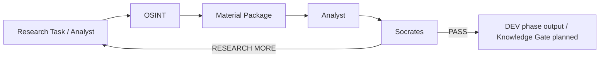
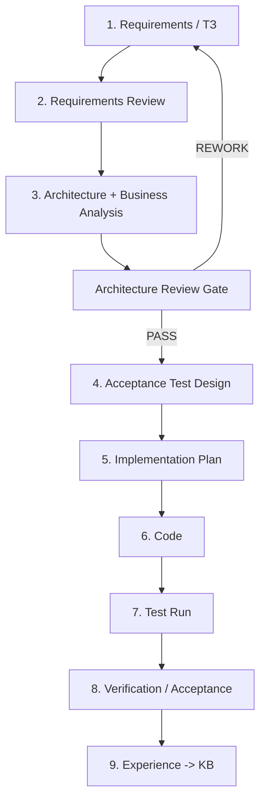

# OSINT_deepseek / FATHER Knowledge Factory

> **Status:** PROJECT / DEV / **STAGE 06 — VERIFICATION AND REPOSITORY RATIONALIZATION**
>
> **Engineering rule:** **NO CODE BEFORE CONTRACT.** Requirements are reviewed first, then architecture, acceptance tests, implementation plan, code, verification and experience capture.

This repository is evolving from the original `OSINT_deepseek` prototype into the first practical worker of the FATHER ecosystem: an OSINT supplier for the Knowledge Factory.

## Mission

The OSINT worker does **not** decide what is true and does **not** publish knowledge by itself. It receives a research task, finds and preserves materials, records provenance and returns evidence to Analyst.



## Engineering lifecycle



## Verified DEV baseline

Current clean-checkout CI proves:

```text
checkout
  ↓
Python 3.12
  ↓
DEV dependency install
  ↓
import father_osint
  ↓
21 tests PASS
  ↓
run_dev_osint.py PASS
  ↓
run_dev_pipeline.py PASS
```

The current semantic baseline also proves:
- equal payload does not collapse independent source observations;
- raw text payloads may be reused by SHA-256 without dropping provenance;
- file-only Material is hashed from original file bytes;
- missing local files fail explicitly;
- follow-up research accumulates evidence across cycles;
- research loops remain hard bounded.

Historical Ollama/GPU/workstation code, old `core/`, `vip/`, the unapproved Teleproto/Node bridge and the unrelated experimental policy/"llm-gateway" prototype were removed only after their useful engineering lessons were documented and clean CI proved the current product did not depend on them.

## Development journal

Living history, WHY decisions, completed work, risks and roadmap:

**[Development Journal](docs/DEVELOPMENT_JOURNAL.md)**

Stage-specific evidence is under `docs/06_verification/`; material changes also receive entries under `docs/journal/`.

## Key documentation

| Pack | Purpose |
|---|---|
| [Development Journal](docs/DEVELOPMENT_JOURNAL.md) | Living history, status, WHY decisions and roadmap |
| [Project Governance](docs/PROJECT_GOVERNANCE.md) | Mandatory engineering chain and gates |
| [OSINT Agent ТЗ v1](docs/OSINT_AGENT_TZ_V1.md) | Current requirements and acceptance criteria |
| [Stage 03 — Architecture Review](docs/03_architecture/README.md) | Business analysis, diagrams and architecture decisions |
| [Stage 04 — Testing](docs/04_testing/README.md) | Acceptance test design and execution rules |
| [Stage 06 — Verification](docs/06_verification/README.md) | Current verification/rationalization evidence |
| [Full Project Audit](docs/06_verification/14_FULL_PROJECT_AUDIT_2026-08-09.md) | Full-project findings and remediation priorities |
| [Semantic Remediation Plan](docs/06_verification/15_SEMANTIC_REMEDIATION_PLAN.md) | Contract for cumulative evidence, reuse metric and file hashing |
| [Traceability Matrix](docs/TRACEABILITY_MATRIX.md) | requirement → architecture → test → code → evidence |
| [Donor KB: Telegram](docs/DONOR_KB_TELEGRAM_INTELLIGENCE_V0_1.md) | Research notes for future transport selection; not approval |

## Directory map

| Directory | Role |
|---|---|
| `father_osint/` | Current FATHER OSINT DEV implementation |
| `scripts/` | Canonical DEV execution adapters |
| `tests/` | Current executable contract evidence |
| `data/` | DEV fixtures/runtime data references |
| `config/` | Draft mission/profile/policy inputs |
| `docs/` | Requirements, architecture, tests, decisions, verification and journal |

## Current disposition

```text
father_osint/                 CURRENT DEV PRODUCT
scripts/run_dev_osint.py      KEEP
scripts/run_dev_pipeline.py   KEEP / CANONICAL DEV RUNNER
tests/                        CURRENT VERIFICATION
config/                       DRAFT PROFILE/POLICY INPUTS
data/dev/                     TEST FIXTURES ONLY
father_osint/transports/      FUTURE BOUNDARY / NO APPROVED IMPLEMENTATION
```

## Dependencies

- `requirements.txt` — current runtime dependency declaration; the DEV core is stdlib-only.
- `requirements-dev.txt` — verification/test dependencies (`pytest`).

Historical prototype dependencies are retained in Git history and audit documents, not in the active dependency surface.

## DEV vs PROD

The current project is **DEV / SIMPLIFIED**. Real MTProto sessions, Tor gateways, proxy rotation, schedulers, secrets infrastructure, production LLM routing, battle monitoring, Knowledge Gate and autonomous KB publication remain separate future requirements.

## Change policy

Before adding a new file, service, database, agent or dependency, answer:

1. Which approved requirement requires it?
2. Which architecture element owns it?
3. Which business/process flow does it participate in?
4. What enters it and what must leave it?
5. Why is the component needed instead of a simpler existing mechanism?
6. Which acceptance test will prove it works?

If these questions have no clear answers, the change is not implementation-ready.
