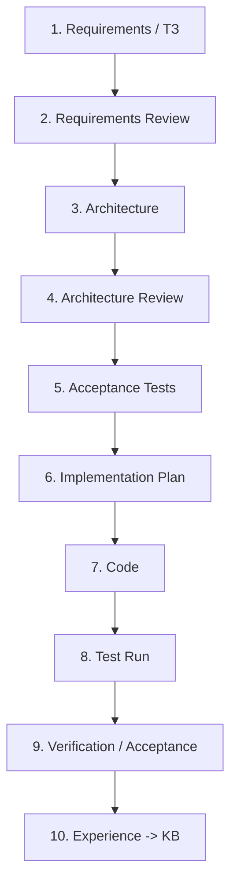

# OSINT_deepseek / FATHER Knowledge Factory

> **Status:** PROJECT / DEV / REQUIREMENTS-FIRST
>
> **Engineering rule:** **NO CODE BEFORE CONTRACT.** Requirements are checked first, then architecture, then acceptance tests, then implementation, then test runs and only after that operational integration.

This repository is being evolved from the original `OSINT_deepseek` prototype into the first practical worker of the FATHER ecosystem: an OSINT supplier for the Knowledge Factory.

## Mission

The OSINT worker does **not** decide what is true and does **not** publish knowledge by itself. It receives a research task, finds and preserves materials, records provenance, removes obvious duplicates and returns a material package to Analyst.

The surrounding DEV chain is:

## FATHER engineering lifecycle

**Current project gate:** requirements/documentation normalization before further implementation.

## Documentation packs

| Pack | Purpose |
|---|---|
| [Project Governance](docs/PROJECT_GOVERNANCE.md) | Mandatory engineering chain, gates, statuses and change rules |
| [OSINT Agent ТЗ v1](docs/OSINT_AGENT_TZ_V1.md) | What the OSINT worker must and must not do |
| [DEV Architecture v1](docs/ARCHITECTURE_DEV_V1.md) | Current logical architecture and interfaces |
| [Test Plan v1](docs/TEST_PLAN_V1.md) | Acceptance strategy and order of runs |
| [Traceability Matrix](docs/TRACEABILITY_MATRIX.md) | Requirement -> architecture -> test -> code mapping |
| [Repository Audit](docs/REPOSITORY_AUDIT_2026-08-09.md) | Inventory and status of existing code and legacy assets |
| [Donor KB: Telegram](docs/DONOR_KB_TELEGRAM_INTELLIGENCE_V0_1.md) | Research notes for future transport selection |

## Directory map

| Directory | Role | README |
|---|---|---|
| `docs/` | Requirements, architecture, ADR/research/test packs | [docs/README.md](docs/README.md) |
| `father_osint/` | New FATHER OSINT DEV implementation | [father_osint/README.md](father_osint/README.md) |
| `father_osint/collectors/` | Source acquisition boundary | [collectors/README.md](father_osint/collectors/README.md) |
| `father_osint/transports/` | Experimental transport adapters, not approved for PROD | [transports/README.md](father_osint/transports/README.md) |
| `tests/` | Existing tests awaiting formal execution and reconciliation with ТЗ | [tests/README.md](tests/README.md) |
| `data/` | DEV fixtures and runtime data | [data/README.md](data/README.md) |
| `config/` | Legacy/current configuration assets | [config/README.md](config/README.md) |
| `core/` | Legacy prototype core | [core/README.md](core/README.md) |
| `scripts/` | Legacy and DEV launch/diagnostic scripts | [scripts/README.md](scripts/README.md) |
| `services/` | Experimental services | [services/README.md](services/README.md) |
| `telegram_bridge/` | Experimental Telegram transport bridge | [telegram_bridge/README.md](telegram_bridge/README.md) |

## DEV vs PROD

The current project works in **DEV / SIMPLIFIED** mode. Fixtures and public/simple sources are preferred until the contract is proven. Real MTProto sessions, Tor gateways, proxy rotation, schedulers, secrets infrastructure and battle monitoring are explicitly deferred to the PROD design gate.

## Change policy

Before adding a new file, service, database, agent or dependency, answer:

1. Which approved requirement requires it?
2. Which architecture element owns it?
3. Which acceptance test proves it works?
4. What existing component cannot solve the task more simply?

If these questions have no clear answers, the change is not implementation-ready.
