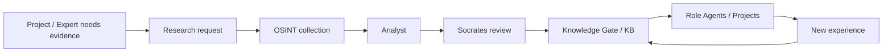
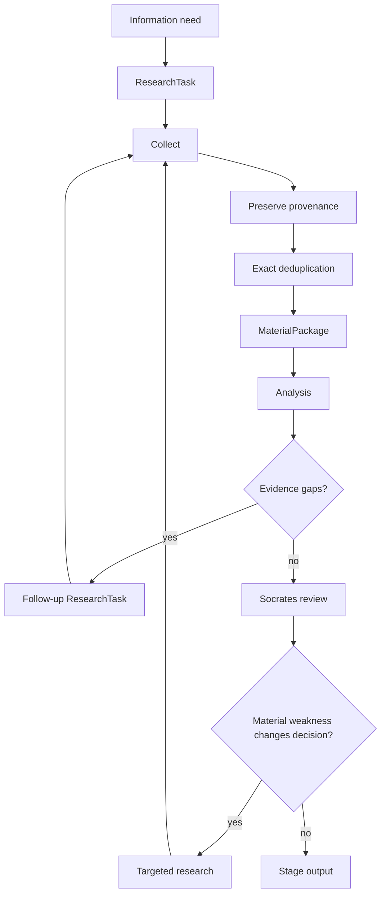
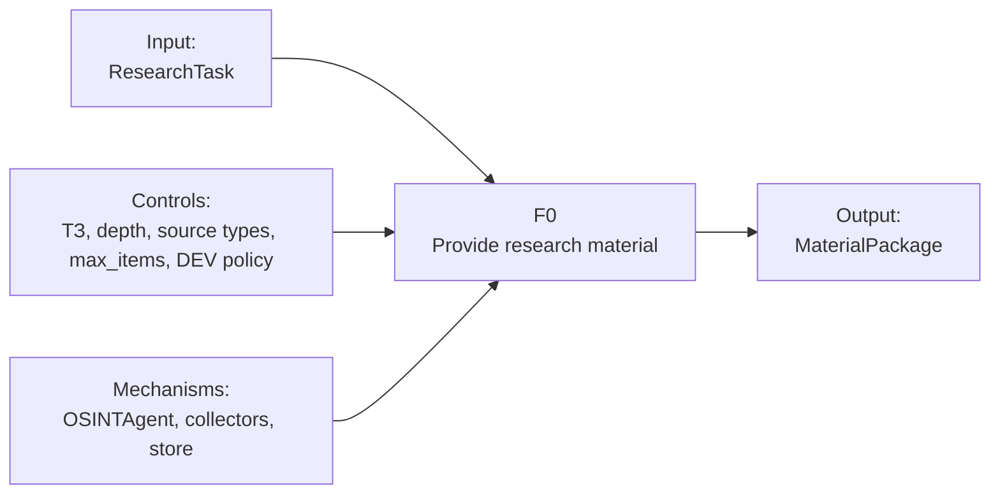
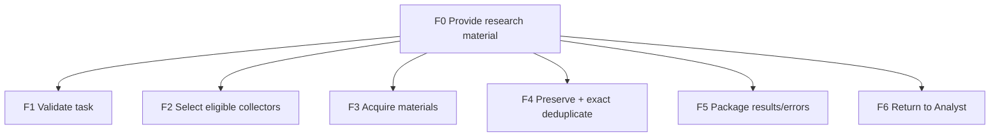

# Stage 03 — Business Analysis

**Project:** OSINT_deepseek / FATHER Knowledge Factory  
**Scope:** first practical Knowledge Factory worker and its handoff to Analyst/Socrates  
**Status:** DRAFT FOR ARCHITECTURE REVIEW

## 1. Business objective

The system must reduce the cost and inconsistency of repeated technology research. It should preserve research materials and make them reusable by later analysts and FATHER role agents instead of forcing each new project to rediscover the same sources from scratch.

The OSINT worker is therefore a **supplier of research material**, not a truth engine and not a final expert.

### Business result

The value is created when later work can reuse checked material and knowledge with known provenance.

## 2. Business boundaries

### In scope for DEV

- receive a research task from Analyst;
- acquire materials through approved DEV collectors/fixtures;
- preserve source locator, raw content or file reference, collection time and metadata;
- remove obvious exact duplicates;
- return a bounded Material Package;
- allow Analyst to request additional research;
- allow Socrates to request additional evidence;
- keep the process inspectable and reproducible enough for tests.

### Out of scope for DEV

- autonomous truth determination;
- autonomous publication into production KB;
- production Telegram/Tor credential operations;
- complex source trust scoring;
- knowledge graphs;
- autonomous purchasing, intrusion or access-control bypass;
- production scheduler, proxy rotation or large-scale crawling.

## 3. Actors and responsibilities

| Actor | Responsibility | Must not do |
|---|---|---|
| Requester / Project | expresses information need | dictate an unverified technical solution |
| Analyst | converts need into a ResearchTask; interprets returned materials | pretend missing evidence exists |
| OSINT Agent | finds/preserves requested material | decide final truth or architecture |
| Collector | acquire one source class and map it to Material | perform cross-domain analysis |
| Socrates | challenge material sufficiency and analysis | generate endless questions without decision impact |
| Knowledge Gate | future publication control | replace Analyst/Socrates reasoning |
| FATHER | future orchestration and role/KB assignment | act as the domain expert itself |

## 4. SIPOC

| Suppliers | Inputs | Process | Outputs | Customers |
|---|---|---|---|---|
| Analyst, project context, source systems | ResearchTask, topics, source types, limits | collect → normalize → deduplicate → package | MaterialPackage | Analyst |
| Analyst | MaterialPackage | analyze → identify findings/gaps | Analysis / follow-up task | Socrates / OSINT |
| Socrates | Analysis + materials | challenge material sufficiency | PASS / RESEARCH_MORE | Knowledge Gate / OSINT |

## 5. Value stream

### Stop principle

Research stops when the current decision can proceed with the accepted uncertainty, or when the configured time/item/cycle limit is reached. More information is not automatically more value.

## 6. IDEF0-style functional decomposition

Decomposition:

## 7. Information contract from a business perspective

### ResearchTask — order to the research worker

Must answer at minimum:

- what question is being investigated;
- which topics are relevant;
- which source classes are requested;
- optional time boundaries;
- work depth;
- maximum material count / stop condition;
- who requested the work.

### Material — acquired evidence candidate

Must answer at minimum:

- where it came from;
- what was captured;
- when it was collected;
- source publication time if known;
- author if known;
- metadata needed by the source class;
- stable content hash where possible.

### MaterialPackage — delivery note

Must answer at minimum:

- which task it fulfils;
- which materials were found;
- which obvious duplicates were skipped;
- which collection failures occurred;
- why collection stopped.

## 8. Business rules

1. OSINT may return **zero** materials; this is a valid result and must be visible.
2. Collector failure does not automatically destroy results from other collectors.
3. Missing source type is a gap, not a fabricated result.
4. Exact duplicate removal may reduce storage/analysis noise, but does not prove source dependence or truth.
5. Analyst or Socrates may return a targeted follow-up request.
6. DEV loops are bounded to prevent endless research.
7. All production-only concerns remain explicitly deferred until DEV behavior is accepted.

## 9. Business risks

| Risk | Impact | Architectural response in DEV |
|---|---|---|
| research loops never stop | cost/time explosion | max cycles / max items |
| source failure hides coverage gap | false confidence | collection_errors + gap reporting |
| OSINT starts making expert conclusions | role contamination | Material contract only |
| implementation grows before requirements stabilize | long rework | NO CODE BEFORE CONTRACT gate |
| legacy/experimental code is mistaken for approved architecture | maintenance risk | explicit repository status and architecture review |
| same material appears many times | analyst noise | exact content hash deduplication |

## 10. Success criteria for Stage 3

Architecture is business-acceptable only if every major arrow in the diagrams has:

- an owner;
- a defined input;
- a defined output;
- an error/stop behavior;
- a reason for existing;
- a requirement or business rule that justifies it.

Anything that cannot satisfy those six questions is a candidate for `DELETE`, `DEFER` or redesign.
