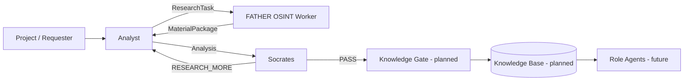
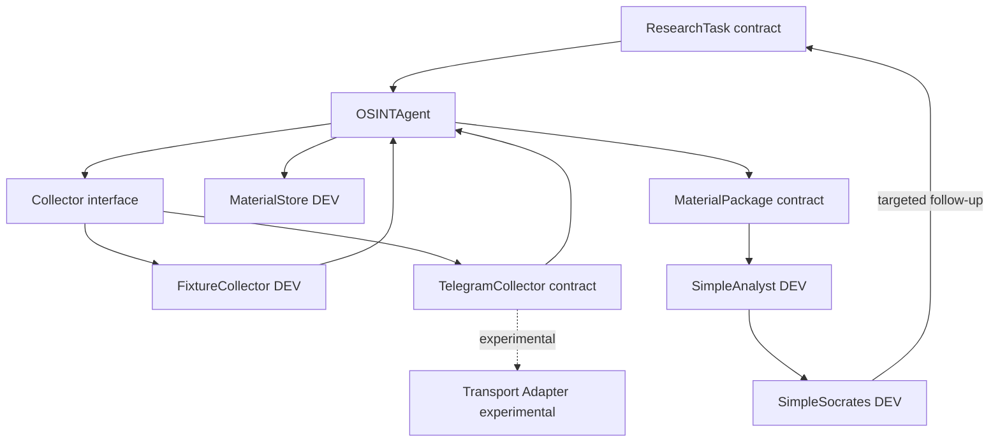
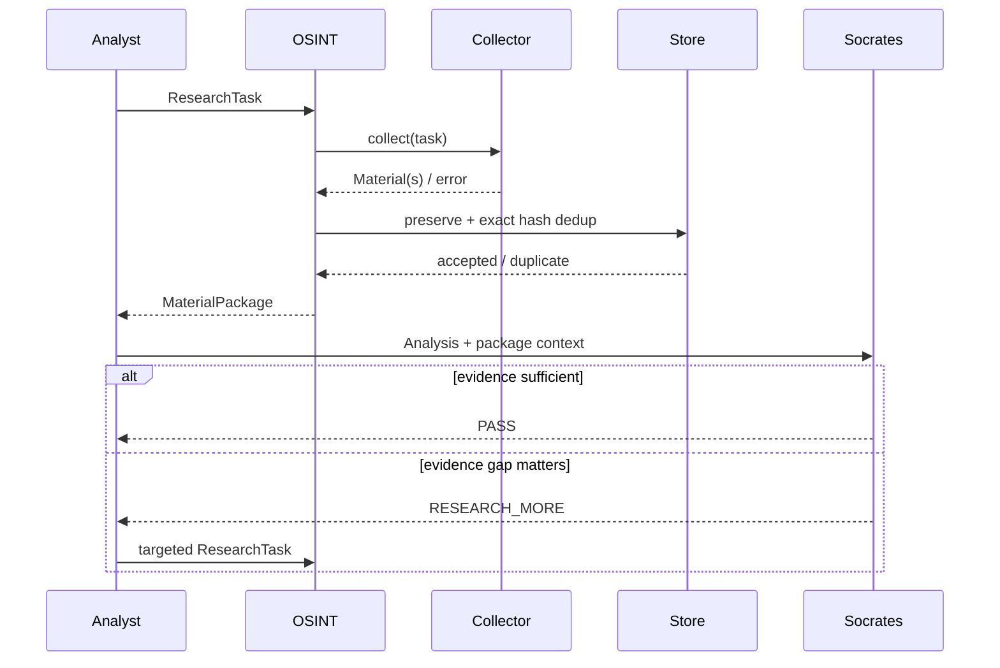
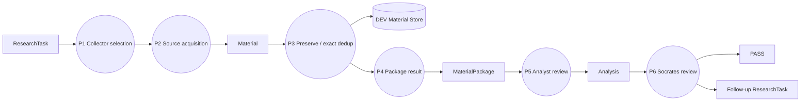
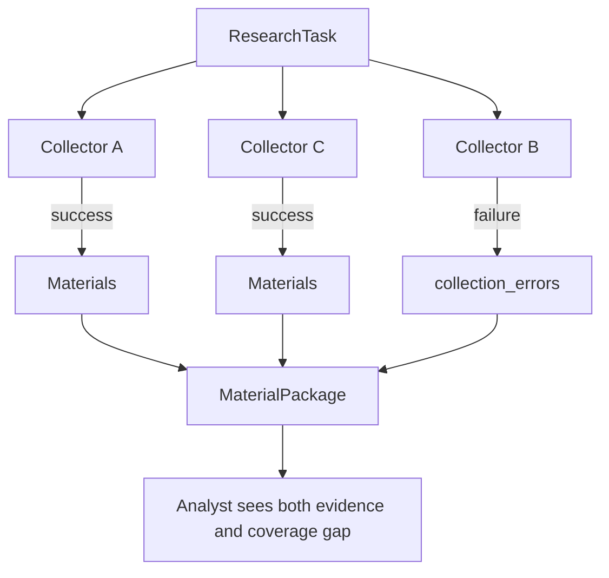
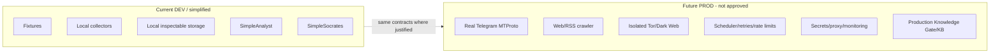
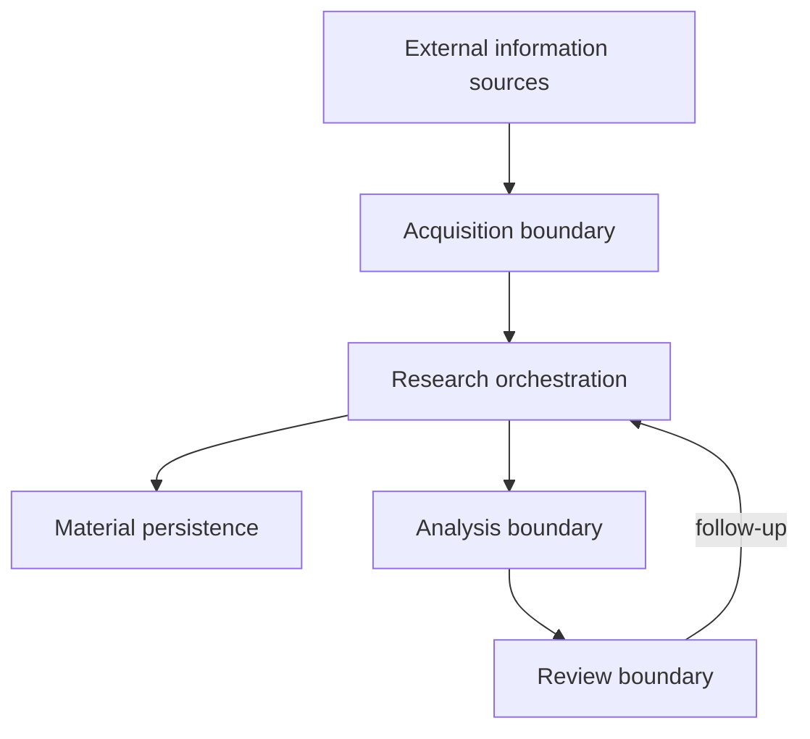

# Stage 03 — Architecture Views

**Status:** DRAFT FOR REVIEW  
**Rule:** diagrams describe responsibilities and information movement, not a final technology stack.

## 1. System context

The current repository implements only the DEV research side of this context. Knowledge Gate, production KB and FATHER orchestration are future boundaries, not approved implementation scope.

## 2. Logical component view

### Why each component exists

| Component | Reason | Current status |
|---|---|---|
| `ResearchTask` | stable order between Analyst and OSINT | candidate contract |
| `OSINTAgent` | bounded orchestration across source collectors | candidate implementation |
| `Collector` | isolate source-specific acquisition | candidate architecture |
| `FixtureCollector` | prove behavior without production infrastructure | DEV approved candidate |
| `TelegramCollector` | preserve future source boundary without locking transport | contract experiment |
| transport adapter | isolate MTProto/vendor mechanics | experimental / frozen |
| `MaterialStore` | inspectable DEV persistence and exact dedup | candidate implementation |
| `MaterialPackage` | stable research delivery object | candidate contract |
| `SimpleAnalyst` | verify handoff/gap cycle before LLM integration | DEV test double / prototype |
| `SimpleSocrates` | verify review/follow-up handoff | DEV test double / prototype |

## 3. Process view

## 4. Data flow view

### Data ownership

- ResearchTask is owned by the requester/Analyst boundary.
- Raw Material is owned by the research collection stage after capture.
- MaterialPackage is the OSINT delivery unit.
- Analysis belongs to Analyst.
- Review belongs to Socrates.
- None of these DEV objects is automatically `Knowledge`.

## 5. Failure view

Architecture requirement: one source failure should be visible without automatically discarding useful results from other independent collectors.

## 6. DEV/PROD boundary

The purpose of DEV is to prove the business contract before buying operational complexity.

## 7. C4-style container-neutral view

No database engine, queue, framework or LLM provider is implied by this view.

## 8. Interface boundaries to verify before Stage 4

### Analyst → OSINT

`ResearchTask` must be sufficient to execute bounded acquisition without requiring hidden conversation context.

### Collector → OSINT

Collector must return source-specific material through a common `Material` boundary or a visible failure. It must not decide final truth.

### OSINT → Analyst

`MaterialPackage` must preserve materials plus coverage/error/stop information. It must not hide incomplete collection.

### Analyst/Socrates → OSINT

Follow-up must be expressible as another bounded `ResearchTask`; no side-channel instructions should be required.

## 9. Architecture questions still open

1. Is exact hash deduplication enough for DEV acceptance, or is source-locator dedup also required?
2. Should `MaterialStore` own task/package persistence or only material persistence?
3. Do `pipeline.py` and `review_pipeline.py` represent two valid scenarios or accidental duplication?
4. Is `SimpleSocrates` part of the OSINT repository scope or only a DEV harness for the wider Knowledge Factory?
5. Which fields in `ResearchTask`, `Material` and `MaterialPackage` are mandatory versus convenience fields?
6. Which existing legacy scripts/services have any approved requirement mapping?

These questions must be resolved in the formal architecture review before new code is added.
