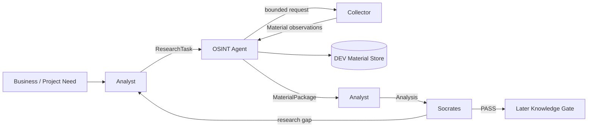
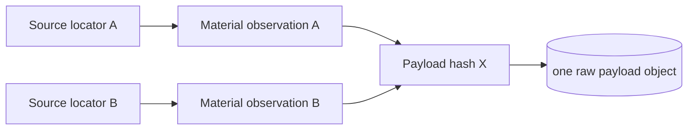

# Stage 03 — Formal Architecture Review

**Status:** IN PROGRESS — FIRST FILE-LEVEL PASS COMPLETE  
**Decision:** PASS is not granted yet.

This document is the architecture gate. Every significant component and information flow must be justified by approved requirements and business value before test design starts.

## 1. Review dimensions

| Dimension | Assessment | WHY |
|---|---|---|
| Business fit | PASS | architecture supports research supply rather than expert decision-making |
| Role separation | PASS | OSINT collects, Analyst interprets, Socrates reviews |
| Contract completeness | PARTIAL PASS | contracts are mostly adequate but provenance/dedup semantics required correction |
| Simplicity | PARTIAL PASS | duplicate pipeline implementations remain |
| Failure behavior | PARTIAL PASS | collector errors are exposed; broader restart/storage semantics need tests |
| DEV/PROD separation | PASS | fixtures are sufficient; Telegram transport is frozen/deferred |
| Traceability | PARTIAL PASS | core components mapped, tests not yet executed |
| Legacy isolation | PASS CONCEPTUALLY | legacy directories are explicitly outside current architecture |
| Technology neutrality | PASS | no PROD transport/database is approved by the logical design |
| Operability | PARTIAL PASS | documentation is now navigable; test evidence still missing |

## 2. End-to-end business flow



Business reason for every hop:

| From | Object | To | WHY |
|---|---|---|---|
| Analyst | ResearchTask | OSINT | convert an analytical information gap into a bounded acquisition order |
| OSINT | ResearchTask/source scope | Collector | isolate source-specific acquisition mechanics |
| Collector | Material observation | OSINT | return evidence material without interpretation |
| OSINT | Material/raw payload | Store | preserve inspectable DEV evidence and provenance |
| OSINT | MaterialPackage | Analyst | deliver materials, errors and stop reason through one source-neutral contract |
| Analyst | Analysis | Socrates | independent challenge before later knowledge publication |
| Socrates/Analyst | follow-up ResearchTask | OSINT | close a material gap without letting collection become unbounded |

## 3. File-by-file architecture decisions

### `father_osint/models.py` — **KEEP WITH CONTRACT CHANGE LATER**

**Owner:** cross-stage contracts.  
**Inputs/outputs:** data objects only.  
**WHY:** `ResearchTask`, `Material`, `MaterialPackage` are required by the approved information flows.

Decision:
- KEEP the three-contract concept;
- no source intelligence or truth score may enter these models;
- Stage 04 tests must validate required/optional fields;
- terminology must treat `Material` as a source observation, not as unique truth.

### `father_osint/agent.py` — **KEEP**

**Owner:** OSINT orchestration boundary.  
**Input:** `ResearchTask`.  
**Output:** `MaterialPackage`.  
**WHY:** one place is needed to select compatible collectors, enforce item bounds, isolate failures and package results.

Supported by code review: the current implementation selects eligible collectors, enforces `max_items`, catches collector exceptions and records explicit stop reasons. It does not perform analytical interpretation.

Restrictions:
- do not add Analyst/Socrates logic;
- do not turn it into the future scheduler;
- do not embed transport credentials or source-specific parsing.

### `father_osint/collectors/dev.py` — **KEEP (DEV ONLY)**

**Owner:** deterministic acquisition fixture.  
**WHY:** proves the collector contract without production credentials or network dependencies.

Stage 04 must test filtering, missing fixture behavior and mapping to `Material`.

### `father_osint/collectors/telegram.py` — **KEEP AS CONTRACT / DEFER LIVE USE**

**Owner:** Telegram source-facing normalization boundary.  
**WHY:** keeping source normalization separate from protocol transport protects the OSINT/Analyst contract from TDLib/Teleproto/etc. changes.

No transport is approved by keeping this file.

### `father_osint/storage.py` — **CHANGE REQUIRED BEFORE APPROVAL**

**Owner:** DEV evidence persistence.

Architecture defect discovered during review: current global content-hash dedup causes `save_material()` to reject a second material with identical payload. That can erase provenance when two different source locators publish the same content.

Required semantic split:

```text
SOURCE OBSERVATION A ─┐
                     ├──► RAW PAYLOAD HASH X (store once)
SOURCE OBSERVATION B ─┘
```

The raw payload may be deduplicated physically; source observations must remain independently traceable.

This finding has already been fed back into ТЗ/AC-02. No code fix is allowed until Stage 04 specifies the failing and expected cases.

### `father_osint/analysis.py` — **KEEP AS DEV HARNESS / NOT OSINT CORE**

**Owner:** temporary Analyst-side contract demonstrator.  
**WHY:** useful for proving the `MaterialPackage → Analysis → follow-up task` handoff.

Restrictions:
- not a final Analyst implementation;
- no claim that deterministic string processing represents expert analysis;
- may later move to a separate Knowledge Factory package.

### `father_osint/socrates.py` — **KEEP AS DEV HARNESS / CHANGE EXPECTATIONS**

**Owner:** temporary review-side demonstrator.

Current implementation mainly checks source availability/gaps. It does **not** actually establish that findings are supported by specific materials. Therefore it is suitable only for pipeline testing, not for expert Socrates quality acceptance.

Stage 04 tests should verify its bounded DEV behavior, not epistemic correctness.

### `father_osint/pipeline.py` — **DELETE CANDIDATE / FREEZE**

It orchestrates `OSINT → Analyst`, while `review_pipeline.py` already contains the superset `OSINT → Analyst → Socrates` flow. No independent business use case currently justifies two orchestration implementations.

Do not delete yet. Stage 04 regression tests must first show that `review_pipeline.py` covers the required bounded-loop behavior.

### `father_osint/review_pipeline.py` — **KEEP PROVISIONALLY**

**Owner:** DEV end-to-end orchestration harness.  
**WHY:** directly maps to the approved DEV process and includes the maximum-cycle guard.

Not a production workflow engine.

### `father_osint/transports/teleproto.py` — **DEFER / FROZEN**

Production transport selection is outside the current gate. The file is an experiment only. It creates Node/subprocess/environment dependencies that are unnecessary for DEV acceptance.

### `telegram_bridge/` — **DEFER / FROZEN**

Same reason as `TeleprotoTransport`. It must not become an implicit prerequisite for Stage 04.

### `core/`, `services/`, root legacy scripts — **DEFER / LEGACY**

No approved requirement currently pulls them into FATHER OSINT v1. Existing code is not architectural evidence.

## 4. Major architecture finding: provenance vs deduplication

The first detailed review found a real contract defect before test execution: deduplicating identical content and discarding the later `Material` record loses the fact that multiple sources carried the same payload.

This is exactly why Stage 03 exists.

Correct conceptual model for v1:



We are **not** adding a graph database or complex provenance engine. The requirement is only that separate observations survive while raw storage may be reused.

## 5. Pipeline decision

Preferred DEV path:

```text
ResearchTask
  → OSINTAgent
  → MaterialPackage
  → SimpleAnalyst
  → SimpleSocrates
  → PASS or bounded follow-up ResearchTask
```

`review_pipeline.py` represents this complete path. `pipeline.py` is therefore frozen as a likely redundant predecessor until Stage 04 tests prove safe removal.

## 6. Risks remaining before Stage 03 PASS

| ID | Risk | Severity | Required action |
|---|---|---|---|
| AR-01 | storage loses multi-source provenance | HIGH | design Stage 04 test and then change implementation |
| AR-02 | duplicate pipeline implementations | MEDIUM | prove review pipeline coverage; then remove/retire simple pipeline |
| AR-03 | Analyst/Socrates stubs mistaken for final expert agents | MEDIUM | preserve DEV-HARNESS labels in docs/tests |
| AR-04 | experimental Telegram transport mistaken for approved | HIGH | remain DEFERRED/FROZEN |
| AR-05 | tests have not been executed | HIGH | Stage 04 test review followed by runs |
| AR-06 | storage restart/corrupt-line behavior not specified | LOW/MEDIUM | define only the behavior needed by DEV acceptance |

## 7. Stage 03 gate status

Completed:
- [x] business boundary reviewed;
- [x] actor/responsibility flow reviewed;
- [x] core files classified KEEP/CHANGE/DELETE-CANDIDATE/DEFER;
- [x] experimental and legacy boundaries identified;
- [x] one requirement defect found and sent back to ТЗ;
- [x] preferred DEV pipeline selected provisionally.

Still required:
- [ ] update Stage 04 test obligations for corrected AC-02;
- [ ] review existing tests against the corrected requirements before executing them;
- [ ] prove `review_pipeline.py` covers required loop behavior;
- [ ] after test evidence, resolve `pipeline.py` final deletion/retirement;
- [ ] implement storage provenance correction only after its test is approved.

**Stage 03 verdict:** `CONDITIONAL PASS TO TEST DESIGN`.

This authorizes Stage 04 **test design/review only**. It does not authorize new feature development or production integration.
