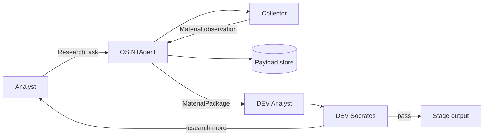

# Stage 03 — Architecture Decision Register

**Status:** ACTIVE / FIRST REVIEW PASS RECORDED

This register records decisions and deferred decisions before implementation. Major long-lived decisions may later be promoted to standalone ADR files.

| ID | Decision / question | Status | WHY / evidence | Next action |
|---|---|---|---|---|
| ADR-CAND-001 | OSINT returns MaterialPackage, not final expert conclusion | ACCEPTED | preserves role separation and source-neutral Analyst handoff | verify in Stage 04 |
| ADR-CAND-002 | DEV uses fixtures/simple sources before production transports | ACCEPTED | proves behavior without secrets/Tor/MTProto complexity | keep production adapters frozen |
| ADR-CAND-003 | Collector is source-facing boundary | ACCEPTED | prevents protocol/source mechanics leaking into Analyst contract | verify collector tests |
| ADR-CAND-004 | raw payload deduplication by content hash | CHANGE REQUIRED | current implementation can erase distinct source provenance when payloads match | Stage 04 test: two sources/same payload; then change storage |
| ADR-CAND-005 | bounded follow-up research cycles | ACCEPTED | prevents uncontrolled cost and infinite loops | test cycle limit |
| ADR-CAND-006 | Analyst/Socrates simple implementations remain DEV harness only | ACCEPTED WITH SCOPE LIMIT | useful for handoff verification; not final expert algorithms | label tests/docs DEV HARNESS |
| ADR-CAND-007 | `pipeline.py` and `review_pipeline.py` both remain | REJECTED AS TARGET ARCHITECTURE | no separate business use case justifies duplicate orchestration; review pipeline is functional superset | freeze `pipeline.py`; prove regression coverage; then retire/delete |
| ADR-CAND-008 | Teleproto/Node bridge as Telegram transport | DEFERRED | production transport not needed to prove DEV contract | revisit after DEV acceptance and donor/benchmark cycle |
| ADR-CAND-009 | local inspectable persistence instead of production DB | ACCEPTED FOR DEV | lowest-cost mechanism for deterministic acceptance | test required semantics only |
| ADR-CAND-010 | legacy `core/`, `services/`, old scripts are not implicit FATHER dependencies | ACCEPTED | prevents accidental architecture inheritance | explicit requirement/test needed for inclusion |
| ADR-CAND-011 | source observation and stored raw payload are logically distinct | ACCEPTED | same content can occur at several sources; evidence provenance must survive storage optimization | update tests, then storage implementation |
| ADR-CAND-012 | `review_pipeline.py` is preferred DEV orchestration harness | PROVISIONAL ACCEPT | maps complete OSINT → Analyst → Socrates → bounded follow-up process | confirm in Stage 04 regression tests |
| ADR-CAND-013 | `TelegramCollector` contract can remain while live transport is deferred | ACCEPTED | source-normalization interface is useful independently of chosen MTProto technology | test with fake transport only |

## Current target architecture



Production transport, Knowledge Gate, graph database, distributed queues and battle infrastructure are not part of this approved DEV target.

## Decision quality rule

Every final architecture decision must record:

```text
Problem
→ Alternatives considered
→ Decision
→ WHY
→ Evidence / constraints
→ Consequences
→ What would cause reconsideration
```

A technology already present in the repository is not evidence that it should remain in the approved architecture.
