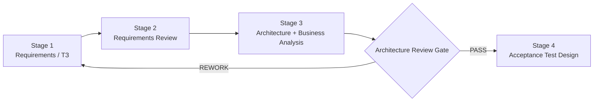

# Stage 03 — Architecture Review Pack

**Status:** ACTIVE / REVIEW BEFORE TEST DESIGN

This pack is the mandatory third stage of the FATHER engineering lifecycle. Its purpose is not to choose technologies prematurely, but to prove that the proposed system structure correctly implements the approved business need and technical specification.

## Gate rule

No new implementation work is allowed while this stage is open.

## Documents

| Document | Purpose |
|---|---|
| [01_BUSINESS_ANALYSIS.md](01_BUSINESS_ANALYSIS.md) | Business objective, actors, value stream, SIPOC, boundaries, success criteria |
| [02_ARCHITECTURE_VIEWS.md](02_ARCHITECTURE_VIEWS.md) | Context, logical components, process flow, data flow, sequence and deployment-independent views |
| [03_ARCHITECTURE_REVIEW.md](03_ARCHITECTURE_REVIEW.md) | Formal review questions, risks, alternatives, defects and PASS/REWORK decision |
| [04_DECISION_REGISTER.md](04_DECISION_REGISTER.md) | Architecture decisions, WHY, evidence and deferred decisions |

## What this stage must answer

1. Why does the system exist and what business problem does it solve?
2. Who gives work to whom?
3. What enters each stage and what must leave it?
4. What information must be preserved between stages?
5. Where are responsibilities separated and why?
6. Which parts are current DEV mechanisms and which are future PROD mechanisms?
7. Which architectural choices are decisions and which are only hypotheses?
8. What can fail, how is failure visible and where is the recovery boundary?
9. Which requirements are not yet represented in architecture?
10. What must be proven by tests before implementation can continue?

## FATHER principle

> Architecture is not a drawing of code. It is the checked explanation of how an approved requirement becomes a controlled business and technical process.

The architecture is intentionally technology-neutral wherever possible. PostgreSQL, Neo4j, message brokers, MTProto libraries, LLM providers and deployment platforms are not approved merely because they are convenient or already present in the repository.
