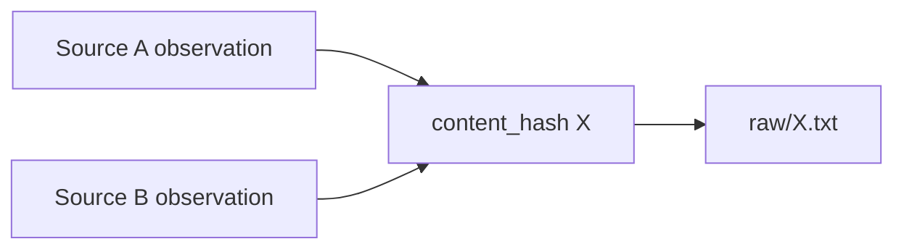

# Stage 05 — Storage Semantics Implementation Plan

**Status:** PROPOSED / NOT YET AUTHORIZED FOR CODE CHANGE

## 1. Problem

Current DEV storage treats `content_hash` as if it were both:

1. identity of the raw payload, and
2. identity of the source observation.

Those are different concepts.

Example:

```text
Source A -> "same payload"
Source B -> "same payload"
```

Business requirement: Analyst must know that two source observations exist. Storage optimization may still keep only one physical raw text blob.

## 2. Required semantics



The two observations are independent records for provenance purposes. The raw payload is shared only as a storage optimization.

## 3. Minimal change target

Change only `MaterialStore.save_material()` behavior.

Current behavior:

```text
hash already known
    ↓
return False
    ↓
Material observation lost
```

Required behavior:

```text
calculate content hash
    ↓
raw blob already exists?
   / \
 no   yes
 |     |
write  reuse
 blob  blob
   \   /
    ↓
always persist Material observation
    ↓
return observation accepted
```

## 4. Deduplication boundary

For this phase, **payload deduplication is storage-level only**.

Stage 05 does NOT introduce semantic deduplication, source-independence scoring or similarity clustering.

An exact duplicate observation key is not yet required. If later needed, it should be based on an explicit observation identity policy such as source locator + source-specific identifier, not payload hash alone.

## 5. Alternatives considered

### A. Keep current hash-as-material identity

**Reject.** Loses provenance and fails AC-02/AT-04.

### B. Introduce separate database tables now (`observations`, `blobs`)

**Defer.** Semantically clean but unjustified complexity for DEV. Current JSONL + raw directory can express the required distinction.

### C. Minimal JSONL observation + hash-addressed raw blob

**Recommend.** Preserves provenance, keeps storage inspectable and requires no new dependency or database.

## 6. Expected code impact

Expected production code change:

- `father_osint/storage.py` only, unless an unforeseen contract mismatch is discovered.

Expected test impact:

- updated AC-02 test should pass;
- AT-04 restart test should pass;
- existing AC-03/04/05 and pipeline tests must remain green.

No change expected to:

- `models.py`;
- `agent.py` interface;
- collectors;
- Analyst/Socrates;
- transports;
- legacy code.

## 7. Return-value semantics

`save_material()` currently returns `bool`, interpreted by `OSINTAgent` as accepted vs duplicate-skipped.

For the minimal fix, successful persistence of a distinct observation returns `True` even when its raw payload blob already exists.

Because exact observation-level duplicate detection is not specified in v1, `False` should no longer mean "same payload hash".

If no legitimate `False` case remains after review, a later cleanup may replace the boolean with a clearer result type. That cleanup is explicitly outside this defect fix.

## 8. Risks

- repeated collection of the exact same source observation may produce multiple JSONL records until observation identity is defined;
- `duplicates_skipped` may temporarily lose practical meaning for equal payloads;
- current append-only DEV store can grow faster.

These are accepted DEV trade-offs because losing provenance is the more serious defect.

## 9. Acceptance after implementation

Required regression evidence:

```text
AC-02 PASS
AT-04 PASS
AC-03 PASS
AC-04 PASS
AC-05 PASS
AC-08 PASS
AC-09 PASS
```

Then record `TEST_REPORT_002`.
