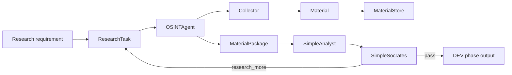

# FATHER OSINT — Component Traceability Map

**Status:** DEV verification artifact  
**Scope:** `father_osint/` current package  
**Rule:** requirement → contract → component → output → test. No component is promoted to PROD merely because code exists.

## Product chain



The current package proves this bounded development chain only. It does not implement a production Knowledge Gate, autonomous KB publication, scheduler, distributed storage, or a production Telegram transport.

## Component register

| Component | Responsibility | Input | Output | Verification | Current status |
|---|---|---|---|---|---|
| `models.py` | Cross-stage DEV contracts | constructor data | `ResearchTask`, `Material`, `MaterialPackage` | MVP + architecture acceptance tests | DEV CORE |
| `agent.py` | Collection orchestration only | `ResearchTask`, collectors | `MaterialPackage` | MVP + architecture acceptance | DEV CORE |
| `storage.py` | Append-only DEV provenance storage; content-addressed raw blobs | tasks/materials/packages | JSONL + raw blobs | MVP/architecture tests | DEV CORE |
| `collectors/dev.py` | Deterministic fixture acquisition | fixture + task | `Material` stream | DEV pipeline tests | TEST SUPPORT |
| `collectors/telegram.py` | Telegram source adapter boundary; no analysis | `ResearchTask`, `TelegramTransport` | Telegram `Material` stream | Telegram collector test | DEV BOUNDARY |
| `analysis.py` | Deterministic handoff/gap detector | task + package | `Analysis` | simple analyst tests | DEV SIMULATOR |
| `socrates.py` | Deterministic evidence/gap review | task + package + analysis | `SocratesReview` | simple Socrates tests | DEV SIMULATOR |
| `review_pipeline.py` | Bounded OSINT→Analyst→Socrates loop | initial task | cycles + stop reason | review/dev pipeline tests | DEV ORCHESTRATION |
| `transports/teleproto.py` | Experimental Node bridge to Telegram MTProto transport | `ResearchTask` | `TelegramMessage[]` | no production acceptance evidence | EXPERIMENTAL / NOT APPROVED |
| `collectors/__init__.py`, `transports/__init__.py`, package `__init__.py` | package exports/boundaries | imports | public Python surface | import coverage indirectly | SUPPORT |

## Architectural findings

### F-01 — OSINT boundary is correct

`OSINTAgent` coordinates collectors and persistence and returns a material package. It does not analyze findings or write knowledge. This matches the intended ecosystem separation:

```text
Analyst asks
    ↓
OSINT collects
    ↓
Analyst interprets
    ↓
Socrates reviews/weighs
    ↓
future Knowledge Gate
```

### F-02 — `Material` is observation/evidence transport, not knowledge

A `Material` record contains source locator, raw payload/local path, timestamps, author, metadata and content hash. It must never be treated as an approved fact solely because it was collected.

### F-03 — storage preserves provenance

Equal payload bytes may reuse a SHA-256 raw blob, but source observations remain separate records. This is the correct DEV behavior: content equality must not silently collapse provenance.

### F-04 — Analyst and Socrates are deliberately fake/minimal

`SimpleAnalyst` and `SimpleSocrates` are deterministic DEV simulators. They validate contracts, handoffs, gaps and bounded follow-up behavior. They are not expert intelligence engines and must not accumulate domain sophistication during this phase.

### F-05 — Telegram collector boundary is good; transport is not approved

`TelegramCollector` depends on a minimal `TelegramTransport` protocol, so TDLib/GramJS/another backend can later be benchmarked without changing the collection contract. `TeleprotoTransport` is one experimental implementation and must remain replaceable.

### F-06 — production concerns remain intentionally absent

Do not add yet:

- autonomous KB promotion;
- production confidence scoring;
- permanent source trust weights;
- distributed queues/databases;
- scheduler/orchestrator infrastructure;
- live credentials in repository;
- dark-web/live Telegram production access merely to make the DEV pipeline look complete.

Those require their own requirement, ADR, donor review, threat review and acceptance criteria.

## Traceability gates for every future change

```text
1. REQUIREMENT
   What problem are we solving?
        ↓
2. ARCHITECTURE
   Which existing boundary owns it?
        ↓
3. CONTRACT
   What exact input/output changes?
        ↓
4. TEST FIRST
   What observable behavior proves it?
        ↓
5. IMPLEMENTATION
   Smallest code that passes the test.
        ↓
6. VERIFICATION
   Unit + integration + architecture acceptance.
        ↓
7. DOCUMENTATION / ADR
   Why was this design retained?
```

If step 1–4 is missing, implementation stops.

## Current verdict

`father_osint/` has a coherent small DEV core. The main risk is no longer missing architecture; it is premature growth. The next engineering action should therefore be verification of the existing tests and gaps, not adding more agents, databases or intelligence logic.
