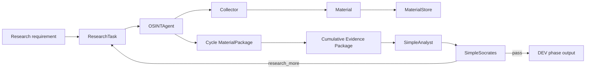

# FATHER OSINT — Component Traceability Map

**Status:** DEV verification artifact / semantic remediation applied  
**Scope:** current `father_osint/` package  
**Rule:** requirement → contract → component → output → test. No component is promoted to PROD merely because code exists.

## Product chain



The current package proves this bounded development chain only. It does not implement a production Knowledge Gate, autonomous KB publication, scheduler, distributed storage or a production Telegram transport.

## Component register

| Component | Responsibility | Input | Output | Verification | Current status |
|---|---|---|---|---|---|
| `models.py` | Cross-stage DEV contracts | constructor data | `ResearchTask`, `Material`, `MaterialPackage` | MVP + semantic tests | DEV CORE |
| `agent.py` | Collection orchestration only | `ResearchTask`, collectors | per-cycle `MaterialPackage` | MVP + architecture tests | DEV CORE |
| `storage.py` | Append-only provenance; text blob reuse; file SHA-256 | tasks/materials/packages | JSONL + raw text blobs | MVP + semantic tests | DEV CORE |
| `collectors/dev.py` | Deterministic fixture acquisition | fixture + task | `Material` stream | DEV pipeline tests | TEST SUPPORT |
| `collectors/telegram.py` | Telegram source adapter boundary; no analysis | `ResearchTask`, `TelegramTransport` | Telegram `Material` stream | Telegram collector tests | DEV BOUNDARY |
| `analysis.py` | Deterministic handoff/gap detector | task + evidence package | `Analysis` | simple analyst tests | DEV SIMULATOR |
| `socrates.py` | Deterministic evidence/gap review | task + evidence + analysis | `SocratesReview` | simple Socrates tests | DEV SIMULATOR |
| `review_pipeline.py` | Bounded cumulative OSINT→Analyst→Socrates loop | initial task | cycles + cumulative evidence + stop reason | pipeline + semantic tests | DEV ORCHESTRATION |
| `transports/` | Reserved transport implementation boundary | future adapter | `TelegramTransport` implementation | none approved | FUTURE BOUNDARY |
| package `__init__.py` files | package exports/boundaries | imports | public Python surface | import/runner coverage | SUPPORT |

## Architectural findings

### F-01 — OSINT boundary remains narrow

`OSINTAgent` coordinates collectors and persistence and returns collected material. It does not decide truth or write knowledge.

### F-02 — Material is observation/evidence transport, not knowledge

A Material record contains source locator, raw text or original local file path, timestamps, author, metadata and content hash. Collection does not make a statement true.

### F-03 — payload reuse and observation identity are separate

Equal raw-text payloads may reuse one SHA-256-addressed blob, while every source observation remains a separate append-only record. The metric is `payloads_reused`; no observation is implied to be skipped.

### F-04 — file-only evidence is hashable

When `raw_text` is absent and `local_path` points to an existing file, SHA-256 is calculated over the original bytes. Missing local files fail explicitly.

### F-05 — follow-up research is cumulative

Each review cycle keeps its own collection package, while Analyst and Socrates review cumulative evidence from the entire bounded research run. Narrow follow-up tasks therefore do not erase earlier source coverage.

### F-06 — Analyst and Socrates remain deliberately minimal

`SimpleAnalyst` and `SimpleSocrates` are deterministic DEV simulators. They validate handoffs, gaps and bounded follow-up behavior; they are not expert reasoning engines.

### F-07 — Telegram transport is deliberately unchosen

`TelegramCollector` depends on a minimal `TelegramTransport` protocol. No TDLib/GramJS/other implementation is approved merely because a prototype once existed. Selection remains a future donor/ADR/benchmark task.

## Production concerns intentionally absent

Do not add without a new requirement and acceptance gate:
- autonomous KB promotion;
- production confidence scoring;
- permanent source trust weights;
- distributed queues/databases;
- scheduler/orchestrator infrastructure;
- live credentials in repository;
- Tor/dark-web or live Telegram access merely to make DEV look complete.

## Traceability gate for future change

```text
1 REQUIREMENT
2 ARCHITECTURE OWNER
3 INPUT/OUTPUT CONTRACT
4 TEST FIRST
5 MINIMAL IMPLEMENTATION
6 CLEAN VERIFICATION
7 DOCUMENTATION / ADR / JOURNAL
```

If steps 1–4 are missing, implementation stops.

## Current verdict

The small DEV core is internally coherent after semantic remediation. The next risk is documentation drift or premature feature growth, not a need for more infrastructure.
