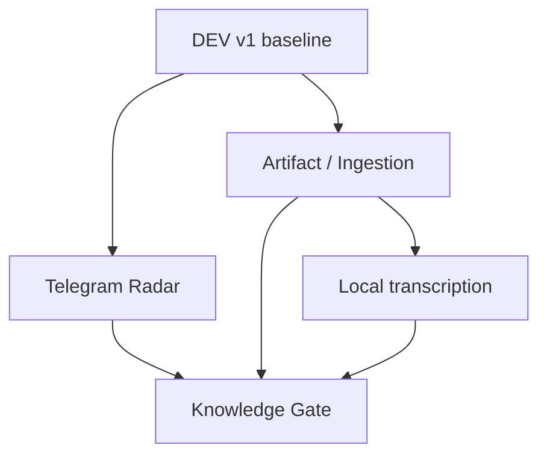

# M5 — Next Business Capability Priority

**Status:** APPROVED FOR REQUIREMENTS DESIGN  
**Date:** 2026-08-10  
**Baseline:** FATHER OSINT DEV v1 frozen after Stage 06

## Decision question

What capability should be built next after the verified DEV v1 baseline?

Candidate capabilities:

1. Telegram Radar
2. Universal Artifact / Ingestion layer
3. Local transcription
4. Knowledge Gate

The decision is based on dependency order and business value, not novelty.

## Dependency map



## Decision matrix

| Capability | Immediate value | Uses current DEV contracts | Dependency burden | Unlocks later work | Decision |
|---|---|---|---|---|---|
| Telegram Radar | Very high | Very high | Medium | live intelligence acquisition, source registry, real provenance | **M5 FIRST** |
| Artifact / Ingestion | High | High | Medium | PDF/image/audio/video/web normalization | **M6** |
| Local transcription | Medium now / high later | Medium | Depends on Artifact layer | private audio/video processing | **M7** |
| Knowledge Gate | High strategically | Low without real evidence flow | High conceptual risk if built too early | approved KB publication | **M8 / after real evidence flow** |

No numeric score is used because the project has no calibrated weighting model. The ordering is an architectural dependency decision.

## Why Telegram Radar is first

The current product is already an OSINT supplier. Its largest missing practical capability is a verified live source connector.

Telegram Radar adds one real acquisition channel without changing the responsibility split:

```text
Analyst
   ↓ ResearchTask
OSINTAgent
   ↓
TelegramCollector
   ↓
approved TelegramTransport
   ↓
Material + provenance
   ↓
MaterialStore
   ↓
Analyst / Socrates
```

Telegram Radar must remain a collector. It must not become an Analyst, truth engine or KB publisher.

## M5 business requirement

> FATHER OSINT shall be able to collect requested public Telegram channel material through a replaceable, approved transport implementation and return it as normal `Material` records with preserved provenance, bounded execution and explicit failures.

## M5 scope

Included in requirements design:

- public Telegram channels/sources;
- source registry supplied by task/config, not hard-coded intelligence truth;
- transport adapter behind the existing `TelegramTransport` boundary;
- message text and Telegram metadata required for provenance;
- bounded collection (`max_items` and explicit stop reason);
- explicit unavailable/private/auth/rate-limit errors;
- restart-safe persistence through existing MaterialStore;
- source/message locator where technically available;
- donor verification and ADR before choosing TDLib, GramJS or another transport;
- secrets kept outside Git;
- fixture/fake transport retained for deterministic tests.

Not included in M5:

- autonomous discovery of every Telegram channel;
- account/person deanonymization;
- sockpuppets;
- proxy/Tor rotation as default behavior;
- mass scraping;
- media transcription;
- OCR/document extraction;
- Knowledge Gate;
- source trust/confidence scoring;
- automatic truth claims;
- permanent production scheduling.

## Acceptance direction

Before implementation, Stage 07 must define executable acceptance cases at minimum for:

1. public channel message is mapped to a provenance-preserving Material;
2. two channels publishing identical payload remain two observations;
3. transport failure is isolated and visible;
4. rate-limit/flood response is explicit and bounded;
5. requested max_items is respected;
6. restart does not corrupt stored provenance;
7. no Telegram credential/session secret is written to repository or Material records;
8. collector behavior is transport-independent;
9. live transport can be disabled and fixture tests still pass;
10. DEV v1 regression remains green.

## Gate before code

```text
M5 requirement
   ↓
Telegram donor refresh
   ↓
SOURCE_VERIFIED candidates
   ↓
PoC / technical verification
   ↓
benchmark + security review
   ↓
ADR: transport selection
   ↓
acceptance tests
   ↓
implementation plan
   ↓
code
```

No transport is APPROVED by this document. Telethon/Pyrogram/GramJS/TDLib or any future candidate must pass the current donor process.

## Planned order after M5

```text
M5 Telegram Radar
        ↓
M6 Artifact / universal ingestion
        ↓
M7 Local transcription
        ↓
M8 Knowledge Gate
```

This order may be revisited only when a concrete business requirement proves another dependency is more urgent.
