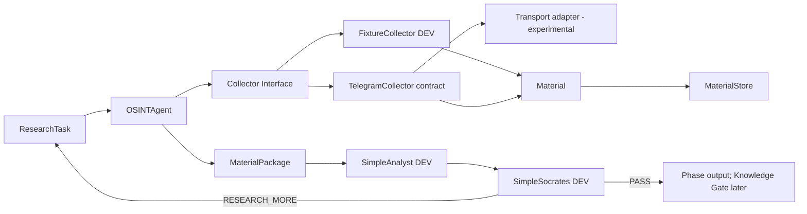

# FATHER OSINT DEV Architecture v1

**Status:** DRAFT / TO BE REVIEWED AGAINST ТЗ

## Architecture objective

Prove the research handoff with the smallest practical structure. Avoid production infrastructure until behavior is demonstrated.

## Responsibilities

- `models.py`: cross-stage contracts only.
- `agent.py`: collector orchestration, bounds, error isolation, package creation.
- `collectors/`: acquisition mapping only; no truth/decision logic.
- `storage.py`: local inspectable persistence for DEV.
- `analysis.py`: deterministic DEV Analyst used to validate handoff, not final intelligence.
- `socrates.py`: minimal DEV review and bounded research-more request.
- `pipeline.py` / `review_pipeline.py`: bounded orchestration experiments.
- `transports/`: experimental external access adapters. Not approved for PROD.

## Architecture rules

1. OSINT returns materials, not conclusions.
2. Analyst/Socrates can be replaced later without changing Material contract unnecessarily.
3. Collectors are source-facing; transports are protocol-facing.
4. DEV storage remains simple until scale requirement is proven.
5. No infinite agent loop: maximum cycle count is mandatory.
6. Production connector/security design is a later gate.

## Known architectural debt

Existing `pipeline.py` and `review_pipeline.py` overlap and should be evaluated after tests; do not merge or expand them before evidence. The legacy `core/`, root scripts and `services/` predate this architecture and are not automatically part of FATHER OSINT v1.
