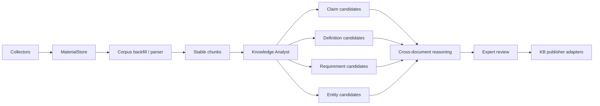

# Knowledge Analyst MVP

## Purpose

FATHER OSINT is split into two independent production loops:

1. **Acquisition loop** discovers and preserves source material.
2. **Knowledge loop** reprocesses already acquired material into traceable, reviewable knowledge candidates.

The knowledge loop must be able to advance even when live OSINT acquisition is paused or blocked.

## Pipeline



## Current MVP contract

Input is the existing `MaterialStore` observation corpus. Raw payload preservation remains the responsibility of the acquisition layer.

Output is `father-osint.knowledge-bundle.v0.1`.

Every extracted sentence becomes a stable chunk carrying:

- material ID;
- source type;
- source locator;
- source title;
- exact character start/end offsets;
- SHA-256 of the exact extracted text span;
- original material content hash when available.

Semantic outputs are **candidates**, never verified facts by default:

- `CLAIM_CANDIDATE`;
- `DEFINITION_CANDIDATE`;
- `REQUIREMENT_CANDIDATE`;
- `ENTITY_CANDIDATE`.

Every candidate starts as `NEEDS_REVIEW`.

## Why deterministic first

The first extraction layer is intentionally deterministic and dependency-light. It gives us:

- repeatable regression fixtures;
- exact provenance;
- measurable false-positive / false-negative rates;
- an explainable baseline to compare future LLM extraction against;
- a safe fallback when an LLM is unavailable.

An LLM analyst should later enrich this bundle, not replace the evidence contract.

## Existing-corpus backfill

Run against a previously populated material store:

```bash
python scripts/run_knowledge_backfill.py --store-root data/osint --output data/knowledge/backfill.bundle.json
```

The runner performs no network acquisition. It reads previously stored observations, extracts traceable candidates and writes one atomic JSON bundle.

## Workstream boundaries

### A. Acquisition
Discovery, collection, raw preservation, source identity, timestamps and hashes.

### B. Normalization
PDF/DOCX/HTML/text parsing, structural locators and stable chunk boundaries.

### C. Knowledge Analyst
Terms, definitions, requirements, claims, entities, applicability candidates and version/change candidates.

### D. Cross-document reasoning
Equivalence, contradiction, overlap, supersession, stale references and missing evidence.

### E. KB publication and QA
Target-schema adapters, stable IDs, idempotent updates, expert review, regression metrics and audit.

## Acceptance gates

A candidate may enter a target KB only when it retains a resolvable evidence reference. A candidate may become VERIFIED only after the target-domain review policy is satisfied.

The system must never infer a legal obligation merely because a sentence contains a requirement marker. `REQUIREMENT_CANDIDATE` is an extraction class, not a legal conclusion.

## Next increments

1. Parse file-only materials into text while preserving page/paragraph locators.
2. Add terminology aliases and canonical concept IDs.
3. Add applicability/scope candidates.
4. Add amendment/supersession/version candidates.
5. Add cross-document contradiction fixtures.
6. Add Security KB publisher adapter.
7. Add extraction metrics: candidates/material, duplicate rate, review acceptance rate, rejected false positives and unresolved evidence gaps.
