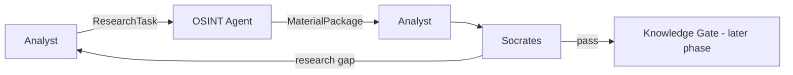

# Техническое задание: FATHER OSINT Agent v1

**Status:** REQUIREMENTS REVIEWED / STAGE 06 SEMANTIC REMEDIATION APPLIED  
**Implementation status:** DEV baseline verified on clean CI; production integrations remain out of scope.

## 1. Purpose

OSINT Agent is a research supplier inside FATHER Knowledge Factory. It receives a research task from Analyst, obtains relevant materials from permitted sources, preserves provenance, reduces redundant payload storage and returns a structured `MaterialPackage`.

The OSINT Agent does not decide truth, does not select architecture, does not publish into KB and does not replace Analyst or Socrates.

## 2. Process position

## 3. Inputs

Minimum `ResearchTask` contract:
- question;
- topics/keywords;
- requested source types;
- optional date range;
- depth: FAST / NORMAL / DEEP / CRITICAL;
- maximum material count or equivalent bounded budget;
- requester identifier;
- optional stop condition.

`depth` and `stop_when_enough` are contract fields in DEV v1; their production operational semantics are intentionally deferred until a concrete requirement and tests exist.

## 4. Outputs

Minimum `MaterialPackage`:
- task identifier;
- collected material observations;
- count of raw payloads reused from content-addressed storage (`payloads_reused`);
- collection errors;
- stop reason;
- notes when required.

`payloads_reused` never means that a source observation was discarded. Observation-level deduplication is not defined in DEV v1.

Minimum material observation record:
- source type;
- source locator;
- title or fallback identifier;
- collected raw text and/or local raw file reference;
- publication time when known;
- author/publisher when known;
- collection time;
- SHA-256 content hash when payload exists;
- source-specific metadata.

### Provenance rule

Two different source observations may contain byte-identical or text-identical content. The system may store the text payload once by hash, but **must not erase the fact that the same content was observed at different source locators**. Payload reuse and source-observation identity are different concerns.

For file-only material, SHA-256 is calculated over the original local file bytes. A missing referenced local file must fail explicitly rather than be silently persisted as unverifiable evidence.

### Cumulative research rule

A bounded multi-cycle research run is cumulative. A follow-up task may narrow collection to a missing source type, but previously collected evidence remains available to Analyst and Socrates. Each cycle keeps its own collection package for audit while review uses a cumulative evidence package.

## 5. Required behavior

1. Accept a bounded research task.
2. Select only collectors compatible with requested source types.
3. Collect permitted material without analytical conclusions.
4. Preserve source locator and original material/reference.
5. Reuse storage for obvious identical text payloads without destroying independent source provenance records.
6. Hash file-only source artifacts from original bytes before downstream interpretation.
7. Isolate collector failure so one source does not necessarily destroy the whole package.
8. Stop at a declared limit or after collectors are exhausted.
9. Return explicit errors/gaps instead of silently inventing material.
10. Preserve cumulative evidence across bounded follow-up research cycles.

## 6. DEV scope

DEV v1 uses simple deterministic collectors and prepared fixtures/public inputs. The goal is to prove contracts and handoffs, not battle collection.

Allowed now:
- JSON/text fixtures;
- local inspectable storage;
- deterministic Analyst/Socrates stubs;
- bounded 1-3 cycle research loops;
- transport-neutral Telegram collector boundary.

Deferred to PROD gate:
- live Telegram account/session operation;
- Dark Web/Tor gateway;
- proxy/session rotation;
- long-running scheduler;
- production secret storage;
- distributed queues/databases;
- automatic KB publication.

## 7. Non-functional requirements for DEV

- minimal dependencies;
- deterministic repeatable fixtures;
- no secrets committed to repository;
- code boundary between collector and transport;
- failures visible in result;
- local storage suitable for inspection;
- no unbounded agent loops;
- source provenance must survive payload reuse;
- cumulative follow-up must not forget earlier evidence.

## 8. Acceptance criteria

AC-01: valid ResearchTask with matching fixture collectors returns a non-empty MaterialPackage.  
AC-02: identical payloads may reuse one stored raw object, but distinct source observations remain separately traceable.  
AC-03: absence of eligible collector returns explicit error/stop reason.  
AC-04: max_items bounds collection.  
AC-05: collector exception is recorded without corrupting already collected material.  
AC-06: Analyst can consume MaterialPackage without source-specific knowledge.  
AC-07: Analyst may request follow-up research when expected source coverage is missing.  
AC-08: DEV research loop has a hard maximum cycle count.  
AC-09: Socrates review either passes analysis or returns a bounded research-more request.  
AC-10: no Knowledge Gate/PROD connector is required to prove OSINT v1.  
AC-11: evidence acquired in earlier cycles remains visible during later follow-up review; a staged Telegram→GitHub scenario can reach PASS without recollecting already satisfied source types.  
AC-12: two distinct observations with equal text are both preserved, one raw blob may be reused, and `payloads_reused` reports that reuse without implying an observation was skipped.  
AC-13: file-only Material receives SHA-256 of original bytes; a missing file reference produces an explicit failure.

## 9. Definition of Done for DEV v1

The DEV phase is complete only when this ТЗ, architecture, traceability, tests and current code agree; all acceptance tests pass on a clean checkout; canonical runners pass; no removed legacy component is presented as current architecture; and remaining deferred items are explicitly labelled rather than implied to exist.
