# FATHER Engineering Governance

**Status:** ACTIVE PROJECT RULE

## Primary principle

**NO CODE BEFORE CONTRACT.**

FATHER development follows an evidence-producing engineering chain. Code is an implementation of an approved contract, not the place where requirements are invented.

## Mandatory chain

```mermaid
flowchart LR
    I[Idea / Business Need] --> R[ТЗ / Requirements]
    R --> RR[Requirements Review]
    RR --> A[Architecture]
    A --> AR[Architecture Review]
    AR --> T[Acceptance Test Specification]
    T --> IP[Implementation Plan]
    IP --> C[Code]
    C --> TR[Test Runs]
    TR --> AC[Acceptance]
    AC --> OP[Operation]
    OP --> EX[Experience / KB]
```

## Gates

### G0 — Requirements Ready
Must define purpose, scope, actors, inputs, outputs, constraints, exclusions, DEV/PROD boundary and acceptance criteria.

### G1 — Architecture Ready
Must show responsibility boundaries, data flow, external dependencies, failure boundaries and WHY for material decisions.

### G2 — Tests Ready
Acceptance tests must exist before further feature code. A test should prove externally observable behavior, not merely call an internal class.

### G3 — Development Allowed
Only requirements traceable through G0-G2 may be implemented.

### G4 — Verified
Existing tests have been executed; failures are recorded and classified; implementation matches the approved contract.

### G5 — Operational Candidate
Production integrations, credentials, schedulers, hardening, monitoring and battle collectors may be introduced only here.

## Project modes

- **DEV / SIMPLIFIED:** fixtures, deterministic workers, local storage, small bounded loops.
- **PROD / BATTLE:** live connectors, secrets, schedulers, isolation, monitoring, retry/rate-limit strategy, legal/security controls.

The DEV model must prove the profession and interfaces before PROD infrastructure is added.

## Occam rule

Do not add an agent, service, datastore, protocol, metric or abstraction unless a concrete approved requirement needs it. Future capability is documented, not pre-built.

## Change request rule

Every material change must be traceable as:

`Need -> Requirement -> Architecture -> Test -> Implementation -> Test Evidence -> Decision/Experience`.

If a discovered implementation predates the contract, it is marked **PROTOTYPE / UNVERIFIED** and is reviewed with `KEEP / CHANGE / DELETE` after requirements approval.
