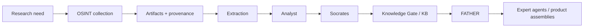
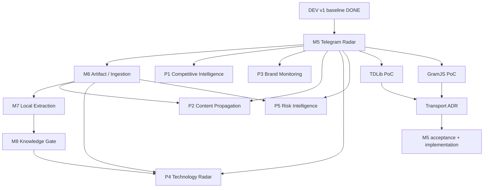
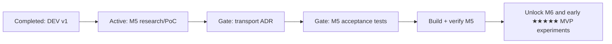

# FATHER / OSINT_deepseek — Capability Roadmap & Project Control

**Status:** living project-management baseline  
**Planning model:** capability/evidence driven; **no calendar deadlines yet**  
**Purpose:** manage the project as a senior product/engineering program: goals, dependencies, gates, risks, progress, commercial options and decision paths.

## 1. Planning principle

We do not invent dates before delivery capacity is known. We plan by **achievable capability states** and evidence.

Three classes are used:

- **MUST** — required to make the core trustworthy/useful or to unlock the next approved stage.
- **SHOULD** — strongly desirable because it reduces operational risk or materially strengthens several product paths.
- **OPTION** — preserves or creates a commercial/product opportunity; it becomes MUST only after an approved requirement/customer hypothesis justifies it.

No OPTION may contaminate the reusable core or bypass the engineering gates.

## 2. North-star capability



FATHER itself is an orchestrator/consumer of governed knowledge and expert capabilities. Collection, analysis, challenge and knowledge publication remain separable responsibilities.

## 3. Integrated capability roadmap

| ID | Capability outcome | Class | Depends on | Done when / evidence gate | Product options strengthened | State |
|---|---|---|---|---|---|---|
| B0 | Frozen DEV v1 semantic baseline | MUST | — | clean CI + 21 tests + canonical runners + freeze record | all | **DONE / FROZEN** |
| M5 | Live Telegram Radar | MUST | B0 | approved transport ADR; bounded catch-up + live updates + reconciliation; checkpoint-after-save; source isolation; restart test; provenance preserved; DEV regression green | Competitive Intelligence, Content Propagation, Brand Monitoring, Trend Radar | **ACTIVE** |
| M5.1 | TDLib PoC | MUST | M5 requirements | repeatable harness and raw metrics against approved public test sources; restart/rate/error/session behavior documented | all Telegram-based products | **NEXT** |
| M5.2 | GramJS comparative PoC | SHOULD | M5 requirements | same contract/harness where technically possible; operational and maintenance evidence recorded | transport optionality | PLANNED |
| M5.3 | Transport ADR + product-path acceptance contract | MUST | M5.1/M5.2 | decision based on measured evidence; rollback path; acceptance tests written before implementation | all Telegram-based products | BLOCKED BY POC |
| M6 | Universal Artifact / Ingestion | MUST | M5 stable boundary | original preserved; SHA-256; detected type; normalized derivative; provenance; safe routing for audio/video/image/docs; no extension-only trust | Research Workspace, Content Propagation, Meeting Intelligence, multi-source products | PLANNED |
| M6.1 | Media/document metadata preservation | SHOULD | M6 | low-cost metadata contract documented/tested; originals never silently replaced | Content Origin, Evidence Workspace, Risk Intelligence | PLANNED |
| M7 | Local-first extraction/transcription | MUST | M6 | local processing path works without mandatory third-party service; language retained; output traceable to Artifact | Meeting Intelligence, private research, evidence processing | PLANNED |
| M7.1 | External transcription provider registry | SHOULD | M7 policy | explicit caution/privacy classification; providers replaceable; never default for sensitive material | convenience / fallback | PLANNED |
| M8 | Knowledge Gate foundation | MUST | stable evidence + analysis contracts | candidate knowledge cannot enter governed KB without provenance, review state and explicit gate decision | FATHER expert ecosystem, Technology Radar, Supplier Monitoring | PLANNED |
| M8.1 | Knowledge revision/history | MUST | M8 | superseded/retracted knowledge remains auditable; no silent destructive overwrite | all knowledge products | PLANNED |
| P1 | Competitive & Channel Intelligence MVP | OPTION ★★★★★ | M5 + thin reporting | bounded watchlist produces source-grounded daily/weekly brief with links/evidence | direct commercial product | OPPORTUNITY |
| P2 | Content Origin & Propagation MVP | OPTION ★★★★★ | M5; stronger with M6 | earliest-observed + similarity/forward timeline without unsupported authorship accusation | media/PR/research | OPPORTUNITY |
| P3 | Brand / Reputation Monitoring MVP | OPTION ★★★★★ | M5 + entity/watchlist/reporting | narrative changes and amplification surfaced with evidence | PR/brand | OPPORTUNITY |
| P4 | Technology / Market Radar MVP | OPTION ★★★★★ | M5 + M6 + later KB | repeatable domain watch produces evidence-grounded horizon brief | R&D/investors/strategy | OPPORTUNITY |
| P5 | Consent-Based Risk Intelligence | OPTION ★★★★☆ | M5/M6 + identity evidence + legal/access policy | risk scenarios surface evidence for human review; no automated guilt verdict | corporate security/compliance | CONTROLLED FUTURE |

## 4. Dependency / critical-path view



**Current critical path:** M5 requirements → TDLib PoC → comparative evidence where justified → ADR → acceptance tests → M5 implementation/verification.

## 5. Progress dashboard

Progress is **gate-based**, not fake percentage-complete. A milestone moves only when its evidence exists.

| Workstream | Requirements | Donor/Research | Architecture | Acceptance tests | Implementation | Verification | Overall |
|---|---|---|---|---|---|---|---|
| DEV v1 | PASS | PASS | PASS | PASS | PASS | PASS | **FROZEN** |
| M5 Telegram Radar | PASS/draft reviewed | **ACTIVE** | pattern review done; final pending ADR | planned | not started | not started | **ACTIVE** |
| M6 Artifact | concept | preliminary | not started | not started | not started | not started | QUEUED |
| M7 Local extraction | concept | preliminary | not started | not started | not started | not started | QUEUED |
| M8 Knowledge Gate | concept | not started | not started | not started | not started | not started | QUEUED |
| Commercial product track | registry active | market evidence not yet systematic | reuse gate active | per-product later | not started | not started | DISCOVERY |

### Delivery graph



## 6. Project threat / risk matrix

This is a **project risk register**, separate from cybersecurity threat modelling of the runtime system. Risk values are qualitative until measured evidence exists.

| ID | Project threat | Likelihood | Impact | Early warning | Treatment / control | Owner/Gate | State |
|---|---|---|---|---|---|---|---|
| R1 | Architecture overengineering before validated need | High | High | growing models/files without acceptance use | Occam rule; no code before contract; MUST/SHOULD/OPTION separation | Requirements + architecture review | CONTROLLED |
| R2 | Technology fascination drives architecture | Medium | High | library selected before contract/benchmark | donor research → PoC → benchmark → ADR | M5 ADR and every donor gate | ACTIVE CONTROL |
| R3 | Telegram upstream/library becomes stale or operationally fragile | Medium | High | release/commit decline, unresolved issues, session failures | replaceable transport boundary; compare donors; rollback | M5 | OPEN |
| R4 | Data/provenance loss during normalization/dedup | Medium | Critical | source observations collapse or originals replaced | frozen provenance invariants; hash originals; checkpoint-after-save | M5/M6 tests | CONTROLLED |
| R5 | Checkpoint advances before durable save | Medium | Critical | gaps after crash/restart | checkpoint only after MaterialStore success; restart tests | M5 acceptance | OPEN UNTIL TESTED |
| R6 | External services create privacy/cost/vendor lock-in | Medium | High | sensitive data sent by default; API becomes mandatory | local-first; provider abstraction; explicit caution registry | M7 architecture | PLANNED CONTROL |
| R7 | Commercial options pollute reusable core | Medium | High | customer-specific fields/logic enter core contracts | permanent commercial/reuse gate; product adapters outside core | every architecture review | CONTROLLED |
| R8 | Commercial work distracts from critical core path | Medium | Medium | many MVP branches before M5/M6 stable | product registry ≠ implementation backlog; capability dependencies enforced | roadmap review | CONTROLLED |
| R9 | False analytical attribution: correlation presented as authorship/causality/guilt | Medium | Critical | language such as “stole”, “is extremist”, “caused” without evidence | evidence-grounded wording; Socrates; human review; earliest-observed ≠ true origin | Analyst/product acceptance | FUTURE CONTROL |
| R10 | Identity mistakes join different people/accounts | Medium | Critical | decisions rely on name/handle alone | minimal identity-evidence layer only when product requires it; unresolved allowed | Person/Risk product gate | FUTURE CONTROL |
| R11 | Legal/privacy scope creep in person/risk products | Medium | Critical | collection exceeds approved purpose or basis | separate controlled product; purpose/access/audit policy; human review | legal/product gate | FUTURE CONTROL |
| R12 | Repository/documentation diverges from code | Medium | High | README/traceability says behavior not proven by tests | journal + traceability + freeze evidence + CI; update at every gate | verification | ACTIVE CONTROL |
| R13 | Tests prove mocks but not real operational behavior | Medium | High | fixture PASS while restart/rate/session fails live | bounded real-source PoCs + failure injection + clean restart | M5/M6 verification | OPEN |
| R14 | Secrets/session leakage into Git/logs/artifacts | Low/Medium | Critical | session/config appears in repo or CI output | secrets outside repo; permissions; redaction; secret scan before PROD | M5 security review | OPEN |
| R15 | Unbounded collection creates cost/storage/rate-limit problems | Medium | High | uncontrolled history/backfill/media | bounded tasks; quotas; source isolation; media deferred to M6 | M5/M6 | OPEN |

### Risk escalation rule

A **Critical** impact risk blocks baseline freeze when its required control is in scope and unverified. High risks require an explicit treatment/acceptance record. Risks are never closed because they are inconvenient; they close only with evidence or an explicit scope decision.

## 7. Opportunity / path register relationship

`PRODUCT_OPPORTUNITY_REGISTRY.md` answers **what could become a product**. This roadmap answers **which reusable capability paths make those products possible**.

```text
Capability roadmap        Product registry
       │                         │
       ├── unlocks ─────────────►│
       │                         │
       ◄── creates requirements ─┤
       │                         │
       └──── review at gates ────┘
```

Every milestone review must therefore record:

1. Which MUST capability moved forward?
2. Which risk changed?
3. Which product opportunities became easier/harder?
4. Did a new opportunity appear?
5. Is any OPTION now justified as SHOULD/MUST by evidence?
6. Did any commercial idea reveal a cheap metadata/interface decision worth preserving now?
7. What is the next evidence-producing task on the critical path?

## 8. Senior project-control cadence — event driven, not date driven

Until delivery velocity is known, reviews happen on **events/gates**, not arbitrary calendar dates:

- requirement created/changed;
- donor/technology shortlist changed;
- PoC completed;
- architecture/ADR proposed;
- acceptance tests approved;
- implementation changes frozen baseline;
- verification completed;
- major defect/risk discovered;
- new commercial hypothesis added;
- product hypothesis receives real customer/market evidence.

Each review updates: roadmap state, risk register, product registry, journal, traceability and next gate.

## 9. Immediate controlled backlog

1. **MUST:** execute TDLib PoC exactly against the approved PoC contract; record raw results.
2. **SHOULD:** decide whether GramJS comparative PoC still adds decision value after TDLib evidence; if yes, run same comparable scenarios.
3. **MUST:** produce Telegram transport ADR with operational/security/maintenance evidence.
4. **MUST:** write M5 acceptance tests before product-path implementation.
5. **MUST:** implement and verify M5 without breaking DEV v1 invariants.
6. **SHOULD:** at M5 verification, reassess M6 interface and ★★★★★ product options using actual collected metadata.
7. **OPTION:** define the smallest Competitive Intelligence and Content Propagation MVP contracts, but do not divert implementation from M5 critical path until their dependencies are satisfied.

## 10. Definition of project success at this stage

Success is not “many features” and not a speculative percentage. It is a sequence of verified capabilities where:

- each block has a justified requirement and clear owner;
- interfaces remain reusable where reuse is cheap and real;
- evidence/provenance is not sacrificed;
- risks are visible before they become incidents;
- commercial options are continuously discovered and ranked;
- product hypotheses do not derail the core;
- every completed capability leaves the next decision easier, not harder.
