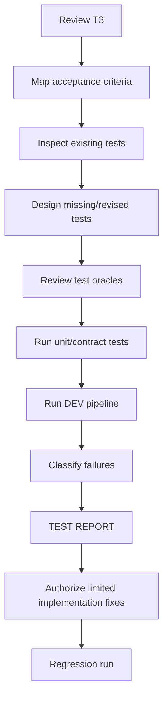

# FATHER OSINT Test Plan v1

**Status:** STAGE 04 / DESIGN ACTIVE / PRE-RUN

## Rule

Tests are derived from the approved contract. Existing tests are useful evidence, but they must be mapped to acceptance criteria and reviewed for obsolete assumptions before they can count as acceptance proof.

## Test order

## Stage 04 pack

See [`04_testing/README.md`](04_testing/README.md):

- `01_ACCEPTANCE_TEST_SPEC.md` — formal AC-01…AC-10 observable contracts;
- `02_EXISTING_TEST_REVIEW.md` — test-by-test decisions;
- `03_TEST_EXECUTION_PLAN.md` — execution order and evidence requirements;
- `04_TEST_REPORT_TEMPLATE.md` — mandatory first-run report format.

## Current test inventory and decisions

- `test_father_osint_mvp.py` — **CHANGE**: old duplicate test contradicts reviewed provenance semantics.
- `test_telegram_collector.py` — **KEEP**: transport-neutral collector contract.
- `test_simple_analyst.py` — **KEEP DEV HARNESS**: generic handoff and follow-up.
- `test_dev_pipeline.py` — **PARTIAL KEEP / MIGRATE**: useful cycle-bound test, but old pipeline is architecture freeze/delete candidate.
- `test_simple_socrates.py` — **KEEP DEV HARNESS**: obvious PASS/RESEARCH_MORE behavior only.

## Missing proof obligations before first run

1. AC-02 — identical payload from different source locators preserves both observations while raw blob reuse is allowed.
2. AC-05 — one collector failure does not destroy valid material from another collector.
3. AC-08 on the preferred `DevReviewPipeline` path before old pipeline removal.
4. AT-04 — restart semantics do not destroy new-source provenance.
5. AC-10 — execution evidence that DEV tests require no PROD credentials/connectors.

## Required next execution

Do **not** run the suite as acceptance evidence until the Stage 04 test-file reconciliation is complete. Then:

1. record environment and commit SHA;
2. run `pytest -q`;
3. preserve exact PASS/FAIL output;
4. classify failures without fixing them inline;
5. run the approved simplified DEV scenario;
6. create `TEST_REPORT_001` from the template;
7. authorize only the implementation changes supported by that evidence.

No production connector test is required at this phase.
