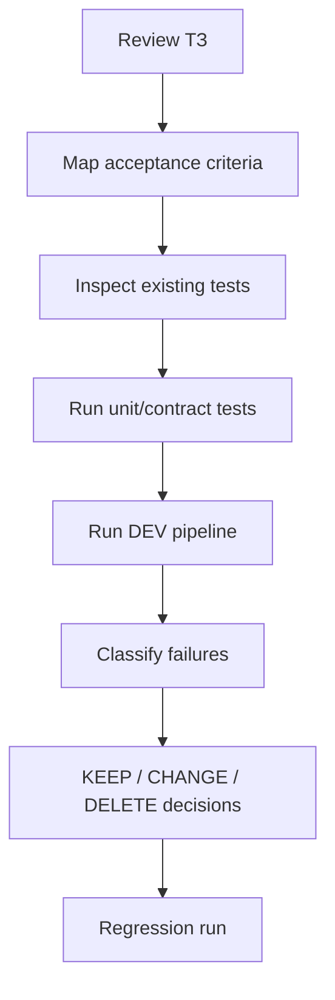

# FATHER OSINT Test Plan v1

**Status:** DRAFT / PRE-RUN

## Rule

Tests are derived from the approved contract. Existing tests are useful evidence, but they must be mapped to acceptance criteria before being treated as acceptance proof.

## Test order

## Current test inventory

- `test_father_osint_mvp.py` — core OSINT orchestration/storage behavior.
- `test_telegram_collector.py` — source-to-Material mapping contract.
- `test_simple_analyst.py` — DEV analyst handoff and follow-up task.
- `test_dev_pipeline.py` — bounded OSINT↔Analyst loop.
- `test_simple_socrates.py` — DEV review behavior.

## Acceptance mapping target

AC-01/02/03/04/05 -> OSINT MVP tests.  
AC-06/07 -> Analyst tests.  
AC-08 -> DEV pipeline tests.  
AC-09 -> Socrates/review-pipeline tests.  
AC-10 -> architecture/document inspection.

## Required next execution

1. Install only required DEV Python dependencies.
2. Run `pytest -q`.
3. Record exact environment and results.
4. Run `python scripts/run_dev_pipeline.py`.
5. Run review pipeline if a dedicated runner exists or add one only after test review.
6. Record defects in a test report instead of immediately patching around them.

No production connector test is required at this phase.
