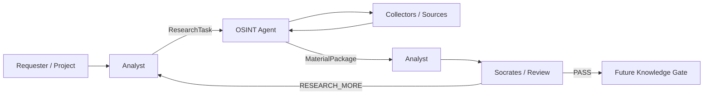

# Lesson 01 / Product — Product Vision

Status: `DRAFT_FROM_CURRENT_EVIDENCE / RETROSPECTIVE_RECONSTRUCTION`

## Product vision

FATHER OSINT Agent is a controlled research worker that receives a bounded research request, collects material from permitted sources, preserves provenance and returns a structured evidence package for downstream analysis.

The product is deliberately separated from truth assessment: collection and preservation belong to OSINT; interpretation belongs to Analyst; challenge/review belongs to Socrates or another review role.

## Primary users

`FACT_FROM_EXISTING_REPO`

- Analyst — primary consumer of `MaterialPackage`;
- Socrates / review role — checks sufficiency and may request additional evidence;
- FATHER / Knowledge Factory — orchestration and future reusable knowledge workflow;
- project/research requester — initiates an information need indirectly through Analyst.

`OWNER_CONFIRMATION_REQUIRED`

- first external/commercial user segment;
- whether direct analyst UI is a first-class product surface or internal tooling only.

## Core value proposition

For an analyst/research workflow that repeatedly needs evidence from heterogeneous sources, the OSINT Agent provides a bounded, inspectable collection layer with explicit provenance, gaps and errors, so later analysis can reuse evidence without silently losing source identity or repeating the same collection work.

## Product principles

1. Evidence before conclusions.
2. Provenance is preserved even when payload storage is reused.
3. Missing material is visible as a gap, not filled by inference.
4. Research loops are bounded.
5. Collector failures are isolated and visible.
6. DEV and PROD capabilities are explicitly separated.
7. Security, legal and supply-chain constraints are continuous inputs.

## High-level product flow

## Evidence

- `README.md` — project mission and lifecycle;
- `docs/OSINT_AGENT_TZ_V1.md` — purpose, inputs/outputs, required behavior;
- `docs/03_architecture/01_BUSINESS_ANALYSIS.md` — actors, SIPOC, value stream and business boundaries.
