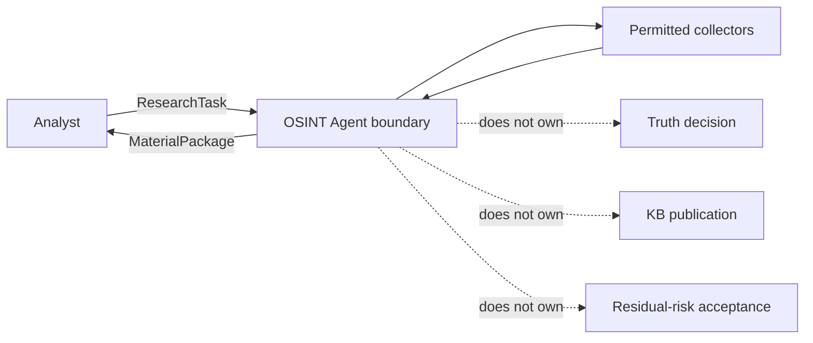

# Lesson 01 / Product — Scope Baseline

Status: `DRAFT_FROM_CURRENT_EVIDENCE / RETROSPECTIVE_RECONSTRUCTION`

## In scope — current DEV baseline

`FACT_FROM_EXISTING_REPO`

- accept bounded `ResearchTask`;
- select compatible collectors;
- collect permitted material from DEV fixtures/public inputs;
- preserve source locator, raw text/file reference, collection/publication metadata;
- calculate content hash where applicable;
- reuse identical raw payload storage without collapsing distinct source observations;
- isolate collector failures and return explicit errors;
- preserve cumulative evidence across bounded follow-up research cycles;
- return `MaterialPackage` to Analyst;
- keep Telegram transport boundary independent from concrete transport implementation.

## Explicitly deferred to production/future milestones

- live Telegram account/session operation;
- Tor / Dark Web gateway;
- proxy/session rotation;
- long-running scheduler;
- production secrets infrastructure;
- distributed queues/databases;
- automatic Knowledge Gate publication;
- autonomous truth determination;
- production trust scoring;
- fully autonomous multi-agent investigation.

## Product boundaries

## Scope-change rule

Any request that adds a new source type, autonomous decision authority, privileged access, production credential flow, publication capability, new external provider or material persistence semantics requires explicit impact analysis before implementation.

## Evidence

- `docs/OSINT_AGENT_TZ_V1.md` sections DEV scope, deferred PROD gate and required behavior;
- `README.md` frozen DEV baseline and current milestone direction;
- `docs/PROJECT_EXECUTION_CONTROL.md` change-impact and work-control rules.
