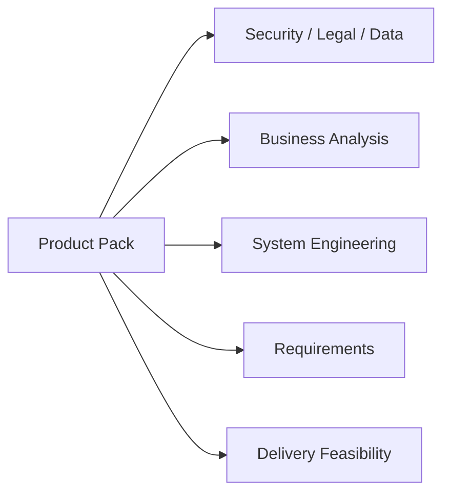

# Lesson 01 / Product — Product Ready Decision

Status: `CONDITIONAL_PASS / RETROSPECTIVE_RECONSTRUCTION`

## Decision

The current OSINT project has enough evidenced product intent to proceed into Security/System/Requirements work, because the repository already establishes:

- a clear business/research problem;
- a bounded product mission;
- primary internal users/roles;
- explicit DEV scope and deferred production scope;
- acceptance behavior;
- role boundaries between OSINT, Analyst and Reviewer;
- existing architecture/test/verification evidence.

## Conditions carried forward

The following are not treated as blockers for the current DEV documentation reconstruction, but must be owned before relevant production gates:

- product/business KPI baseline;
- named legal/compliance authority;
- production data classification/retention rules;
- production workload/SLO targets;
- approved LLM hosting strategy;
- production budget/TCO envelope;
- explicit external/commercial target segment.

## Gate result

```text
PRODUCT_READY = CONDITIONAL_PASS
```

Reason: the product problem, mission, scope and current internal workflow are evidenced; production/commercial parameters remain open but visible and owned as follow-up questions.

## Handoff



## Evidence

- `README.md`;
- `docs/OSINT_AGENT_TZ_V1.md`;
- `docs/03_architecture/01_BUSINESS_ANALYSIS.md`;
- project verification and traceability packs.
