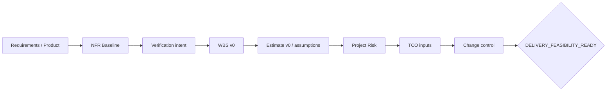

# Lesson 02 — Delivery Feasibility Pack / OSINT Agent

Status: `PROJECT-SPECIFIC DRAFT / NO INVENTED ESTIMATES`

## Purpose

Apply OTUS Lesson 02 to the real `OSINT_deepseek` project: make requirements measurable, expose estimation assumptions, delivery risks, TCO inputs and change-control needs before architecture commitments.

## Current project situation

The repository already has strong capability/evidence gates and a roadmap, but deliberately avoids invented calendar deadlines. This lesson keeps that principle while adding a formal estimation layer.

## Feasibility chain

## Artifacts

- `01_NFR_BASELINE.md`;
- `02_WBS_ESTIMATE_V0.md`;
- `03_PROJECT_RISK_CROSSWALK.md`;
- `04_TCO_CHANGE_EVAL_INPUTS.md`;
- `05_LESSON_02_REVIEW.md`.

## Estimation rule

No date/hour/cost is promoted to FACT without estimator rationale and evidence. Current work may be classified as:

- `KNOWN WORK ITEM`;
- `ROUGH ORDER OF MAGNITUDE NEEDED`;
- `PERT INPUTS NEEDED`;
- `MEASUREMENT REQUIRED`;
- `BLOCKED BY ARCHITECTURE/POC`;
- `UNKNOWN`.

## Gate

Current result: `DELIVERY_FEASIBILITY_READY = CONDITIONAL_PASS FOR DOCUMENTATION`.

Reason: work structure, risks and measurement gaps are explicit; final Production schedule/budget is intentionally not claimed.
