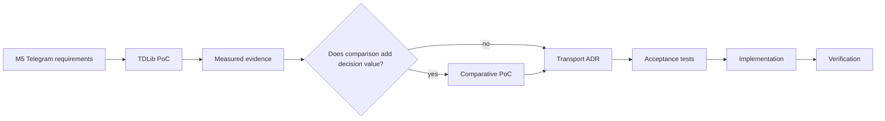
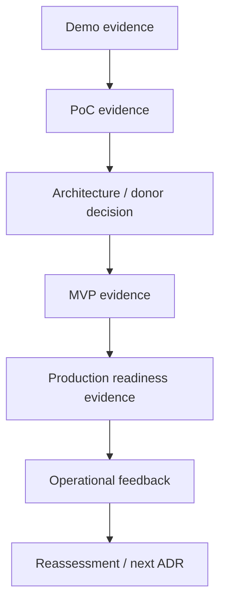

# Lesson 03 — OSINT Agent Roadmap: PoC → MVP → Production

Status: `DRAFT_FROM_CURRENT_EVIDENCE`

## Goal

Decompose the existing OSINT Agent into delivery stages where each stage produces measurable evidence, reduces uncertainty and leaves an explicit decision gate.

## Roadmap

| Stage | Business purpose | Scope | Evidence / DoD | Main risks reduced | Exit decision |
|---|---|---|---|---|---|
| Demo | Show the intended analyst workflow and information flow | façade / prepared data / static or deterministic flow | stakeholders can understand intended workflow; no production claim | misunderstanding of product idea | continue to technical PoC / revise vision |
| PoC | Prove technical feasibility of the riskiest hypothesis | one bounded source/transport/data path; controlled inputs; no broad production commitments | repeatable experiment; raw results; failure modes; constraints; measured unknowns; recommendation for next step | technology feasibility, upstream fragility, data handling assumptions | GO / PIVOT / STOP / MORE EVIDENCE |
| MVP | Prove user/business value on a narrow real workflow | one approved product path; minimal integrations; selected production-like NFRs; human review | real users can complete target task; quality/latency/provenance/support metrics captured; security/legal conditions met for MVP scope | value uncertainty, UX/operability gaps, acceptance ambiguity | SCALE / PIVOT / STOP |
| Production | Operate approved capability reliably and govern changes | full approved scope; operations, SLO, monitoring, backup/recovery, security, support, change management | production acceptance; operational ownership; observability; incident/rollback procedures; verified release evidence | operational, security, compliance, continuity and support risks | OPERATE / IMPROVE / REASSESS |

## Mapping to current OSINT project

### Current PoC path



This path already exists in project governance and is reused as the Lesson 03 technical PoC case.

### Candidate MVP shape

The project already contains several product opportunities, but no opportunity is silently promoted here. A future MVP should select exactly one bounded outcome and prove it end-to-end.

Candidate shape:

```text
Approved watchlist / research need
    ↓
Bounded collection
    ↓
Preserved source evidence
    ↓
Analyst-facing result
    ↓
Human review
    ↓
Measured value + quality + operability evidence
```

Possible product path examples already present in the project roadmap include Competitive/Channel Intelligence, Content Propagation, Brand Monitoring and Technology Radar. Product Owner selection is required.

### Production shape

Production adds controls that DEV and PoC intentionally defer:
- authenticated users and role separation;
- secrets/session management;
- production data classification/retention/deletion;
- supported live-source connectors;
- monitoring/alerting/audit;
- backup/recovery and restart correctness;
- capacity/sizing and cost controls;
- vulnerability/dependency lifecycle;
- incident/change/release management;
- support ownership and SLO;
- legal/compliance applicability and purpose limitation.

## Stage evidence chain



## Important separation

- Demo proves understandability, not feasibility.
- PoC proves a technical hypothesis, not business value.
- MVP proves bounded value, not enterprise production readiness.
- Production requires operational ownership and lifecycle controls, not only successful functional tests.

## Current project state

- DEV v1 baseline: `EXISTING_VERIFIED`.
- M5 Telegram requirements: `ACTIVE`.
- TDLib PoC: current evidence-producing path.
- Product MVP choice: `UNKNOWN / OWNER DECISION REQUIRED`.
- Production readiness: `NOT CLAIMED`.
