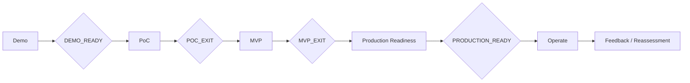

# Lesson 03 — Stage Gate Criteria

Status: `DRAFT_FROM_CURRENT_EVIDENCE`

## Purpose

Define what must be proven before OSINT Agent work moves from Demo → PoC → MVP → Production. These gates complement existing FATHER execution controls and do not override them.

## DEMO_READY

Pass requires:
- user/problem narrative is understandable;
- intended workflow is visible end-to-end;
- demo limitations are explicit;
- no demo behavior is presented as production evidence.

Possible outcomes: `PASS / REWORK / STOP`.

## POC_READY

Pass requires:
- one bounded technical hypothesis;
- hypothesis owner and decision to be informed;
- controlled test scope and lawful/approved sources;
- success/failure criteria before execution;
- measurement/logging plan;
- time/item/resource bounds;
- known security/privacy constraints;
- rollback/cleanup plan when relevant.

Hard blockers:
- “try technology X” without a decision question;
- no observable result;
- unbounded live-source collection;
- missing legal/security permission for the experiment.

## POC_EXIT

Exit requires:
- raw/inspectable results preserved;
- success/failure against predefined criteria recorded;
- failure modes and limitations visible;
- new risks/unknowns registered;
- recommendation is `GO / PIVOT / STOP / MORE EVIDENCE`;
- no architecture choice is promoted solely from preference.

For the current M5 path, PoC evidence should feed the transport ADR and acceptance-test design.

## MVP_READY

Pass requires:
- one bounded product/user outcome selected;
- target users/owner identified;
- MVP scope and exclusions explicit;
- minimum measurable NFR/quality criteria defined;
- data/legal/security applicability sufficient for real-use scope;
- support/escalation model for MVP known;
- acceptance/evaluation dataset or other evidence strategy defined;
- cost/budget envelope or explicit owner-held UNKNOWN;
- Change Request process for material scope changes.

## MVP_EXIT

Exit requires:
- real or representative users can complete the target workflow;
- product/value evidence collected;
- quality/provenance/latency/reliability evidence collected for in-scope usage;
- unresolved material risks visible with owners;
- operational burden and cost observed, not merely guessed;
- decision `SCALE / PIVOT / STOP` recorded.

## PRODUCTION_READY

Pass requires:
- approved production scope and requirements baseline;
- architecture and ADRs reviewed;
- legal/compliance and data-handling rules resolved for production scope;
- authentication/RBAC/secrets/session controls;
- production observability and audit;
- backup/restore/recovery and restart behavior;
- capacity/sizing and cost controls;
- vulnerability/dependency/supply-chain lifecycle;
- incident/change/release procedures;
- service/support ownership and SLO;
- rollback/disable strategy;
- acceptance/verification evidence complete;
- no unresolved in-scope Critical blocker without explicit authorized acceptance.

## Stage transition view

## Relationship to current project controls

Existing `Definition of Ready`, `Definition of Done`, WIP limits, Senior Council rules, ADR threshold and change-impact analysis remain canonical project governance. These lesson gates add the missing staged value-delivery interpretation required by OTUS Lesson 03.
