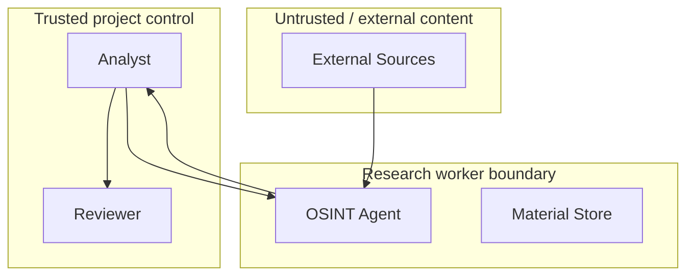

# Lesson 04 — C1 System Context

Status: `CURRENT DEV CONTEXT + FUTURE BOUNDARIES`

## System of interest

**FATHER OSINT Agent** — a bounded research worker that accepts a research task, collects material from permitted sources, preserves provenance and returns an evidence package for downstream analysis/review.

## C1 diagram

```mermaid
flowchart LR
    REQ[Requester / Project] -->|information need| AN[Analyst]
    AN -->|ResearchTask| OS[FATHER OSINT Agent]

    subgraph EXT[External Information Sources]
      TG[Telegram / source adapters]
      GH[GitHub / repository sources]
      WEB[Web / future sources]
      DOC[Files / future artifacts]
    end

    OS -->|bounded acquisition| EXT
    EXT -->|Material observations| OS
    OS -->|MaterialPackage + gaps/errors| AN
    AN -->|Analysis + evidence refs| REV[Socrates / Reviewer]
    REV -->|RESEARCH_MORE| AN
    REV -->|PASS| KG[Knowledge Gate — future]
    KG --> KB[(Governed Knowledge Base — future)]
    KB --> FA[FATHER / role agents — future consumers]
```

## Actors and responsibilities

| Actor/System | Gives | Receives | Authority boundary |
|---|---|---|---|
| Requester / Project | research need | evidence-based result through Analyst | does not silently redefine collector contract |
| Analyst | `ResearchTask` | `MaterialPackage` | owns interpretation, not source acquisition mechanics |
| OSINT Agent | bounded collection request to collectors | `Material` observations | does not decide final truth or publish knowledge |
| External sources | observable source material | source requests | untrusted external content |
| Socrates / Reviewer | challenge/review | analysis + evidence | may request more evidence; does not fabricate evidence |
| Knowledge Gate | publication decision | reviewed candidate knowledge | future boundary; not current DEV OSINT implementation |
| Knowledge Base | governed knowledge | accepted knowledge objects | future |
| FATHER / role agents | work/context requests | governed knowledge | future consumer, not evidence source by default |

## Trust / responsibility boundaries

External content is evidence candidate, not instruction. This becomes especially important if later RAG/agent/tool execution is introduced.

## Scope markers

### Current DEV

- `ResearchTask` input;
- collector selection and bounded collection;
- `Material` observations;
- inspectable persistence;
- `MaterialPackage` output;
- DEV Analyst/Reviewer handoff verification.

### Future / not claimed by current baseline

- production-scale Telegram operation;
- generic web/file ingestion at scale;
- production Knowledge Gate/KB;
- production LLM/RAG orchestration;
- production multi-agent action execution;
- external customer-facing API/UI;
- final deployment topology.

## Open C1 questions

1. Who is the named Production System Owner?
2. Which external source classes are legally/operationally approved for the first MVP?
3. Which downstream consumer becomes the first real MVP customer/user?
4. Is Knowledge Gate part of this repository's deployable product or a separate FATHER service?
5. Which external AI providers, if any, are permitted for sensitive evidence?

These questions remain `UNKNOWN` until owner/evidence confirms them.
