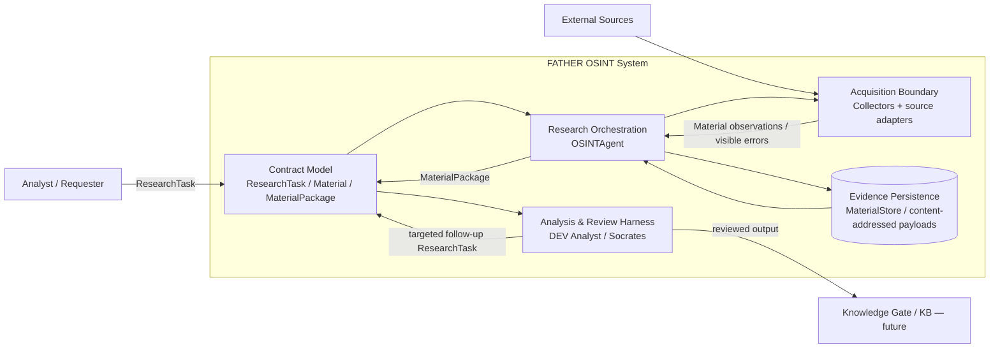
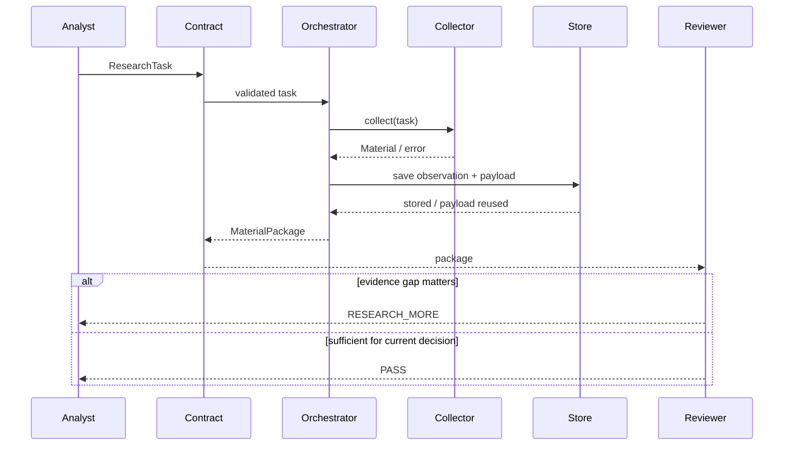

# Lesson 04 — C2 Containers / Responsibility View

Status: `LOGICAL / DEPLOYMENT-NEUTRAL`

The word **container** here follows C4: an independently understandable runtime/data responsibility. It does not imply Docker/Kubernetes.

## C2 diagram

## Container catalogue

| Container | Responsibility | Inputs | Outputs | Current state |
|---|---|---|---|---|
| Contract Model | stable source-neutral data contracts | project/analyst intent | validated domain objects | CURRENT |
| Acquisition Boundary | isolate source/protocol-specific collection | ResearchTask subset | Material / error | CURRENT boundary; real transports vary |
| Research Orchestration | select eligible collectors, bound work, preserve package semantics | ResearchTask + collectors | MaterialPackage | CURRENT |
| Evidence Persistence | preserve tasks/material/package evidence and payload reuse semantics | task/material/package | stored evidence + reuse result | CURRENT DEV |
| Analysis & Review Harness | prove downstream handoff and bounded follow-up | MaterialPackage | PASS/RESEARCH_MORE path | CURRENT DEV HARNESS, not final expert engine |
| Knowledge Gate / KB | govern promotion from candidate evidence/analysis into knowledge | reviewed candidates | governed knowledge | FUTURE |

## Information movement

## Security-relevant boundaries

- External Source → Acquisition: untrusted content boundary.
- Collector/Transport → Orchestrator: protocol/library failure boundary.
- Orchestrator → Store: evidence-integrity/provenance boundary.
- Evidence → semantic model/reviewer: prompt/retrieval-poisoning boundary when model use is introduced.
- Reviewer → Knowledge Gate: authority/promotion boundary.

## Non-functional drivers visible at C2

- provenance preservation;
- bounded work / loop control;
- collector failure isolation;
- deterministic evidence identity;
- source-neutral handoff;
- replaceable source transport;
- inspectability/auditability;
- no silent promotion of observation to knowledge;
- future security isolation for untrusted content.

## Deliberately unresolved

The C2 view does not select:

- relational vs graph vs document DB;
- broker/queue technology;
- cloud vs on-prem deployment;
- LLM provider/model;
- vector DB;
- web framework;
- Kubernetes/VM/bare-metal topology.

Those choices require downstream requirements, PoC/evidence and ADR.
