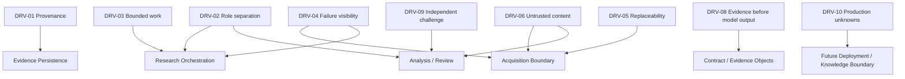

# Lesson 04 — HLD Driver Trace

Status: `DRAFT_FROM_CURRENT_EVIDENCE`

This file links current business/system evidence to the HLD view. It prevents C4 diagrams from becoming an isolated picture.

## Driver trace

| Driver ID | Driver / constraint | Evidence source | HLD consequence | Current state |
|---|---|---|---|---|
| DRV-01 | preserve source provenance even when payload is reused | `OSINT_AGENT_TZ_V1.md`, acceptance criteria | observation identity and payload storage remain logically separate | CURRENT / VERIFIED BY DEV CONTRACT |
| DRV-02 | OSINT must not decide final truth | project mission / business analysis | separate collection, analysis and review responsibilities | CURRENT |
| DRV-03 | bounded research / no endless loops | requirements + project execution control | task budget/max_items and review-loop boundary remain explicit | CURRENT |
| DRV-04 | collector failure must remain visible without losing independent results | requirements / current `OSINTAgent` behavior | source adapter isolation + error channel in MaterialPackage | CURRENT |
| DRV-05 | source protocol/vendor must be replaceable | architecture decision register + M5 roadmap | acquisition boundary remains separate from orchestration | CURRENT DESIGN DRIVER |
| DRV-06 | external content is untrusted | security threat register | trust boundary before semantic/agent/tool layers | CURRENT SECURITY DRIVER |
| DRV-07 | current DEV is not Production | README/TZ/roadmap | C2 remains deployment-neutral; future Prod boundary explicit | CURRENT |
| DRV-08 | model output never replaces source evidence | `model_stage_registry.yaml` | semantic stages consume evidence refs; deterministic evidence identity remains separate | CURRENT MODEL POLICY |
| DRV-09 | independent challenge before knowledge promotion | current review/Knowledge Factory direction | Reviewer/Knowledge Gate remains distinct responsibility | CURRENT/FUTURE BOUNDARY |
| DRV-10 | Production legal/data constraints are not yet fully defined | Product/lesson 3 UNKNOWN | no production data/hosting topology may be declared final | OPEN / OWNER INPUT REQUIRED |

## Driver → container mapping

## Quality attributes / architecture characteristics candidates

These are **candidates** derived from current evidence, not final prioritized architecture characteristics:

- traceability;
- auditability;
- integrity;
- boundedness / resource control;
- resilience to partial source failure;
- modularity / replaceability of source adapters;
- inspectability;
- security isolation of untrusted content;
- evolvability;
- testability.

Production availability, latency, throughput, cost and capacity characteristics remain insufficiently baselined and are carried as Lesson 2/3 improvement items.

## Rule for Lesson 09

Any later architecture option or LLM-hosting decision must trace back to one or more drivers above or to a newly approved requirement. A technology preference without a driver is not an architecture decision basis.
