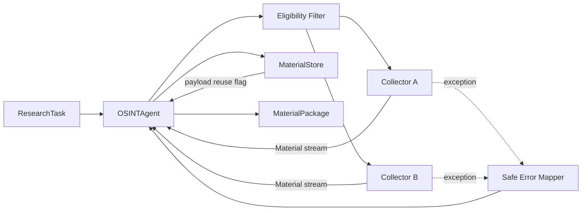
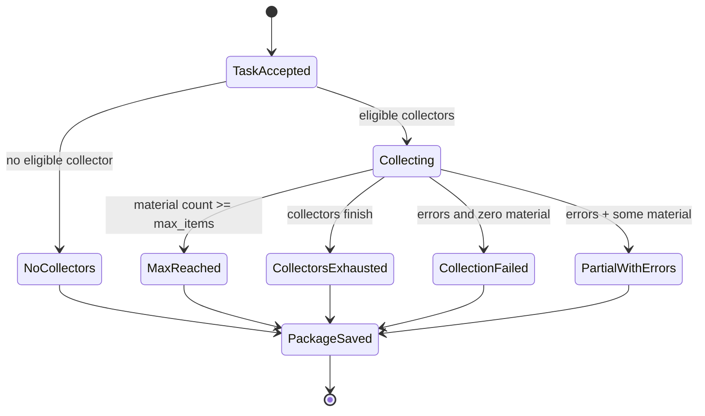

# Lesson 05 — C3 Research Orchestration Components

Status: `CURRENT DEV COMPONENT VIEW`

## Component diagram

## Responsibilities

### `ResearchTask`

Current fields include question, topics, requested source types, optional date bounds, max_items, depth, optional stop hint, requester id, task id and creation time.

Validation currently enforces:
- non-empty question;
- positive `max_items`;
- depth belongs to FAST/NORMAL/DEEP/CRITICAL.

### `OSINTAgent`

Current orchestration flow:
1. persist task;
2. select collectors whose declared `source_types` intersect requested source types;
3. return explicit `no_eligible_collectors` when none match;
4. iterate eligible collectors;
5. bound collection by `max_items`;
6. persist every material observation;
7. count payload reuse without dropping observations;
8. isolate collector exceptions;
9. calculate visible stop reason;
10. persist and return MaterialPackage.

### `Collector`

Protocol contract:
- has `name`;
- declares `source_types`;
- yields `Material` for a ResearchTask.

Collector is a source-facing adapter boundary. It does not own package-level orchestration or truth decisions.

### `MaterialStore`

LLD responsibility inferred from current contract and acceptance evidence:
- save task;
- save material observation;
- preserve payload/content identity semantics;
- return whether raw payload storage was reused;
- save package.

Storage engine choice is not part of this LLD document.

### `MaterialPackage`

Current output fields:
- task id;
- list of Material observations;
- payload reuse counter;
- collection errors;
- notes;
- stop reason;
- package id and creation time.

## State / branch behavior

## Security considerations at component level

- raw collector exception text is not passed directly into evidence packages;
- external source content is untrusted data;
- no model/tool execution is authorized by collected text;
- source-specific credentials belong outside domain objects and repository evidence;
- any future external API must add authentication/authorization without weakening current role separation.

## Open LLD questions

- Should package/task retrieval become a first-class persistence API?
- What idempotency contract is needed for future network/API invocation?
- Will long-running collection require asynchronous job semantics?
- What pagination/export contract is needed for large MaterialPackages?
- Which fields become immutable after acquisition?
- How are schema versions negotiated across future services?
