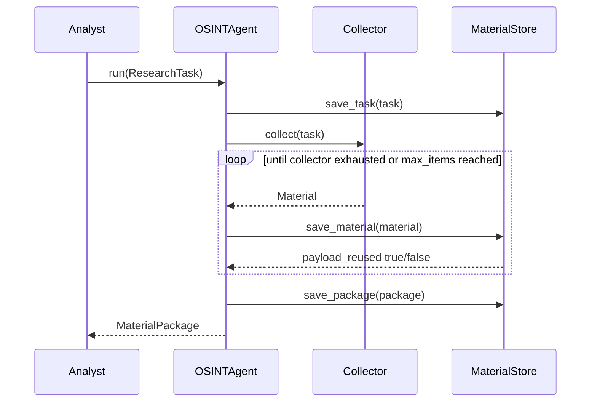
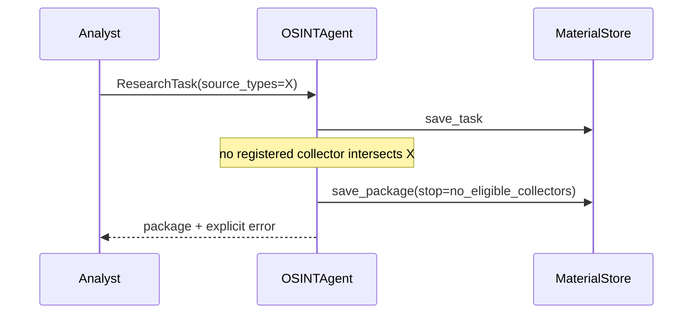
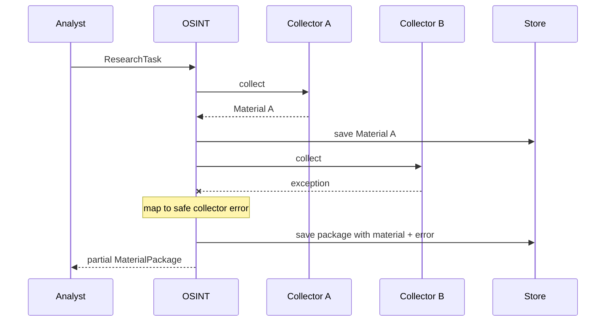
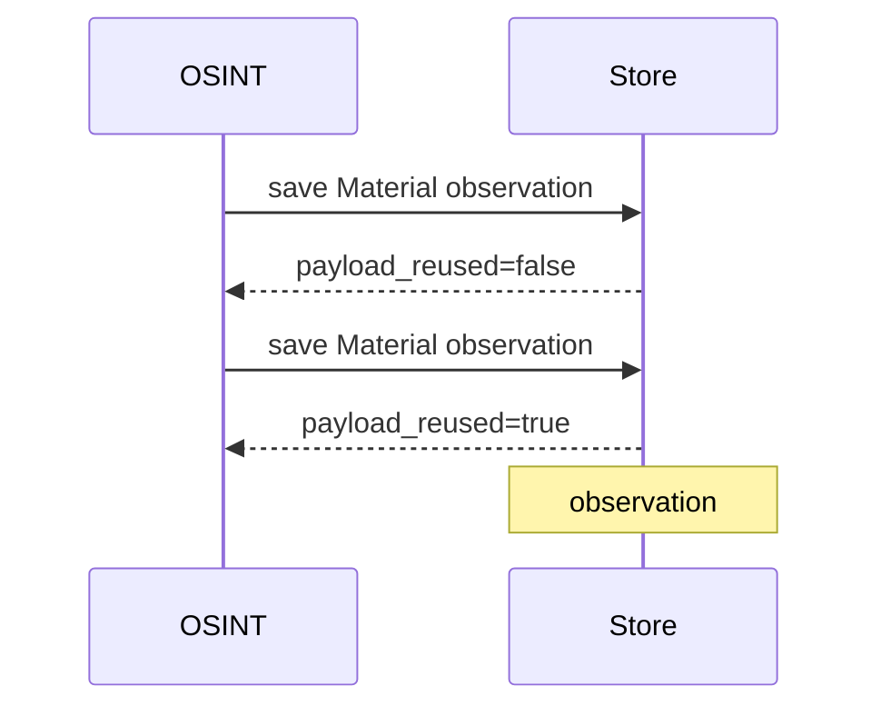
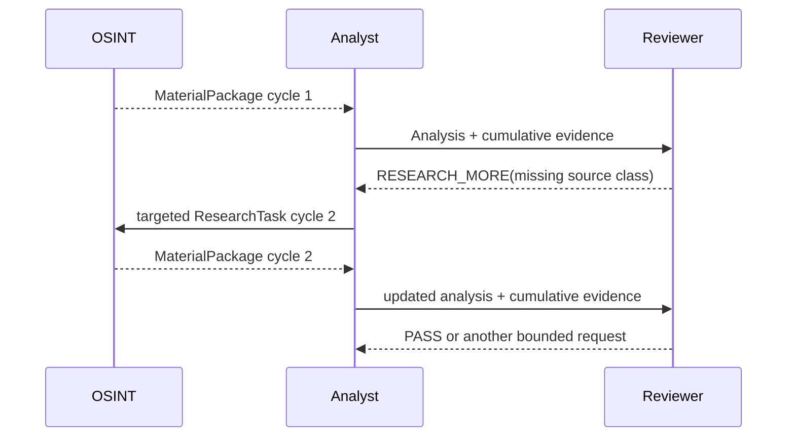

# Lesson 05 — Sequence Scenarios

Status: `CURRENT DEV + FUTURE ADAPTER NOTES`

## Scenario A — successful bounded collection

## Scenario B — no eligible collector

## Scenario C — partial source failure

## Scenario D — provenance-preserving payload reuse

## Scenario E — bounded follow-up research

## Sequence invariants

- earlier evidence is not silently forgotten in follow-up cycles;
- source errors are visible;
- max_items/cycle limits are enforced before uncontrolled work;
- payload reuse does not equal observation deduplication;
- reviewer request cannot bypass ResearchTask contract;
- future API/network adapters must preserve these semantics.
