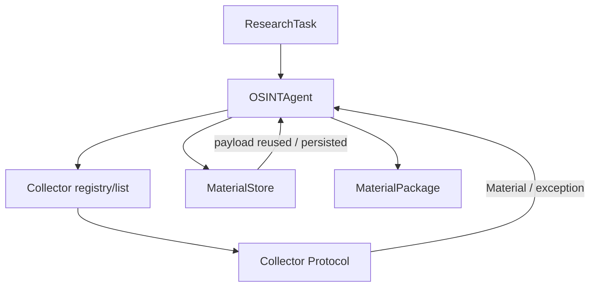

# Lesson 05 — LLD / Components and Interactions

Status: `DOCUMENTATION OF CURRENT DEV + CANDIDATE EXTERNAL ADAPTER`

## Purpose

Detail the Lesson 04 HLD into components, interaction sequences and explicit interfaces without modifying implementation.

## Current implementation components used as evidence

- `father_osint.models.ResearchTask`;
- `father_osint.models.Material`;
- `father_osint.models.MaterialPackage`;
- `father_osint.agent.Collector` protocol;
- `father_osint.agent.OSINTAgent`;
- `father_osint.storage.MaterialStore`;
- existing collector implementations/adapters;
- DEV Analyst/Reviewer harness described by existing architecture docs.

## C3 focus

The primary container decomposed in this lesson is **Research Orchestration**.

## Component contracts

| Component | Responsibility | Must not do |
|---|---|---|
| ResearchTask | represent bounded research order | hide unbounded implicit context |
| OSINTAgent | orchestration, collector eligibility, limits, package semantics | final analysis/truth decision |
| Collector | source-specific acquisition | cross-domain final analysis |
| MaterialStore | evidence persistence and payload-reuse semantics | collapse independent observation identity |
| MaterialPackage | delivery of evidence + errors + stop reason | claim completeness when collection failed |

## Error behavior

Collector/library errors are converted to stable user-facing errors without leaking exception payloads that may contain sensitive URLs/identifiers/credentials. Collector failure is isolated at orchestration boundary.

## API note

There is no approved HTTP API in the current DEV baseline. `03_OPENAPI_CANDIDATE.yaml` is an **optional future adapter contract** around existing domain objects, created for design/lesson purposes. It is not evidence that a web service exists.

## LLD gate

`LLD_READY = CONDITIONAL_PASS`

Current Python component contracts and main sequences are sufficiently clear for DEV. Production API/auth/idempotency/async execution/pagination/rate limits remain future design work.
