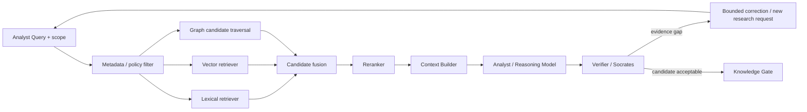
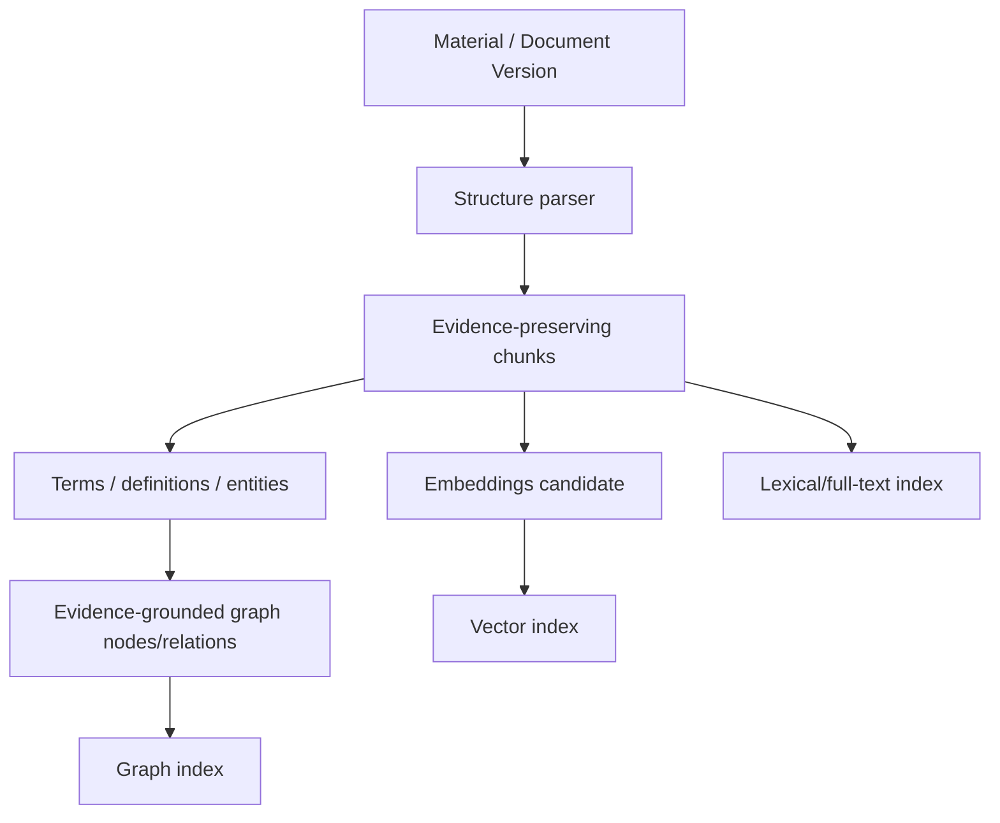

# Lesson 06 — Hybrid RAG Candidate Architecture

Status: `CANDIDATE / NOT IMPLEMENTED`

## Pipeline



## Indexing / preparation path



Every derived object must retain references to the source version and exact evidence span/locator where available.

## Core objects

### RetrievalRequest

Candidate fields:
- query;
- workspace/project scope;
- allowed source classes;
- time/freshness constraints;
- data classification boundary;
- top-k / bounded budget;
- required evidence diversity;
- requester/role context.

### RetrievalHit

Candidate fields:
- evidence object id;
- source/version/span locator;
- retrieval channel (LEXICAL/VECTOR/GRAPH);
- raw score;
- fused/rerank score;
- source class;
- freshness/version;
- relation path when graph-assisted;
- policy/filter outcome.

### EvidenceContext

Candidate fields:
- ordered evidence hits;
- source/version identifiers;
- unresolved conflicts;
- omitted/filtered reason summary;
- context size/token budget;
- query transformation history;
- retrieval trace id.

## Graph-assisted retrieval

Current Knowledge Factory domain objects already support `KnowledgeNode`, `KnowledgeRelation` and evidence refs. A future graph-assisted retriever should only traverse relations whose review/status/evidence satisfy policy.

Candidate relation use cases:
- find definitions of a term;
- find contradictions/overlaps;
- follow requirement → control → evidence;
- retrieve alternatives/trade-offs;
- follow source/document version relations.

## Bounded correction loop

If retrieval fails quality checks:

```text
LOW COVERAGE / CONFLICT / LOW CONFIDENCE
   ↓
query rewrite OR additional retrieval channel OR targeted OSINT ResearchTask
   ↓
new evidence/retrieval attempt
   ↓
review
   ↓
PASS / UNKNOWN / STOP
```

Hard bounds are required on attempts, cost, time and corpus scope.

## Non-goals

- letting retrieved text modify system policy;
- executing instructions from evidence;
- promoting generated answer directly into KB;
- treating similarity score as source trust;
- hiding conflict because a reranker selected one side.
