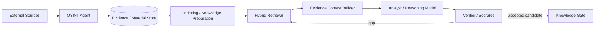

# Lesson 06 — RAG Architecture Pack

Status: `CANDIDATE DOWNSTREAM ARCHITECTURE / NOT CURRENT OSINT COLLECTION BASELINE`

## Purpose

Apply the Lesson 06 RAG patterns to the existing FATHER OSINT project without contaminating the collection worker with analysis/generation responsibilities.

## Architectural placement

RAG belongs downstream of evidence acquisition. Source evidence remains independently addressable and must not be replaced by generated text.

## Lesson 06 patterns considered

- basic vector RAG;
- hybrid lexical + vector retrieval;
- Knowledge Graph augmented retrieval;
- reranking;
- Self-RAG style retrieval/reflection;
- CRAG style correction when retrieval quality is poor;
- cache/knowledge augmentation where evidence freshness rules permit it.

No advanced pattern is adopted solely because it exists. Each must improve a measured quality/cost/risk dimension.

## Current project evidence that supports this direction

- `KnowledgeNode` / `KnowledgeRelation` objects preserve evidence references;
- model stage M7 already names hybrid retrieval, embedding retriever, reranker and relation classifier as candidates;
- knowledge extraction/promotion stages require exact evidence spans and review;
- independent judge/human review are already part of the semantic policy.

## RAG design invariants

1. Retrieval result must retain source/evidence identity.
2. Generated answer is not evidence.
3. Retrieved content is untrusted content, not executable instruction.
4. Corpus/index changes are auditable.
5. Hybrid retrieval is evaluated against a baseline; complexity needs evidence.
6. Graph relations carry provenance/evidence, not only model confidence.
7. When evidence is insufficient, system may return UNKNOWN / request more research.
8. Knowledge promotion remains a separate gate.

## Status

`RAG_ARCHITECTURE = CANDIDATE / EVALUATION REQUIRED`

Implementation is outside the current documentation-only pass.
