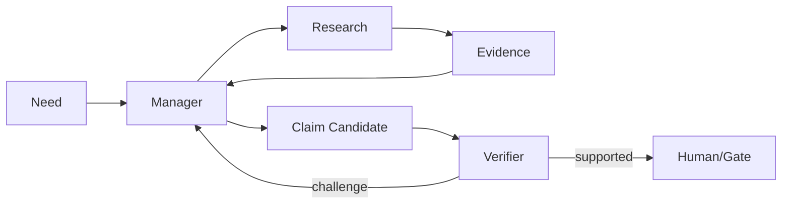

# Lesson 07 — Agent Role Model / Single Responsibility

Status: `CANDIDATE ROLE CONTRACT`

## Responsibility matrix

| Role/Agent | Primary goal | Reads | Writes/Produces | Must not do |
|---|---|---|---|---|
| Manager / Analyst | turn information need into bounded research and interpret evidence | user need, MaterialPackage, prior evidence | ResearchTask, Analysis, gap list | silently invent evidence; bypass reviewer on gated output |
| OSINT Research Agent | obtain evidence from permitted sources | ResearchTask, collector registry | MaterialPackage | final truth verdict; KB publication |
| Collector / Tool Adapter | acquire from one source class | scoped task + credentials/policy outside evidence contract | Material observations / explicit failure | cross-domain conclusion; broaden task scope itself |
| Retriever / RAG layer | retrieve relevant governed evidence | query + corpus/index + policy | EvidenceContext / retrieval trace | treat similarity as truth; execute retrieved instructions |
| Verifier / Socrates | challenge claims/evidence sufficiency | candidate analysis + evidence refs | PASS / RESEARCH_MORE / review findings | create missing evidence; accept risk for owner |
| Knowledge Curator/Gate | govern promotion/revision | reviewed candidate + provenance | promoted/rejected/superseded knowledge state | silently overwrite history |
| Human Owner / Risk Owner | material authority | evidence + review + risk | acceptance/rejection/override record | delegate accountability silently to model |

## Why separation matters



A system where one model searches, interprets, approves its own conclusion and publishes it would collapse acquisition, reasoning and verification into one authority. FATHER deliberately keeps these responsibilities separable.

## Current vs future mapping

### Current DEV evidence

- `OSINTAgent` performs bounded collection orchestration;
- Collector protocol isolates source acquisition;
- `SimpleAnalyst` proves analysis/gap/follow-up handoff;
- reviewer/Socrates path is represented in current architecture and pipeline tests;
- Knowledge Gate remains future/not part of DEV collection baseline.

### Future candidate

A production Manager/Analyst model may use tools and RAG, but only under:
- explicit task scope;
- bounded cycles/cost/time;
- tool allowlist;
- propagated authorization context;
- evidence-reference requirements;
- independent verification;
- human approval for privileged/irreversible actions.

## Delegation contract

Every agent-to-agent handoff should include at least:

```text
task_id
parent_task_id / trace_id
requesting_role
receiving_role
objective
scope / exclusions
allowed tools/source classes
budget limits (calls/time/items/cost)
input evidence refs
required output schema
stop conditions
privilege ceiling
review requirement
```

## Single Responsibility checks

A role is too broad if it simultaneously:
- controls source acquisition and final truth;
- controls generation and independent verification;
- can expand its own privileges;
- can publish persistent knowledge without gate;
- can spend unbounded resources;
- can hide tool errors or evidence gaps.
