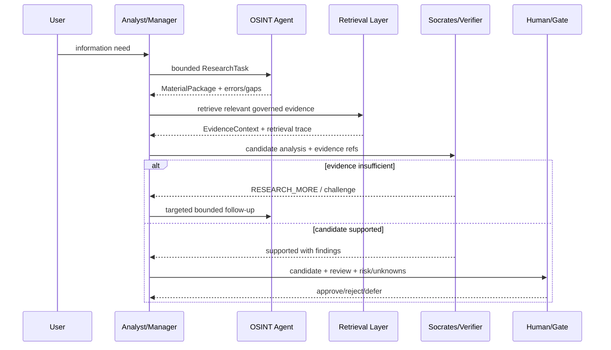

# Lesson 07 — Agent Handoffs and RAG Flow

Status: `CANDIDATE / BOUNDED ORCHESTRATION`

## Manager → Research → Review flow



## ReAct candidate loop

```text
OBSERVE task/evidence
  ↓
REASON about next information need
  ↓
SELECT allowed read/retrieval tool
  ↓
ACT within task/permission/budget
  ↓
OBSERVE tool result with execution/evidence id
  ↓
STOP / REQUEST MORE / HANDOFF
```

The model does not directly authorize high-impact writes or privilege escalation.

## Plan-and-Execute candidate

A planning agent may create a bounded research plan such as:

```text
P1 verify official source
P2 obtain primary document
P3 obtain independent corroborating source
P4 compare definitions/claims
P5 identify gaps/conflicts
```

The plan itself is a candidate. Executor/tool policy may reject or narrow a step.

## RAG use in agent flow

RAG can provide:
- internal policy/methodology;
- previously verified evidence;
- definitions/terms;
- historical decisions/ADR;
- source/corpus context.

RAG must not silently grant authority. Retrieved policy has a version and scope; retrieved external content remains untrusted.

## Handoff outcomes

Every handoff must end with an explicit state such as:

- `COMPLETED`;
- `PARTIAL_WITH_GAPS`;
- `RESEARCH_MORE`;
- `BLOCKED_POLICY`;
- `BLOCKED_PERMISSION`;
- `BUDGET_EXHAUSTED`;
- `NEEDS_HUMAN_DECISION`;
- `FAILED_TOOL`;
- `UNKNOWN`.

## Traceability

```text
User Need
 -> Agent Task
 -> Tool/Retrieval Calls
 -> Evidence IDs / Execution IDs
 -> Candidate Finding
 -> Verifier Finding
 -> Human/Gate Decision
```

Narrative text without resolvable evidence/execution references cannot prove that an action or fact occurred.
