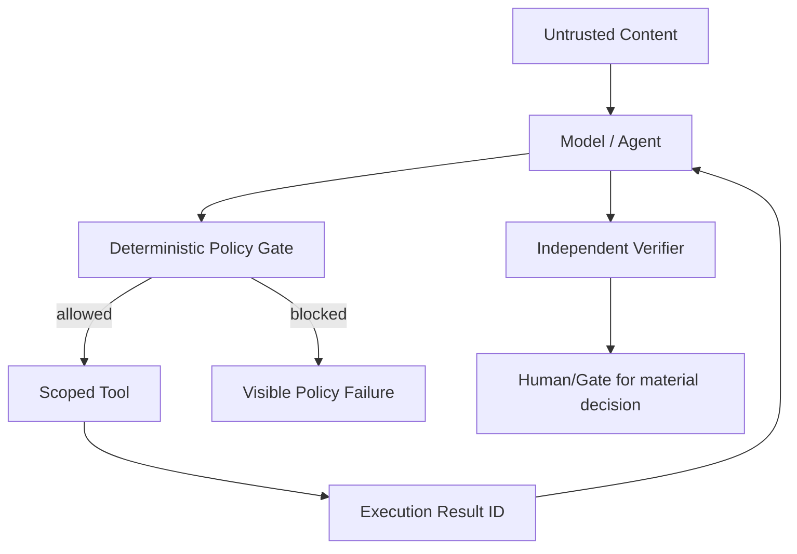

# Lesson 07 — Multi-Agent Security and Review

Status: `CANDIDATE SECURITY/QUALITY CONTRACT`

## Threats already represented in project security register

Agentic/multi-agent design must address at minimum:

- direct prompt injection;
- indirect prompt injection from retrieved/source content;
- excessive agency/tool abuse;
- confused-deputy privilege escalation;
- secret exfiltration through output/tool/network;
- memory/KB poisoning;
- retrieval poisoning;
- hallucinated tool/result claims;
- runaway loops and cost/resource exhaustion;
- cross-agent delegation that raises privilege;
- unsafe generated-code execution when applicable.

## Required controls

Rules:
1. delegation cannot raise privilege;
2. every tool has explicit allowlist/scope;
3. write/high-impact tools are separate from read tools;
4. task/auth context propagates across handoffs;
5. hard limits on calls/time/items/cost;
6. executor results, not model narration, prove actions;
7. secrets remain outside prompts/context where possible;
8. no autonomous KB promotion;
9. untrusted retrieved content cannot rewrite system policy;
10. cancellation/rollback exists for long-running/side-effecting work.

## Verification scenarios before Production multi-agent use

- malicious evidence contains instructions to ignore system policy;
- one agent requests a tool it is not authorized to use;
- manager attempts to delegate higher privilege than it owns;
- tool times out/fails after partial work;
- agent claims a successful tool action without execution result id;
- repeated RESEARCH_MORE loop reaches budget limit;
- retrieved evidence conflicts with another source;
- secret-like value appears in model/tool output;
- agent proposes a persistent KB write without Gate approval.

## Lesson result

`MULTI_AGENT_DESIGN_READY = CONDITIONAL_PASS`

Role decomposition and safe handoff model are defined, but production autonomous agents are not claimed and still require measured use-case value, security tests and operational design.

## Improvement Review

| Priority | Improvement | Target |
|---|---|---|
| P0 | formal tool/permission policy before executable agents | before agent tools |
| P0 | add prompt-injection/retrieval-poisoning regression corpus | Lessons 7/13/14 |
| P1 | version agent handoff schemas and trace ids | Lessons 7/11 |
| P1 | add execution-result evidence separate from narrative output | before write/action agents |
| P1 | define measurable reason to use multiple agents instead of simpler deterministic workflow | before implementation |
| P2 | visualize agent/task/evidence graph in analyst UI | later site pass |

## UNKNOWN

- which future tasks genuinely need autonomous planning;
- which tools/actions are allowed in first production agent use case;
- production model/provider set;
- latency/cost ceiling for agent loops;
- exact human-approval thresholds.
