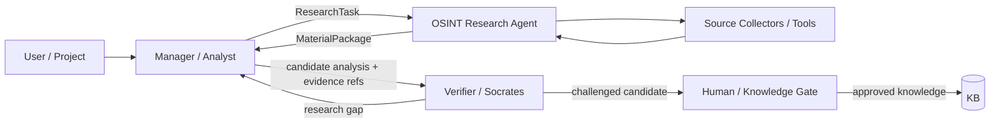

# Lesson 07 — AI Agents / Multi-Agent Architecture Pack

Status: `CURRENT ROLE SEPARATION + FUTURE MULTI-AGENT CANDIDATE`

## Purpose

Apply agent and multi-agent design concepts to the existing OSINT/Knowledge Factory workflow while preserving the current fact that `SimpleAnalyst`/review logic are DEV harnesses, not a production autonomous agent platform.

## Existing logical roles

- **Requester / Project** — states information need;
- **Analyst** — creates ResearchTask, interprets evidence and identifies gaps;
- **OSINT Agent** — bounded source acquisition and evidence packaging;
- **Collector** — one source/protocol acquisition responsibility;
- **Reviewer / Socrates** — challenges sufficiency and can request more evidence;
- **Knowledge Gate** — future promotion authority;
- **Human/Owner authority** — required for material legal/risk/product decisions.

## Candidate multi-agent flow

This is a responsibility architecture. It does not imply every box must be an LLM agent or separate runtime service.

## Design rule

Use an autonomous agent only where adaptive planning/reasoning produces measurable value. Deterministic validation, policy, evidence identity, permission checks and final promotion remain deterministic/human-gated where appropriate.

## Patterns considered

- ReAct for bounded read/reason/retrieve loops;
- Plan-and-Execute for explicit multi-step research plans;
- Manager/Worker delegation;
- independent Verifier/Challenger;
- human-in-the-loop for privileged or irreversible decisions.

## Multi-agent readiness status

`MULTI_AGENT_ARCHITECTURE = CANDIDATE / NOT PRODUCTION CLAIM`

Current DEV proves handoffs and bounded feedback loops. It does not prove autonomous production multi-agent safety or usefulness.
