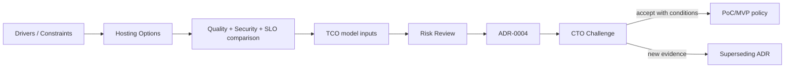

# Lesson 09 — Architecture Verification / CTO Challenge

Status: `HOMEWORK-READY / DECISION WITH EXPLICIT CONDITIONS`

## Goal

Verify a material LLM-hosting decision for the existing OSINT/Knowledge Factory project using drivers, trade-offs, risk, TCO inputs and an ADR rather than technology preference.

## Decision under challenge

For the **current PoC/MVP semantic-model phase**:

> Use a hosted model API behind a provider-neutral Model Gateway only for data explicitly allowed for external processing. Unclassified/sensitive evidence fails closed and is not sent to the provider. Do not purchase/commit to self-hosted Production infrastructure until measured workload, quality, SLO and TCO evidence justify it.

This is not a permanent Production hosting decision.

## Why the scope matters

The project currently has:
- verified DEV evidence/collection baseline;
- semantic model stages defined as model/provider-independent capabilities;
- security risks for external AI providers already registered;
- no approved Production workload/SLO/TCO baseline;
- incomplete Production data-classification/legal boundary.

A hardware purchase before those inputs exist would create false precision and lock-in of another kind.

## Verification chain

## Pack

- `01_HOSTING_DRIVERS.md`;
- `02_CLOUD_VS_SELFHOSTED_TRADEOFF.md`;
- `03_TCO_INPUTS_AND_GAPS.md`;
- `ADR-0004-llm-hosting-policy.md`;
- `04_CTO_CHALLENGE.md`;
- `05_LESSON_09_REVIEW.md`.

## Gate

`CTO_CHALLENGE_READY = PASS FOR REVIEW`

The decision is defendable for current stage because conditions/unknowns are explicit. Production hosting remains a future evidence-driven decision.
