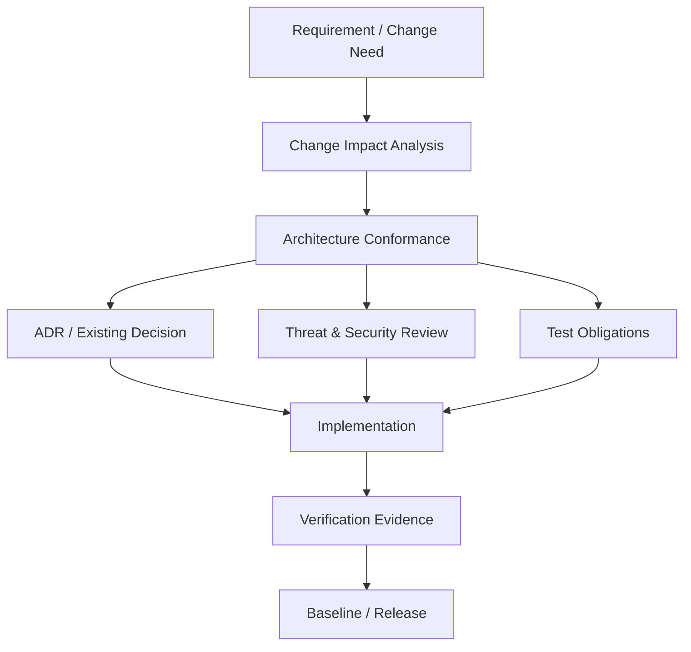

# Architectural Conformance Model

Status: `CANDIDATE GOVERNANCE MODEL / BASED ON CURRENT PROJECT CONTROLS`

## Goal

Keep implementation, documentation and runtime changes aligned with the approved contracts and ADRs without making the architect a bottleneck for every trivial edit.

## Review trigger

Architectural review is required when a change materially affects one or more of:

- system or trust boundary;
- approved requirement/NFR;
- public/internal interface or data contract;
- persistence/provenance semantics;
- external dependency/provider/transport;
- security control or privilege model;
- deployment/operability assumptions;
- architecture decision or a costly-to-reverse choice;
- cross-component behavior.

Formatting, typo fixes and behavior-preserving local refactors do not require a full architecture council unless they reveal a material issue.

## Conformance dimensions

| Dimension | Question | Evidence |
|---|---|---|
| Business/requirement fit | Which approved capability requires the change? | requirement/issue/owner decision |
| Boundary fit | Does responsibility move between OSINT, Analyst, Reviewer, Knowledge layer? | C4/C3 + contract diff |
| Interface fit | Does a contract/schema/protocol change? | OpenAPI/schema/model diff |
| Data/provenance fit | Can source identity, raw evidence or lineage be weakened? | data contract + tests |
| Security fit | New trust boundary, credential, tool, egress or sensitive data path? | threat/security review |
| Dependency fit | New donor/library/provider creates lock-in or supply-chain exposure? | dependency review + ADR/PoC |
| Operability fit | Retry/restart/monitoring/rollback/capacity behavior changed? | operational evidence |
| Verification fit | Which acceptance/regression/security tests prove conformance? | test plan/results |
| Decision fit | Is a new ADR needed or an existing ADR superseded? | decision register/ADR |

## Conformance outcome

```text
PASS
PASS_WITH_CONDITIONS
REWORK
DEBT_ACCEPTANCE_REQUIRED
ADR_REQUIRED
BLOCKED_BY_MISSING_EVIDENCE
```

`DEBT_ACCEPTANCE_REQUIRED` is valid only when the current approved contract can still be met and the compromise has an owner, consequence, repayment trigger and simplest repayment path.

## Role split

- **Developer/author** — explains why the change is needed and supplies implementation evidence.
- **Architect** — checks boundaries, decisions, cross-component consequences and ADR impact.
- **Security** — reviews attack surface, trust, credentials, dependency and data-security impact.
- **QA** — checks observability/testability and regression evidence.
- **Product/Requirement owner** — confirms material scope/outcome changes.
- **Independent reviewer / Model Zoo panel** — challenges high-impact decisions; does not replace accountable owner.

## Trace



## Current OSINT-specific invariants

A change fails conformance if it silently breaks any of these established rules:

1. OSINT supplies evidence/material, not final truth.
2. `ResearchTask` remains bounded.
3. Source observation identity survives raw payload reuse.
4. Collector/source mechanics do not leak into the Analyst contract.
5. Missing evidence/errors remain visible.
6. DEV harness behavior is not presented as Production capability.
7. External AI processing remains subject to data/privacy policy and replaceable-provider rules.

## Governance proportionality

Architecture governance is successful when it catches expensive divergence early **without** requiring a ceremony for every edit. Review depth is selected by materiality, not file count.