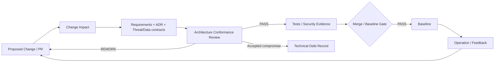

# Lesson 10 — Architectural Governance & Technical Debt

Status: `DOCUMENTATION LAYER / CURRENT PROJECT GOVERNANCE NORMALIZED`

OTUS Lesson 10 asks how architecture is kept true after the diagrams and ADRs exist: architectural review of changes, code/PR conformance, and technical-debt lifecycle management.

For the existing OSINT Agent this lesson does not create a new governance bureaucracy. It reuses the current `PROJECT_EXECUTION_CONTROL.md`, ADRs, requirements, risk/security registers, traceability and verification evidence.

## Canonical lesson artifacts

- `01_ARCHITECTURAL_CONFORMANCE_MODEL.md` — how an implementation/document change is checked against approved architecture.
- `02_PR_ARCHITECTURE_REVIEW_CHECKLIST.md` — compact review contract for material PRs/changes.
- `03_TECH_DEBT_REGISTER.md` — current accepted compromises only; debt is separated from defect/risk/feature.
- `04_LESSON_10_REVIEW.md` — result, UNKNOWNs and improvement actions.

## Core governance loop



## Important distinction

```text
DEFECT = approved contract is violated now
RISK   = uncertain event/exposure may cause harm
DEBT   = known compromise accepted now, with future cost/trigger
FEATURE = desired capability not yet required by current contract
```

No item is called debt merely because it is unfinished.
