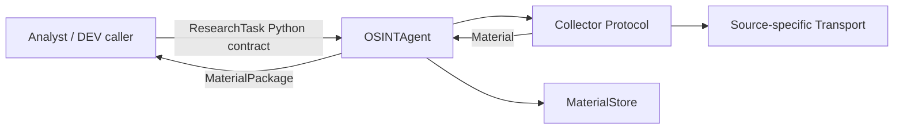

# Integration Landscape — OSINT Agent

Status: `CURRENT + CANDIDATE BOUNDARIES`

## 1. Current DEV integration truth

The current OSINT Agent is deliberately simple:

Current properties:

- Analyst→OSINT is a direct application contract, not an approved public HTTP API.
- Source acquisition is isolated behind `Collector`.
- Telegram transport is isolated behind `TelegramTransport`, so TDLib/GramJS/other transport can be replaced without changing the Analyst contract.
- Persistence is local DEV storage.
- no broker is required to prove current contract behavior.

## 2. Integration boundaries

| Boundary | Contract | Current mode | Future options | Decision owner |
|---|---|---|---|---|
| Analyst → OSINT | `ResearchTask` | in-process/direct | HTTP/gRPC/queue adapter | System/Integration |
| OSINT → Source adapters | Collector protocol | direct call | isolated workers / connector service | Integration |
| Telegram collector → transport | `TelegramTransport.search()` | protocol abstraction | TDLib/GramJS/etc. adapter | Architecture/Integration |
| OSINT → persistence | `MaterialStore` semantics | local sync | metadata DB + object/raw store | Data/Architecture |
| OSINT → Analyst | `MaterialPackage` | direct return | result API/event | Integration |
| Analyst → model provider | not current OSINT core | candidate | Model Gateway / hosted/local | Architecture/Security |
| Review → Knowledge Gate | future | none | API/event/workflow | Knowledge/Architecture |

## 3. Interaction classes

### Request/response

Use when the caller needs an immediate answer, work is bounded/short and retry semantics are simple.

Candidate technologies: HTTP or gRPC.

### Durable asynchronous work

Use when collection can be long-running, independently scaled, retried or delayed by upstream limits.

Candidate pattern: queue/message broker + worker + result event/status API.

### Batch data movement

Use when synchronizing larger datasets, periodic exports or historical backfills.

Candidate pattern: ETL/ELT with versioned dataset manifests.

### Agent/tool integration

Use only when an LLM/agent needs controlled access to tools/resources. MCP/A2A are candidate coordination standards, not justification for bypassing authorization or evidence boundaries.

## 4. Failure ownership

Every integration must declare:

- timeout/deadline;
- retry policy;
- idempotency key or duplicate handling;
- backpressure/rate-limit treatment;
- error visibility;
- authentication/authorization context;
- data classification and egress policy;
- observability correlation ID;
- owner and support boundary.

## 5. Current architecture decision

The project does **not** introduce a broker, service mesh or public API merely to satisfy the lesson. The current DEV direct contracts remain the baseline. Production adapters are candidate layers activated only by requirements such as durable asynchronous processing, multiple workers, independent scaling or external consumers.