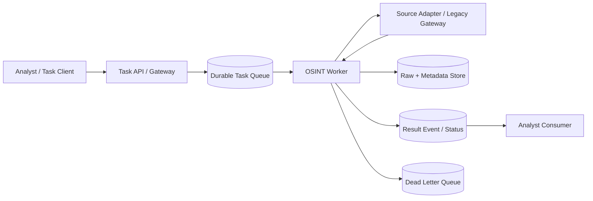
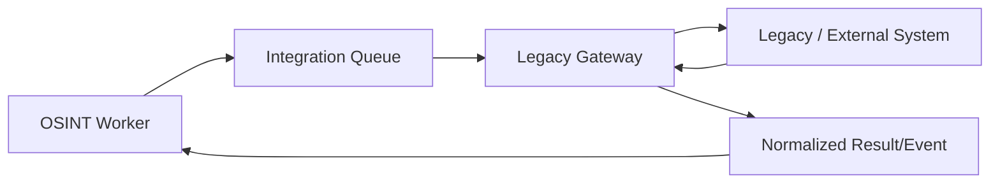

# Reliable Asynchronous Integration Candidate

Status: `CANDIDATE / NOT IMPLEMENTED`

## Why this candidate exists

A broker is justified only if Production requirements introduce long-running collection, multiple independent workers, backpressure, replay/retry, or unreliable legacy/external dependencies. It is not required for the current DEV contract.

## Candidate Production flow



## Reliability contract

### Task identity

Each submitted task carries:

- `task_id`;
- idempotency key where external resubmission is possible;
- trace/correlation ID;
- bounded scope/limits;
- requester/auth context;
- deadline/expiry where applicable.

### Delivery semantics

The architecture should assume **at-least-once delivery** unless a chosen broker/provider proves otherwise. Therefore consumers must be idempotent or deduplicate by stable work identity.

### Retry policy

Retry only transient failures. Permanent validation/auth/policy failures must fail visibly and should not loop indefinitely.

```text
transient failure
→ bounded retry with backoff/jitter
→ exhausted retry
→ DLQ / operator-visible failure
```

### Durable checkpoint rule

Checkpoint/progress must never advance before the corresponding material/evidence is durably saved. Otherwise restart can create silent gaps.

### Backpressure

Rate-limited sources and downstream stores must be protected by queue depth/worker limits and per-source quotas. Scaling workers cannot override upstream rate or legal constraints.

### Failure isolation

One source adapter failure should not corrupt unrelated tasks or erase already persisted evidence.

## Legacy/external system gateway

For a slow/unreliable legacy source, isolate protocol peculiarities behind an adapter/gateway:



The gateway owns protocol translation, timeout/retry mapping and schema normalization. Business/analytical meaning remains outside the gateway.

## Security controls

- task auth context is propagated; no global admin credential inheritance;
- secrets remain outside messages where possible;
- queue payloads are classified/encrypted according to data policy;
- untrusted source content is data, not executable instruction;
- egress destinations are constrained;
- message retention is explicit;
- audit/correlation IDs survive retries.

## When to activate this pattern

Promote from candidate only when at least one is true:

- work duration exceeds acceptable synchronous request lifetime;
- multiple workers need independent scaling;
- source outages/rate limits require durable buffering;
- replay/reconciliation is a real operational requirement;
- external consumers require asynchronous result delivery.

Until then, direct contracts remain simpler and preferable.