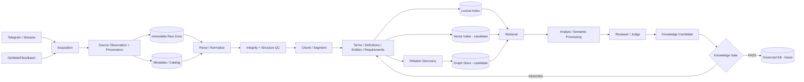
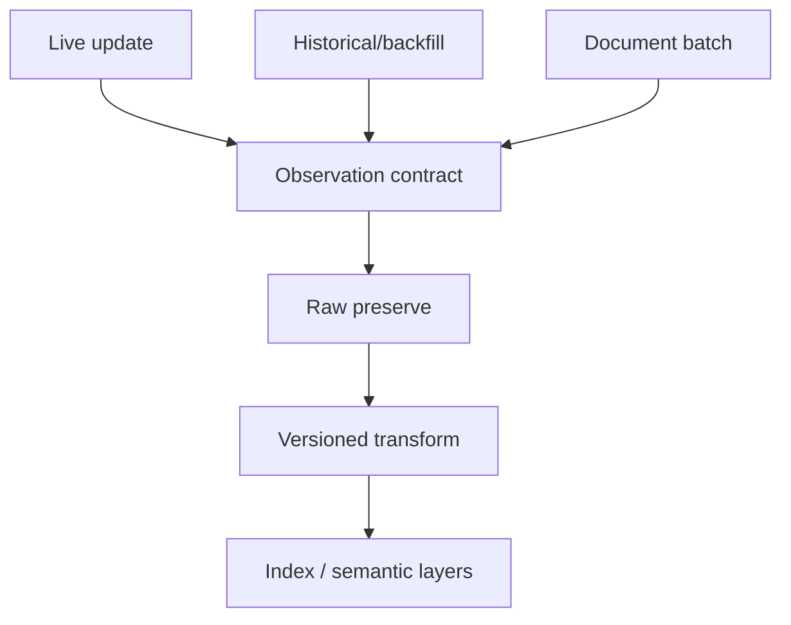

# End-to-End Data Pipeline — OSINT / Knowledge Factory

Status: `CURRENT SEMANTICS + CANDIDATE PRODUCTION DATA PLANE`

## 1. Data source classes

### Stream-like sources

- live Telegram updates / future channel radar;
- future webhook/event sources;
- incremental source feeds where freshness matters.

### Batch sources

- Git repositories/releases/documents;
- uploaded PDFs/files/media;
- historical Telegram/backfill;
- official/legal/technical document corpora;
- periodic exports from external systems.

The transport differs, but downstream evidence/provenance contracts should converge.

## 2. Pipeline principle

For evidence systems a **raw-first ELT-like pattern** is preferred:

1. acquire and identify the source observation;
2. preserve original/raw payload and integrity metadata;
3. only then parse, normalize and derive semantic objects;
4. every derivative keeps lineage to the original.

This prevents a parser/model upgrade from destroying the ability to reprocess original evidence.

## 3. End-to-end flow



## 4. Mapping to existing knowledge stages

The current project already models a staged progression broadly equivalent to:

```text
D0  source discovered
D1  source verified
D2  original acquired
D3  integrity/metadata verified
D4  structure parsed
D5  chunked
D6  terms extracted
D7  definitions extracted
D8  requirements extracted
D9  entities extracted
D10 internal relations
D11 cross-document relations
D12 conflicts/overlaps
D13 knowledge-graph ready
D14 expert reviewed
D15 KB ready
```

These stages are conceptual/data states; they do not require a particular database product.

## 5. Data zones

### RAW / Bronze

Contains original evidence or content-addressed payloads plus immutable provenance.

Properties:
- original bytes/text preserved;
- checksum/hash;
- source locator and acquisition time;
- source observation identity separate from payload identity;
- no semantic truth claim.

### CURATED / Silver

Contains normalized/parsed/chunked representations.

Properties:
- parser/chunking version;
- structural locators back to raw source;
- data-quality status;
- reproducible transformation metadata.

### SEMANTIC / Gold candidate

Contains embeddings, extracted claims, entities, relations, evaluated context, reviewed knowledge candidates.

Important: `Gold` here means curated/reviewed analytical objects, **not automatically authoritative truth**.

## 6. Stream + batch convergence

Live Telegram and batch document imports should converge after acquisition:



The same source/data contract prevents separate incompatible pipelines for live and historical evidence.

## 7. Embedding generation

Embedding generation, when justified by RAG evaluation, occurs **after** normalized/chunked content exists and must record:

- source/chunk ID;
- embedding model ID/version;
- embedding dimension;
- normalization policy;
- chunking/parser version;
- index generation/version;
- creation time;
- access/data-class restrictions.

Embeddings are derivatives and may be rebuilt. They never replace the original evidence.

## 8. Reprocessing

Parser/model changes create new derivative versions rather than silently overwriting old evidence:

```text
Raw v1
 ├─ Parse v1 → Chunk v1 → Embedding v1
 └─ Parse v2 → Chunk v2 → Embedding v2
```

A production pipeline needs explicit rules for active index generation, migration/canary, rollback and deprecation of old derivatives.

## 9. Pipeline acceptance intent

The data pipeline is acceptable only when a reviewer can answer:

- where did this object come from?
- which raw observation/version produced it?
- which parser/chunker/model produced it?
- which transformations happened?
- which data policy applies?
- is this current or superseded?
- can it be rebuilt/retracted without losing audit history?
