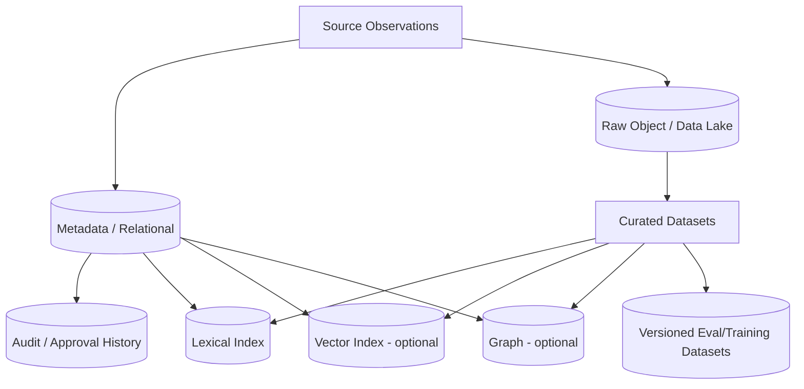

# Storage Selection — by Data Role, not Fashion

Status: `CANDIDATE PRODUCTION STORAGE MODEL`

## 1. Current DEV truth

Current DEV uses:

- append-only JSONL for tasks/material/package metadata;
- content-addressed raw text files by SHA-256;
- original file paths for file-only evidence;
- in-memory/application structures for semantic processing.

This is sufficient for deterministic DEV verification, but not presented as the final Production data platform.

## 2. Storage roles

| Data role | Required properties | Candidate storage class | Current decision |
|---|---|---|---|
| Original/raw evidence | immutable/original bytes, cheap retention, version/hash | object storage / Data Lake raw zone | Production candidate |
| Observation/task/package metadata | transactional metadata, query, ownership, status, audit links | relational DB / metadata catalog | Production candidate |
| Append-only audit/events | ordered history, durable append, retention policy | event/audit store | Production candidate |
| Lexical retrieval | full-text/filter/search | search index | candidate when needed |
| Semantic retrieval | vector nearest-neighbor + metadata filters | Vector DB/index | conditional on RAG eval |
| Relation traversal | entities/claims/relations/evidence paths | graph store | conditional on graph use cases |
| BI/telemetry analytics | aggregates, cost/quality/throughput trends | warehouse/lakehouse | future operational analytics |
| Training/eval datasets | versioned snapshots/manifests | object/lakehouse + dataset registry | candidate |
| Online/offline ML features | same definitions offline/online, point-in-time consistency | Feature Store | conditional; not currently required |

## 3. Why Data Lake / object storage fits raw evidence

Raw OSINT/document evidence is often append-heavy and should remain reprocessable. An object/raw store is a strong candidate because it supports:

- original bytes;
- content-addressed objects;
- immutable/versioned retention patterns;
- cheap large-object storage;
- reprocessing from source evidence;
- separation between raw evidence and derived indexes.

A Data Lake is not treated as a substitute for metadata governance or transactional workflow state.

## 4. Why a relational metadata store is likely separate

Tasks, observations, owners, review states, approvals, versions and lineage edges need structured queries and referential/transactional semantics. A relational metadata/catalog store is therefore a likely Production complement to object storage.

The exact product is not chosen before workload, availability, backup/restore and operations constraints exist.

## 5. Vector DB applicability

Vector storage is promoted only if semantic retrieval demonstrates measurable value over lexical/baseline retrieval on a versioned eval set.

Required before adoption:

- chosen embedding model/version;
- data classes approved for embedding/external processing;
- index rebuild/versioning plan;
- metadata filter needs;
- latency/throughput/storage expectations;
- deletion/retraction propagation;
- quality evidence.

A Vector DB is a derivative index, not the evidence source of truth.

## 6. Graph store applicability

A graph store is justified when project decisions require repeated relation traversal such as:

- source → claim → evidence → contradiction;
- entity → document → relation → review;
- requirement → control → test → result;
- narrative/propagation chains.

If these queries are rare or can be served by simpler relational/document structures, a graph DB remains optional.

## 7. Warehouse / Lakehouse applicability

Useful for larger analytical datasets and telemetry, especially:

- model/retrieval evaluation history;
- cost/latency/quality telemetry;
- operational trend analysis;
- historical corpus analytics;
- reproducible dataset snapshots.

It should not become the only operational source for task/review workflow unless that design is explicitly justified.

## 8. Storage selection rule

```text
Data object / access pattern / consistency / retention / security
→ storage class
→ candidate technology
→ benchmark/PoC if material
→ ADR
```

Not:

```text
Kafka + S3 + Pinecone + Neo4j
→ because this is an AI architecture
```

## 9. Candidate Production composition



The exact technology stack remains unresolved until requirements and measurements justify it.