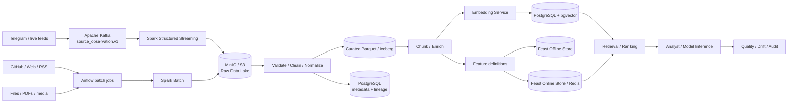

# ДЗ 12 — Проектирование Data Pipelines и интеграционных шлюзов

**Проект:** FATHER OSINT Agent / Knowledge Factory  
**Статус:** `SUBMISSION CANDIDATE / ARCHITECTURE ONLY`  
**Важно:** выбранные технологии — целевая архитектура для ДЗ и будущего Production-кандидата. Они не объявляются уже внедрёнными в текущий DEV baseline.

## 1. Data Sources

Вместо учебного ритейл-кейса используется тот же сквозной проект OSINT Agent.

| Источник | Режим | Примеры | Требование |
|---|---|---|---|
| Telegram / live feeds | Streaming | новые сообщения, обновления каналов | низкая задержка, replay, backpressure |
| GitHub / Web / RSS | Micro-batch / polling | репозитории, страницы, публикации | плановый опрос, повторяемость загрузки |
| PDF / DOCX / media / uploaded files | Batch / event | документы и исходные файлы | сохранить оригинал, hash, provenance |
| Internal project datasets | Batch | eval/golden sets, curated corpora | versioning и воспроизводимость |

## 2. Архитектурный подход

Для проекта предлагается **hybrid Lambda/Kappa**:

- streaming-ветка использует Kappa-принцип: append-only event log, replay и перестраиваемые downstream-представления;
- batch/historical источники сохраняются в Data Lake и обрабатываются воспроизводимыми batch jobs;
- обе ветки сходятся в единую raw/curated модель и используют общие схемы/transform definitions.

Это позволяет не дублировать бизнес-смысл преобразований, но сохраняет сильный исторический слой, необходимый OSINT/Knowledge Factory для повторного анализа и построения датасетов.

## 3. End-to-end pipeline



### Где очистка

Очистка выполняется **после raw landing**, а не до него. Original payload сохраняется неизменяемым, после чего validation/normalization формирует curated representation. Это позволяет повторно прогнать новый parser/cleaner по исходным данным без потери evidence.

### Где создаются embeddings

Embeddings создаются после:

`raw → validate → normalize → chunk → enrich`.

Для каждого embedding сохраняются `source/chunk id`, `embedding model id/version`, `transform version`, `created_at` и ссылка на исходный raw object. При смене модели индекс можно перестроить из curated слоя.

## 4. Выбор технологий

| Задача | Выбор для ДЗ | Почему |
|---|---|---|
| Streaming ingress | **Apache Kafka** | durable event log, partitioning, consumer groups, replay |
| Batch orchestration | **Apache Airflow** | явные DAG, retries, dependency scheduling, auditability |
| Stream + batch transforms | **Apache Spark / Structured Streaming** | единая processing model для batch и streaming, масштабирование при росте объёма |
| Raw Data Lake | **MinIO / S3 API** | дешёвое object storage, immutable originals, cloud/on-prem portability |
| Curated datasets | **Parquet + Iceberg** | columnar format + versioned tables/snapshots/schema evolution |
| Metadata / lineage | **PostgreSQL** | транзакционные метаданные, удобная трассировка объектов/версий |
| Vector retrieval | **PostgreSQL + pgvector** | минимальный новый зоопарк, metadata и vectors рядом; Qdrant — scale-out candidate после benchmark |
| Feature Store | **Feast** | единые feature definitions и offline/online materialization |
| Online feature serving | **Redis** | low-latency lookup для online inference/ranking |

### Почему не Pinecone/Qdrant сразу

Для текущего масштаба разумнее начать с PostgreSQL + pgvector, потому что проект уже нуждается в relational metadata и lineage. Отдельный Vector DB должен появиться только если benchmark покажет, что pgvector не выполняет latency/scale requirements.

## 5. Feature Store и Training–Serving Skew

В текущем verified DEV core Feature Store **не нужен**: ядро занимается evidence/provenance, а не обученным online ranking model.

Но в целевой AI-архитектуре он появляется, если вводится learned relevance/ranking model. Пример признаков:

- source trust class;
- recency / age;
- content length;
- duplicate/repost count;
- entity/topic signals;
- source coverage;
- historical retrieval usefulness;
- document quality flags.

### Как предотвращается skew

```text
ONE FEATURE DEFINITION
        ↓
versioned transform code
        ↓
point-in-time correct offline materialization
        ↓
Feast Offline Store
        ↓ train/eval
same feature definition
        ↓
Feast Online Store / Redis
        ↓ online inference
```

Контроли:

1. `event_time` и `feature_timestamp` обязательны;
2. offline train set строится point-in-time correct, без данных из будущего;
3. один registry определений признаков используется и offline, и online;
4. feature/schema version привязана к model version;
5. перед release выполняется offline↔online parity check на одном наборе сущностей;
6. drift/skew telemetry сохраняется после запуска;
7. несовместимое изменение feature definition создаёт новую версию, а не тихо переписывает старую.

## 6. Data Governance и консистентность

Каждый объект должен проходить трассу:

```text
source
→ source observation
→ immutable raw object/hash
→ parser/cleaner version
→ curated record
→ chunk/version
→ embedding/feature version
→ retrieval/inference
→ finding/claim
→ review
→ knowledge candidate
```

Для material data фиксируются:

- owner;
- sensitivity/data class;
- legal/external-processing status;
- retention/deletion policy;
- source and acquisition time;
- schema version;
- transformation version;
- model/embedding version;
- lineage refs;
- quality state;
- approval/review state.

## 7. Отказоустойчивость

- Kafka offset/checkpoint продвигается только после durable persistence;
- consumers должны быть idempotent по observation/event id;
- poison event попадает в DLQ с исходным payload/ref;
- batch jobs повторяемы и не создают дубликаты при retry;
- derived stores (vector index, online Feature Store, search index) считаются rebuildable из canonical raw/curated layers;
- raw evidence не удаляется из-за ошибки downstream processing.

## 8. Итоговое решение

Для учебной Production-кандидатной архитектуры:

`Kafka + Airflow + Spark → MinIO/S3 → Parquet/Iceberg → PostgreSQL metadata → pgvector → Feast/Redis (если появляется trained ranking model)`.

Такой стек покрывает оба типа источников, сохраняет lineage от исходника до inference, позволяет replay/rebuild и показывает корректную роль Feature Store в предотвращении Training–Serving Skew.

### Что остаётся UNKNOWN до реального Production выбора

- фактический events/sec и batch volume;
- retention periods;
- p95/p99 latency targets;
- volume of vector index;
- GPU/embedding throughput;
- нужен ли вообще trained ranking model;
- достаточен ли pgvector или потребуется отдельный Vector DB.

Эти параметры должны измеряться, а не подставляться из учебных примеров.
