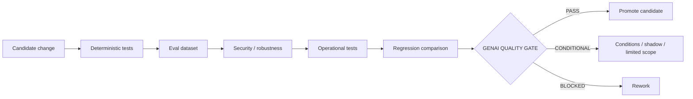

# GenAI Quality Gate & CI Contract

Status: `CANDIDATE QUALITY GOVERNANCE`

## 1. Purpose

Define when a semantic/RAG/model change may move from experiment to accepted project baseline.

The gate extends ordinary regression testing with semantic and evidence-quality checks.

## 2. Gate chain



## 3. Candidate changes that trigger evaluation

- model/provider/version change;
- embedding model change;
- chunking/index change;
- retrieval/fusion/reranking change;
- system/prompt/policy change;
- tool permission change;
- evidence/citation schema change;
- judge/rubric change;
- significant data/index rebuild;
- security mitigation that may affect quality.

## 4. CI tiers

### Tier 0 — deterministic fast checks

Run on every material PR/change where applicable:

- schema validation;
- unit/acceptance regression;
- citation/reference resolution tests;
- policy/tool allowlist tests;
- dataset manifest integrity;
- prompt/config version validation.

### Tier 1 — compact semantic regression

Run on a stable small subset for candidate semantic changes.

Goal: catch obvious quality regressions cheaply.

### Tier 2 — full eval regression

Run before model/prompt/retrieval promotion.

Includes the full approved regression dataset and metric/rubric suite.

### Tier 3 — adversarial/security

Required when retrieval, agent/tool behavior, external model/provider or sensitive data paths change.

### Tier 4 — load/cost benchmark

Required before Production promotion or a material hosting/model decision.

## 5. Gate output

```text
PASS
CONDITIONAL_PASS
BLOCKED
INSUFFICIENT_EVIDENCE
```

Required gate report fields:

```text
candidate_ref
baseline_ref
dataset_version
metric_versions
quality_delta
critical_case_results
security_results
operational_results
cost_delta
known_regressions
conditions
reviewer / authority
revisit_trigger
```

## 6. Threshold policy

Thresholds must be owned and justified. Until measured baseline exists, use `TO_BE_BASELINED` rather than inventing numbers.

A threshold can be:

- absolute minimum;
- no-regression bound vs current baseline;
- per-critical-case hard pass;
- confidence interval / statistically supported comparison where justified.

## 7. Promotion rule

A candidate cannot be promoted merely because:

- average score improved;
- a judge preferred it;
- one demo looked better;
- it is a newer/larger model;
- it is cheaper;
- it is faster.

Promotion requires the declared gate contract and human/domain approval for material changes.

## 8. Flaky / non-deterministic evaluations

When results vary materially:

- repeat selected cases;
- capture variance;
- identify judge disagreement;
- keep per-case results;
- do not hide instability behind an average;
- escalate close decisions to independent/human review.

## 9. Auditability

Every eval run should retain:

- run ID;
- code/config commit;
- model/provider/version;
- prompt/policy version;
- dataset version/hash;
- retrieval/index version;
- metric/judge/rubric version;
- raw outputs where policy permits;
- summary metrics;
- final gate decision.

## 10. Current state

The project has existing deterministic test/verification assets, but GenAI CI execution and thresholds are not yet implemented or measured.

`GENAI_CI_GATE = CONTRACT_DEFINED / EXECUTION_PENDING`.
