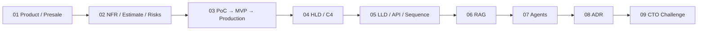
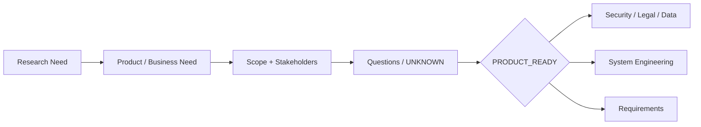
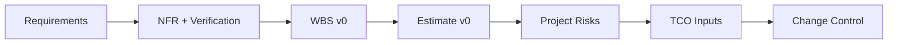
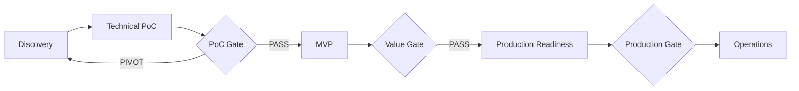
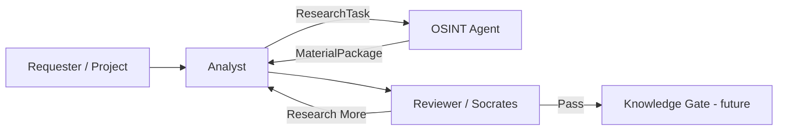
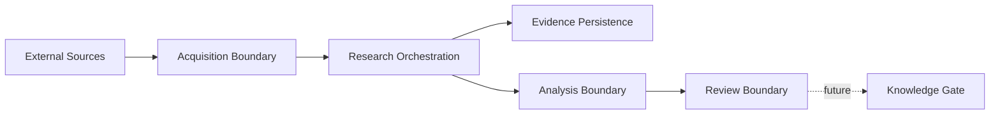
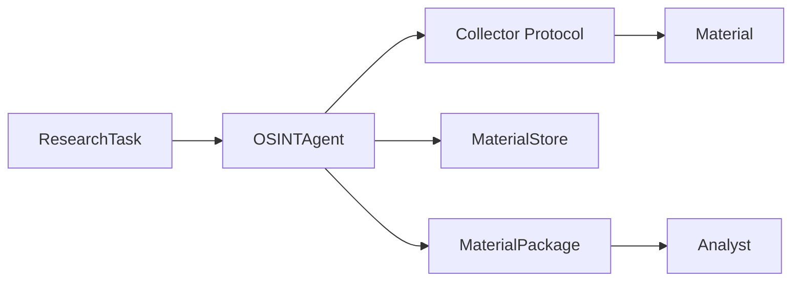
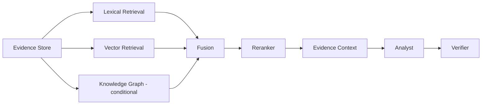
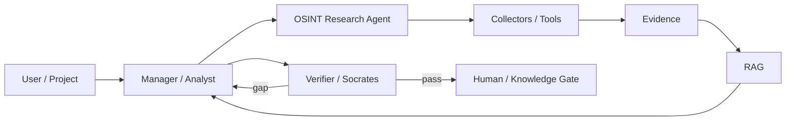
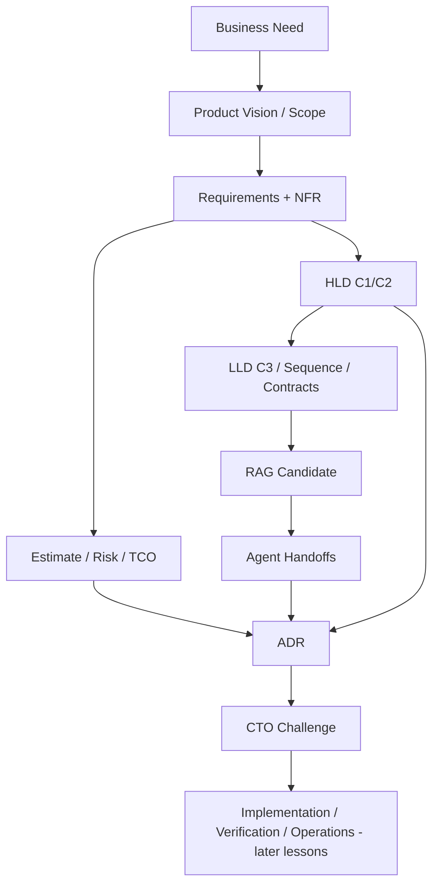

# FATHER OSINT Agent — канонический review ДЗ 01–09

**Проект:** `VictorKVS/OSINT_deepseek`  
**Режим:** один реальный проект проходит через уроки 01–20  
**Статус:** `READY FOR HUMAN REVIEW BEFORE LESSON 09 SUBMISSION`  
**Принцип:** документация уточняет и объясняет существующий проект; реализация в этом проходе не менялась.

---

## 1. Зачем сделан этот review

Вместо девяти несвязанных домашних работ используется один сквозной кейс — **FATHER OSINT Agent**. На каждом уроке проект получает новый слой инженерной документации: от продуктовой постановки и требований до HLD/LLD, RAG, агентной модели, ADR и архитектурной защиты.

Это позволяет проверить не только отдельные техники курса, но и главное: **как решение постепенно становится всё более определённым, проверяемым и управляемым**.



### Текущее состояние проекта

| Область | Состояние |
|---|---|
| DEV baseline | `EXISTING_VERIFIED` |
| Technical PoC | `ACTIVE / evidence-producing path` |
| MVP | `NOT YET OWNER-SELECTED` |
| RAG | `CANDIDATE / NOT CLAIMED IMPLEMENTED` |
| Multi-Agent | `CANDIDATE / NOT CLAIMED PRODUCTION` |
| Production readiness | `NOT CLAIMED` |

Ключевой принцип всей работы: **не подменять отсутствующие факты красивой архитектурой**. Если данных нет — фиксируется `UNKNOWN`, `TO_BE_BASELINED` или отдельный вопрос владельцу.

---

# Урок 01. Пресейл, контракты и работа с требованиями

## Что требовал урок

Сформировать фундамент проекта до технического проектирования: понять исходный запрос, выявить скрытые требования и неопределённости, сформулировать уточняющие вопросы, учитывать контрактные ограничения и роль архитектора на пресейле.

## Что сделано для OSINT Agent

Ретроспективно восстановлен продуктовый слой, которого раньше не хватало перед уже существующим ТЗ и кодом:

| Артефакт | Что фиксирует |
|---|---|
| Business Need | зачем вообще нужен OSINT worker |
| Product Vision | какой результат получает пользователь/аналитик |
| Stakeholders & Authority | кто владелец факта, scope и решения |
| Scope Baseline | что входит и не входит в DEV |
| Success Metrics | как измерять полезность, где пока нужен baseline |
| Assumption / UNKNOWN Log | что пока нельзя считать фактом |
| Product Ready Decision | можно ли передавать проект дальше |

### Смысл продукта

OSINT Agent — это **поставщик исследовательских материалов и provenance**, а не «машина истины». Он получает ограниченный `ResearchTask`, собирает разрешённые материалы, сохраняет происхождение и возвращает `MaterialPackage` аналитику.



### Почему это важно

Без этого слоя проект легко превратить в «давайте напишем Telegram-бота/LLM». Product layer удерживает проблему отдельно от заранее выбранной технологии.

### Результат

`PRODUCT_READY = CONDITIONAL_PASS`

Причина: миссия, границы и роли подтверждаются текущим репозиторием, но Production KPI, Legal/Data authority, workload, SLO и бюджет ещё не подтверждены.

---

# Урок 02. От требований к плану, рискам и смете

## Что требовал урок

Перевести требования в измеримые NFR, научиться оценивать работы и неопределённость, использовать WBS / PERT / Bottom-Up, вести риски, TCO и Change Request.

## Что сделано для OSINT Agent

Создан слой **Delivery Feasibility** между требованиями и архитектурой.



### Главная идея

Оценка разделена на два уровня:

**Estimate v0 — до архитектуры.** Нужен, чтобы понять масштаб, неопределённость, риск и бюджетный диапазон без ложной точности.

**Estimate v1 — после выбора архитектуры.** Уточняет часы, sizing, инфраструктуру и TCO уже на основании выбранного решения и измерений.

### NFR

Для каждого существенного NFR фиксируются:

`metric → baseline/UNKNOWN → target/TO_BE_BASELINED → priority → verification method → evidence owner`.

Числа из учебных примеров OTUS не копируются в проект как реальные цели.

### Текущий пробел проекта

DEV acceptance хорошо описывает поведение, но Production пока не имеет доказанных числовых baseline по latency, throughput, freshness, availability, storage growth и operating cost.

### Результат

`DELIVERY_FEASIBILITY = CONDITIONAL_PASS`

Есть структура оценки и рисков; окончательная смета и Production TCO сознательно не выдумываются без workload/price/ops evidence.

---

# Урок 03. Стратегия поставки ценности: PoC → MVP → Production

## Что требовал урок

Разделить большой проект на этапы, каждый из которых снижает неопределённость и приносит измеримую ценность; различать Demo, PoC, MVP и Production; связать этапы с контрактной моделью и рисками.

## Что сделано

Существующая capability-roadmap OSINT Agent приведена к явной модели жизненного цикла:



### Как трактуется текущий проект

| Стадия | Состояние |
|---|---|
| DEV baseline | проверен |
| Technical PoC | активен, есть evidence path TDLib/Telegram |
| MVP | ещё не выбран владельцем продукта |
| Production | не заявляется |

### Почему это важно

Работающий скрипт не становится автоматически MVP, а MVP не становится Production только потому, что «у нас всё запускается». Каждая стадия отвечает на другой вопрос:

- **PoC:** технически возможно?
- **MVP:** создаёт полезность реальному пользователю?
- **Production:** можно безопасно и устойчиво эксплуатировать?

### Контрактная логика

На высоконеопределённом PoC разумнее T&M / capped exploration; FP становится защищаемым только после более зрелого baseline требований, acceptance и change control.

### Результат

`LESSON_03_DOCUMENTATION = CONDITIONAL_PASS`

---

# Урок 04. HLD и C4 Model

## Что требовал урок

Показать систему на разных уровнях абстракции, прежде всего C1 System Context и C2 Containers, чтобы архитектура была понятна не только разработчику.

## Что сделано

Существующие диаграммы OSINT Agent нормализованы в C4/HLD без преждевременного выбора технологий.

### C1 — контекст



C1 показывает ответственность: OSINT собирает evidence, Analyst интерпретирует, Reviewer проверяет достаточность, а Knowledge Gate остаётся отдельной будущей границей.

### C2 — контейнеры ответственности



Здесь специально **нет обязательного PostgreSQL, Kafka, Qdrant, Kubernetes или конкретного LLM**. Сначала фиксируются ответственность и поток информации; технология выбирается позже по драйверам.

### Результат

`HLD = CONDITIONAL_PASS`

Архитектурные границы ясны; Production deployment topology ещё не утверждена.

---

# Урок 05. LLD: компоненты и взаимодействия

## Что требовал урок

Перейти от HLD к C3, sequence diagrams и контрактам API.

## Что сделано

LLD построен вокруг реально существующих компонентов проекта:



### Зафиксированы ключевые последовательности

- нормальный сбор;
- нет подходящего Collector;
- частичный отказ одного источника;
- одинаковый payload из разных source observations;
- bounded follow-up research.

Это особенно важно для provenance: одинаковое содержимое может храниться один раз, но разные наблюдения источников не должны исчезать.

### OpenAPI

Для задания создан `OPENAPI_CANDIDATE.yaml`, но он честно помечен как **candidate adapter / not implemented**. Текущий DEV-контракт — Python `ResearchTask → MaterialPackage`; HTTP API не выдаётся за уже существующий runtime.

### Результат

`LLD = CONDITIONAL_PASS`

---

# Урок 06. RAG и продвинутые вариации

## Что требовал урок

Понять базовый и продвинутый RAG, hybrid search, reranking, Self-RAG/CRAG-подобные идеи и возможность сочетать Vector DB с Knowledge Graph.

## Как это применено к OSINT Agent

RAG не помещён внутрь Collector/OSINT boundary. Сначала собирается evidence, потом retrieval помогает Analyst/Knowledge layer найти релевантный контекст.



### Последовательность зрелости

`lexical baseline → vector → hybrid → reranker → graph only if measured value exists`.

### Инварианты

`Retrieved text ≠ instruction`  
`Similarity ≠ truth`  
`Generated answer ≠ evidence`

RAG должен сохранять source/evidence refs и проверяться на одном versioned eval set.

### Результат

`RAG = CANDIDATE / EVAL REQUIRED`

Архитектура описана, но реализация и выбор конкретной Vector DB/embedding/reranker не заявляются.

---

# Урок 07. AI Agents и Multi-Agent Systems

## Что требовал урок

Разделить сложный бизнес-процесс между агентами, использовать single responsibility, описать handoff и показать связь с RAG.

## Что сделано

Существующие роли OSINT / Analyst / Socrates превращены в явную кандидатную агентную архитектуру:



### Главное отличие от «агенты всё делают сами»

Каждый handoff должен передавать контекст и границы полномочий: objective, task/trace ID, allowed tools, scope, evidence refs, budget/limits, stop condition, privilege ceiling и review requirement.

### Security by design

Кандидатная схема сразу учитывает prompt injection, retrieval poisoning, runaway loops, excessive agency, confused deputy, cross-agent privilege escalation и fake execution results.

LLM предлагает; deterministic policy/tool layer исполняет только разрешённые действия.

### Результат

`MULTI_AGENT = CANDIDATE / VALUE + SECURITY PROOF REQUIRED`

---

# Урок 08. Architecture Decision Records

## Что требовал урок

Фиксировать ключевые архитектурные решения через ADR и сохранять контекст, альтернативы, последствия и историю изменений в Git.

## Что сделано

Существующий Decision Register не удалён. Из подтверждённых проектных решений сформированы первые ретроспективные ADR:

| ADR | Решение |
|---|---|
| ADR-0001 | OSINT — evidence supplier, а не финальный эксперт |
| ADR-0002 | Source observation и stored payload — разные сущности |
| ADR-0003 | Follow-up research должен быть bounded и cumulative |

### Стандарт решения

```text
Context
→ Drivers
→ Alternatives
→ Evidence
→ Decision
→ Consequences
→ Verification
→ Revisit trigger
```

Решение не переписывается задним числом. Новое решение создаёт новый ADR и `supersedes` старый.

### Результат

`ADR DISCIPLINE = PASS`

---

# Урок 09. Верификация архитектуры и CTO Challenge

## Что требовал урок

Сравнить hosted/cloud LLM и self-hosted/on-prem, аргументировать выбор по Cost / Privacy / Quality / Latency / Support, оформить ADR и защитить решение перед CTO, честно указав trade-offs.

## Варианты

1. Hosted model API.
2. Self-hosted model на cloud GPU.
3. On-prem GPU.
4. Hybrid через provider-neutral gateway.

## Принятое решение текущей стадии

Для **PoC/MVP semantic-функций** использовать hosted LLM API через заменяемый **Model Gateway**, но только для данных, которым явно разрешена внешняя обработка.

Sensitive или unclassified evidence наружу по умолчанию не отправляется. Финальное Production-решение о cloud GPU / on-prem откладывается до появления реальных workload, quality, SLO и TCO evidence.

### Почему не покупаем GPU сразу

Пока неизвестны реальные:

- requests/month и tokens/request;
- peak concurrency;
- p95 latency/SLO;
- качество сравнимой локальной модели;
- GPU utilization;
- текущие цены API/cloud/hardware;
- стоимость эксплуатации.

Без этих данных «API дешевле» или «on-prem окупится» — не инженерный вывод, а предположение.

### Правило честного сравнения

Варианты сравниваются только при **одинаковом quality/security/SLO gate**. Дешёвая локальная модель не выигрывает, если не проходит тот же eval-набор.

### CTO pitch

> На текущем этапе нам выгоднее купить знание о реальной нагрузке и качестве, чем заранее купить инфраструктуру. Hosted API за заменяемым gateway позволяет быстро получить измерения и сохранить путь к локальному inference. Sensitive evidence наружу не выпускается. После накопления workload, quality и TCO telemetry решение пересматривается отдельным ADR.

### Триггеры пересмотра

- внешняя обработка запрещена для нужных данных;
- API TCO становится хуже сравнимого self-hosted варианта;
- provider не выполняет p95/availability;
- локальная модель проходит тот же eval/security gate;
- workload позволяет уверенно оценить GPU utilization;
- требуется offline/local operation.

### Результат

`LESSON_09 = READY FOR HOMEWORK REVIEW`

---

# 10. Сквозная трассировка проекта после урока 09



Теперь каждое архитектурное решение можно проследить назад до потребности/требования и вперёд до проверки.

---

# 11. Что уже доказано, а что нет

| Доказано / поддержано evidence | Пока не доказано |
|---|---|
| OSINT worker имеет чёткую роль и bounded contract | конкретный внешний MVP и его бизнес-KPI |
| provenance сохраняется как ключевой инвариант | Production workload/SLO |
| DEV baseline отделён от PROD | Production legal/data-processing matrix |
| HLD/LLD описывают текущую ответственность | финальная deployment topology |
| RAG/agents спроектированы как candidate layers | их Production value/quality/security |
| ADR discipline введена | финальный Production LLM hosting winner |
| CTO decision имеет trade-offs и revisit triggers | TCO без реальных workload/price inputs |

Это намеренно: **отсутствие доказательства не маскируется документом**.

---

# 12. Что стоит доработать дальше

| Priority | Следующий существенный пробел |
|---|---|
| P0 | Legal/Data applicability и external-processing policy |
| P0 | Tool permission / untrusted-content policy до executable agents |
| P1 | выбрать реальный MVP и product-value metric |
| P1 | Production NFR baseline |
| P1 | versioned RAG/LLM Golden/Eval Dataset |
| P1 | Model Gateway contract и compliance tests |
| P1 | measured local-vs-hosted benchmark + TCO |
| P1 | independent review/sign-off material ADR |

Полный рабочий backlog хранится отдельно, чтобы рекомендации не смешивались с AS-IS.

---

# 13. Итог

Уроки 01–09 дали не девять отдельных артефактов, а один последовательный инженерный контур:

```text
Зачем нужен продукт
→ что именно требуется
→ можно ли это оценить и проверить
→ какой PoC снижает неопределённость
→ как устроена система на HLD
→ как работают компоненты на LLD
→ где RAG действительно полезен
→ как разделить ответственность агентов
→ как фиксировать решения
→ как защитить компромисс перед CTO
```

Главное состояние после девятого урока: **архитектура уже объяснима и защищаема, но мы сознательно не объявляем Production readiness до появления evidence из последующих уроков и реальной эксплуатации.**

---

## Canonical project references

- `docs/course_live_reproduction/01_product/`
- `docs/course_live_reproduction/02_delivery_feasibility/`
- `docs/course_live_reproduction/03_poc_to_production/`
- `docs/course_live_reproduction/04_hld_c4/`
- `docs/course_live_reproduction/05_lld/`
- `docs/course_live_reproduction/06_rag/`
- `docs/course_live_reproduction/07_agents/`
- `docs/course_live_reproduction/08_adr/`
- `docs/course_live_reproduction/09_cto_challenge/`
- `docs/course_live_reproduction/IMPROVEMENT_BACKLOG.md`
- `docs/course_live_reproduction/00_MASTER_ARTIFACT_REGISTER.yaml`

**Source of truth:** `VictorKVS/OSINT_deepseek`, branch `feature/otus-live-reproduction-01-20`.
